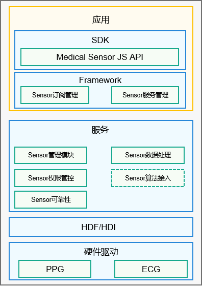

# Medical_Sensor组件

## 简介

Medical_Sensor是健康类传感器，主要用于测量人体健康相关的数据，例如人体心率、心电图、设备的佩戴情况等。Medical_Sensor使用场景复杂，并且需要配套相关算法共同使用，所以将其与传统传感器区分开来单独实现。传感器的介绍可以参考[sensors\_sensor组件](https://gitee.com/openharmony/sensors_sensor)。Medical_Sensor传感器架构如图1所示。

**图 1**  Medical_Sensor架构图



架构图说明：
- Medical_Sensor组件提供一个JS接口打包到SDK中，提供给用户进行应用开发。
- 服务层是一个Service Ability，运行在一个用户态进程中，用户应用使用Medical_Sensor组件的Framework模块通过IPC机制与服务层所在进程通信。
- HDI层对于sensor会单独启动一个用户态进程，服务层所在进程通过IPC机制与此HDI用户态进程交互，完成驱动的控制，以及驱动数据的上报。
- PPG、ECG等Medical Sensor接入OpenHarmony的HDF框架，通过Sensor驱动模型向上层提供HDI接口。

## 目录

Medical_Sensor导入模块的代码结构如下：

```
/base/sensors/medical_sensor
├── frameworks                 # 框架代码
│   └── native                 # Medical_Sensor客户端代码          
├── interfaces                 # 对外接口存放目录
│   ├── native                 # Medical_Sensor native实现
│   └── plugin                 # Js API
├── sa_profile                 # 服务名称和服务的动态库的配置文件
├── services                   # 服务的代码目录
│   └── medical_sensor         # 传感器服务，包括PPG、ECG等，上报传感器数据
└── utils                      # 公共代码，包括权限、通信等能力
```

## 约束

-   要使用传感器的功能，设备必须具有对应的传感器器件。

-   针对某些传感器，开发者需要请求相应的权限，才能获取到相应传感器的数据。

    **表 1**  传感器权限列表

    | 传感器 | 权限名 | 敏感级别 | 权限描述 |
    | :-- | :-- | :-- | :-- |
    | 心率传感器 | ohos.permission.READ_HEALTH_DATA | user_grant | 允许读取健康数据。 |


## 说明

### 接口说明

传感器接口用于监听数据变化，如果多次调用，则仅最后一次调用生效，开放能力如表2所示。

**表 2**  接口列表

| 接口名 | 描述 |
| :--- | :--- |
| `on(type: SensorType, callback: Callback<Response>, options?: Options)` | 监听传感器数据变化。`SensorType`为支持订阅的传感器类型，`callback`表示订阅传感器的回调函数，`options`为设置传感器数据上报的时间间隔。 |
| `off(type: SensorType, callback?: Callback<Response>)` | 取消订阅传感器数据。参数与`on`前两个参数一样。 |


### 使用说明

1.  导入medical sensor api包。导包之后可以使用medical sensor对外提供的接口，如表2所示。
    ```
    import medical from '@ohos.medical';
    ```

2.  使用`on`接口注册并监听传感器数据的变化。此接口会将第二个参数做为回调函数注册到medical sensor框架中，并打开底层传感器驱动；应用就可以通过回调函数监听传感器数据的变化并进行业务逻辑处理。
    ```
    medical.on(medical.MedicalSensorType.TYPE_ID_PHOTOPLETHYSMOGRAPH, (data) => {
        console.info("PPG data obtained. data: " + data.dataArray);
    });
    ```

3.  取消订阅传感器数据的变化。此接口会根据sesorid和回调函数向medical sensor框架去注册，并关闭底层传感器驱动。
    ```
    medical.off(medical.MedicalSensorType.TYPE_ID_PHOTOPLETHYSMOGRAPH, (data) => {
        console.info("Succeeded in unsubscribe from sensor data");
    });
    ```

完整示例代码：

```
import medical from '@ohos.medical';
export default {
    onCreate() {
        console.info('Application onCreate');
        medical.on(medical.MedicalSensorType.TYPE_ID_PHOTOPLETHYSMOGRAPH, (data) => {
            console.info("PPG data obtained. data: " + data.dataArray);
        });
    }

    onDestroy() {
        console.info('Application onDestroy');
        medical.off(medical.MedicalSensorType.TYPE_ID_PHOTOPLETHYSMOGRAPH, (data) => {
            console.info("Succeeded in unsubscribe from sensor data");
        });
    }
};
```

## 相关仓

[泛Sensor服务子系统](https://gitee.com/openharmony/docs/blob/master/zh-cn/readme/%E6%B3%9BSensor%E5%AD%90%E7%B3%BB%E7%BB%9F.md)

**sensors\_medical\_sensor**

[sensors\_sensor](https://gitee.com/openharmony/sensors_sensor)

[sensors\_miscdevice](https://gitee.com/openharmony/sensors_miscdevice)

