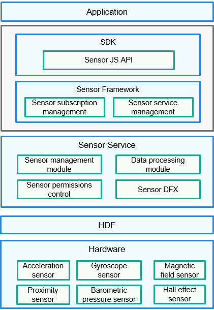

# Sensor<a name="EN-US_TOPIC_0000001148682248"></a>

-   [Introduction](#section11660541593)
-   [Directory Structure](#section44981327519)
-   [Constraints](#section98068674513)
-   [Usage](#section1581412211528)
    -   [Available APIs](#section15684191115524)
    -   [How to Use](#section1543714111810)

-   [Repositories Involved](#section96071132185310)

## Introduction<a name="section11660541593"></a>

A sensor is a device to detect events or changes in an environment and send messages about the events or changes to another device \(for example, a CPU\). Generally, a sensor is composed of sensitive components and conversion components. Sensors are the cornerstone of the IoT. A unified sensor management framework is required to achieve data sensing at a low latency and low power consumption, thereby keeping up with requirements of "1+8+N" products or business in the Seamless AI Life Strategy. Based on the usage, sensors are divided into the following categories:

-   Motion: acceleration sensors, gyroscope sensors, gravity sensors, linear acceleration sensors, etc.
-   Orientation: rotation vector sensors, orientation sensors, etc.
-   Environment: magnetic field sensors, barometric pressure sensors, humidity sensors, etc.
-   Light: ambient light sensors, proximity sensors, color temperature sensors, etc.
-   Body: heart rate sensors, heartbeat sensors, etc.
-   Other: Hall effect sensors, grip detection sensors, etc.

The following figure shows the sensor architecture.

**Figure  1**  Sensor architecture<a name="fig18632347122018"></a>  




## Directory Structure<a name="section44981327519"></a>

The sample code for importing the sensor module is as follows:

```
/base/sensors/sensor
├── frameworks                 # Framework code
│   └── native                 # Sensor client code
├── interfaces                 # External APIs
│   ├── native                 # Native Implementation for sensors
│   └── plugin                 # JS APIs
├── sa_profile                 # Configuration file of system ability names and dynamic libraries
├── services                   # Code of services
│   └── sensor                 # Sensor service for reporting data about sensors, such as the acceleration and gyroscope sensors
└── utils                      # Common code, including permissions and communication capabilities 
```

## Constraints<a name="section98068674513"></a>

-   To use sensor functions, ensure that the device where your application runs has the required sensor components.

-   To obtain data of some sensors, you need to request the required permissions.

    **Table  1**  Permissions required by sensors

    <a name="table1379101653916"></a>
    <table><thead align="left"><tr id="row137911161397"><th class="cellrowborder" valign="top" width="23.46765323467653%" id="mcps1.2.5.1.1"><p id="p15138132134118"><a name="p15138132134118"></a><a name="p15138132134118"></a>Sensor</p>
    </th>
    <th class="cellrowborder" valign="top" width="27.61723827617238%" id="mcps1.2.5.1.2"><p id="p2798169398"><a name="p2798169398"></a><a name="p2798169398"></a>Permission Name</p>
    </th>
    <th class="cellrowborder" valign="top" width="13.358664133586636%" id="mcps1.2.5.1.3"><p id="p14791716163914"><a name="p14791716163914"></a><a name="p14791716163914"></a>Sensitivity</p>
    </th>
    <th class="cellrowborder" valign="top" width="35.55644435556444%" id="mcps1.2.5.1.4"><p id="p379171633919"><a name="p379171633919"></a><a name="p379171633919"></a>Permission Description</p>
    </th>
    </tr>
    </thead>
    <tbody><tr id="row12791216173912"><td class="cellrowborder" valign="top" width="23.46765323467653%" headers="mcps1.2.5.1.1 "><p id="p41385264116"><a name="p41385264116"></a><a name="p41385264116"></a>Acceleration sensor, uncalibrated acceleration sensor, and linear acceleration sensor</p>
    </td>
    <td class="cellrowborder" valign="top" width="27.61723827617238%" headers="mcps1.2.5.1.2 "><p id="p177941653914"><a name="p177941653914"></a><a name="p177941653914"></a>ohos.permission.ACCELEROMETER</p>
    </td>
    <td class="cellrowborder" valign="top" width="13.358664133586636%" headers="mcps1.2.5.1.3 "><p id="p207991683914"><a name="p207991683914"></a><a name="p207991683914"></a>system_grant</p>
    </td>
    <td class="cellrowborder" valign="top" width="35.55644435556444%" headers="mcps1.2.5.1.4 "><p id="p118061614399"><a name="p118061614399"></a><a name="p118061614399"></a>Allows an application to subscribe to data of these acceleration-related sensors.</p>
    </td>
    </tr>
    <tr id="row480116123911"><td class="cellrowborder" valign="top" width="23.46765323467653%" headers="mcps1.2.5.1.1 "><p id="p1213992174111"><a name="p1213992174111"></a><a name="p1213992174111"></a>Gyroscope sensor and uncalibrated gyroscope sensor</p>
    </td>
    <td class="cellrowborder" valign="top" width="27.61723827617238%" headers="mcps1.2.5.1.2 "><p id="p13807165395"><a name="p13807165395"></a><a name="p13807165395"></a>ohos.permission.GYROSCOPE</p>
    </td>
    <td class="cellrowborder" valign="top" width="13.358664133586636%" headers="mcps1.2.5.1.3 "><p id="p188031617391"><a name="p188031617391"></a><a name="p188031617391"></a>system_grant</p>
    </td>
    <td class="cellrowborder" valign="top" width="35.55644435556444%" headers="mcps1.2.5.1.4 "><p id="p4804168392"><a name="p4804168392"></a><a name="p4804168392"></a>Allows an application to subscribe to data of these gyroscope-related sensors.</p>
    </td>
    </tr>
    <tr id="row68051693916"><td class="cellrowborder" valign="top" width="23.46765323467653%" headers="mcps1.2.5.1.1 "><p id="p191397210413"><a name="p191397210413"></a><a name="p191397210413"></a>Pedometer sensor</p>
    </td>
    <td class="cellrowborder" valign="top" width="27.61723827617238%" headers="mcps1.2.5.1.2 "><p id="p9802016183911"><a name="p9802016183911"></a><a name="p9802016183911"></a>ohos.permission.ACTIVITY_MOTION</p>
    </td>
    <td class="cellrowborder" valign="top" width="13.358664133586636%" headers="mcps1.2.5.1.3 "><p id="p11801216143916"><a name="p11801216143916"></a><a name="p11801216143916"></a>user_grant</p>
    </td>
    <td class="cellrowborder" valign="top" width="35.55644435556444%" headers="mcps1.2.5.1.4 "><p id="p48010163399"><a name="p48010163399"></a><a name="p48010163399"></a>Allows an application to subscribe to the motion status.</p>
    </td>
    </tr>
    <tr id="row20323104234015"><td class="cellrowborder" valign="top" width="23.46765323467653%" headers="mcps1.2.5.1.1 "><p id="p3139172144118"><a name="p3139172144118"></a><a name="p3139172144118"></a>Heart rate sensor</p>
    </td>
    <td class="cellrowborder" valign="top" width="27.61723827617238%" headers="mcps1.2.5.1.2 "><p id="p7323942174013"><a name="p7323942174013"></a><a name="p7323942174013"></a>ohos.permission.READ_HEALTH_DATA</p>
    </td>
    <td class="cellrowborder" valign="top" width="13.358664133586636%" headers="mcps1.2.5.1.3 "><p id="p1232314214407"><a name="p1232314214407"></a><a name="p1232314214407"></a>user_grant</p>
    </td>
    <td class="cellrowborder" valign="top" width="35.55644435556444%" headers="mcps1.2.5.1.4 "><p id="p12323144254018"><a name="p12323144254018"></a><a name="p12323144254018"></a>Allows an application to read health data.</p>
    </td>
    </tr>
    </tbody>
    </table>


## Usage<a name="section1581412211528"></a>

This section uses the sensor JS APIs as an example to describe their functionalities and usage.

### Available APIs<a name="section15684191115524"></a>

The sensor JS APIs listen for sensor data changes. If an API is called multiple times, the last call takes effect. The following table describes these APIs.

**Table  2**  Sensor JS APIs

<a name="table13821942165419"></a>
<table><thead align="left"><tr id="row6821194225417"><th class="cellrowborder" valign="top" width="40.11%" id="mcps1.2.3.1.1"><p id="p3822542145420"><a name="p3822542145420"></a><a name="p3822542145420"></a>API</p>
</th>
<th class="cellrowborder" valign="top" width="59.89%" id="mcps1.2.3.1.2"><p id="p0822942175411"><a name="p0822942175411"></a><a name="p0822942175411"></a>Description</p>
</th>
</tr>
</thead>
<tbody><tr id="row1782284211544"><td class="cellrowborder" valign="top" width="40.11%" headers="mcps1.2.3.1.1 "><p id="p18666622171316"><a name="p18666622171316"></a><a name="p18666622171316"></a>on(type: SensorType, callback: Callback&lt;Response&gt;, options?: Options)</p>
</td>
<td class="cellrowborder" valign="top" width="59.89%" headers="mcps1.2.3.1.2 "><p id="p1476355071517"><a name="p1476355071517"></a><a name="p1476355071517"></a>Subscribes to a type of sensor that listens for changes of sensor data. <strong id="b14384115423516"><a name="b14384115423516"></a><a name="b14384115423516"></a>SensorType</strong> indicates the type of the sensor that can be subscribed to. <strong id="b6384145413356"><a name="b6384145413356"></a><a name="b6384145413356"></a>callback</strong> specifies whether the subscription is successful. <strong id="b562874515315"><a name="b562874515315"></a><a name="b562874515315"></a>options</strong> indicates the interval for reporting sensor data.</p>
</td>
</tr>
<tr id="row1489993155613"><td class="cellrowborder" valign="top" width="40.11%" headers="mcps1.2.3.1.1 "><p id="p1490010315564"><a name="p1490010315564"></a><a name="p1490010315564"></a>once(type: SensorType, callback: Callback&lt;Response&gt;)</p>
</td>
<td class="cellrowborder" valign="top" width="59.89%" headers="mcps1.2.3.1.2 "><p id="p5900163115564"><a name="p5900163115564"></a><a name="p5900163115564"></a>Subscribes to a type of sensor that listens for the sensor data change once. <strong id="b16369115653114"><a name="b16369115653114"></a><a name="b16369115653114"></a>SensorType</strong> indicates the type of the sensor that can be subscribed to. <strong id="b2370135693114"><a name="b2370135693114"></a><a name="b2370135693114"></a>callback</strong> specifies whether the subscription is successful.</p>
</td>
</tr>
<tr id="row1909165317562"><td class="cellrowborder" valign="top" width="40.11%" headers="mcps1.2.3.1.1 "><p id="p16909135319564"><a name="p16909135319564"></a><a name="p16909135319564"></a>off(type: SensorType, callback: Callback&lt;Response&gt;)</p>
</td>
<td class="cellrowborder" valign="top" width="59.89%" headers="mcps1.2.3.1.2 "><p id="p3909165315613"><a name="p3909165315613"></a><a name="p3909165315613"></a>Unsubscribes from a type of sensor that listens for data changes. <strong id="b63331753103316"><a name="b63331753103316"></a><a name="b63331753103316"></a>SensorType</strong> indicates the type of the sensor that can be unsubscribed from. <strong id="b153331453173315"><a name="b153331453173315"></a><a name="b153331453173315"></a>callback</strong> specifies whether the unsubscription is successful.</p>
</td>
</tr>
</tbody>
</table>


### How to Use<a name="section1543714111810"></a>

1.  Import the sensor package.
2.  Subscribe to and listen for data changes of an acceleration sensor.
3.  Unsubscribe from data changes of the acceleration sensor.
4.  Subscribe to and listen for a data change of a acceleration sensor.

Example:

```
// Step 1 Import the sensor package.
import sensor from '@ohos.sensor';
export default {
    onCreate() {
        // Step 2 Subscribe to and listen for data changes of a type of sensor.
        sensor.on(sensor.SensorType.SENSOR_TYPE_ID_ACCELEROMETER, (data) => {
            console.info("Acceleration data obtained. x: " + data.x + "; y: " + data.y + "; z: " + data.z);
        }, {'interval':200000000});
        // Step 3 Unsubscribe from data changes of the sensor 10 seconds later.
        sensor.off(sensor.SensorType.SENSOR_TYPE_ID_LINEAR_ACCELERATION);
        // Step 4 Subscribe to and listen for a data change of a type of sensor.
        sensor.once(sensor.SensorType.SENSOR_TYPE_ID_ACCELEROMETER, (data) => {
            console.info("Acceleration data obtained. x: " + data.x + "; y: " + data.y + "; z: " + data.z);
       });
    }
    onDestroy() {
        console.info('AceApplication onDestroy');
    }
}
```

## Repositories Involved<a name="section96071132185310"></a>

Pan-sensor subsystem

**sensors\_sensor**

[sensors\_miscdevice](https://gitee.com/openharmony/sensors_miscdevice)

