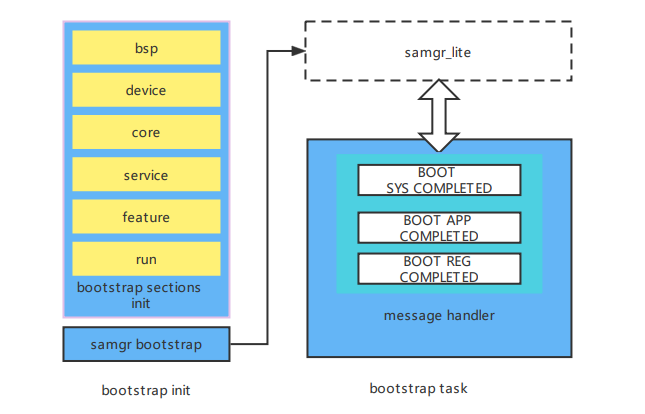

# bootstrap启动引导部件<a name="ZH-CN_TOPIC_0000001082300996"></a>
## 简介<a name="section469617221261"></a>

bootstrap启动引导组件，提供了各服务和功能的启动入口标识。在SAMGR启动时，会调用bootstrap标识的入口函数，并启动系统服务。

**图 1**  bootstrap启动引导组件框架图



## 目录<a name="section1464106163817"></a>

```
base/startup/bootstrap_lite/    # 启动引导组件
└── services
    └── source                  # 启动引导组件源文件目录
```

## 约束<a name="section12212842173518"></a>

目前支持轻量系统设备（参考内存≥128KB），如Hi3861V100。

## 使用说明<a name="section1483211215513"></a>

bootstrap组件无需单独配置，在SAMGR启动时会自动调用，用于启动系统服务。

## 相关仓<a name="section641143415335"></a>
**[startup\_bootstrap\_lite](https://gitee.com/openharmony/startup_bootstrap_lite)**

[startup\_init\_lite](https://gitee.com/openharmony/startup_init_lite)

[startup\_appspawn](https://gitee.com/openharmony/startup_appspawn)