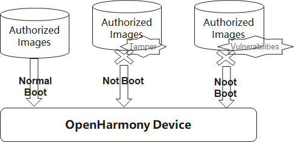

# OpenHarmony Verified Boot<a name="ZH-CN_TOPIC_0000001129033057"></a>

## Introduction<a name="section469617221261"></a>

Open**H**armony **V**erified **B**oot (HVB) component is used to verify and authenticate system images to make sure OpenHarmony is running system images:

- from authenticated sources
- without tampering
- can not roll back to old versions with vulnerabilities




HVB is composed of three modules as shown below：


- libhvb is the verifying utility library. It will be integrated by Bootloader to verify initial images, and integrated by init to verify system images.
- hvbtool is used to sign system images, it will be integrated by Building system.


## Directory Structure<a name="section15884114210197"></a>

The structure of the repository directory is as follows:

```
base/startup/hvb/
├── libhvb         # source code for libhvb module
└── tools          # source code for hvbtool module
```


##  Repositories Involved<a name="section641143415335"></a>

**[startup\_init\_lite](https://gitee.com/openharmony/startup_init_lite)**

