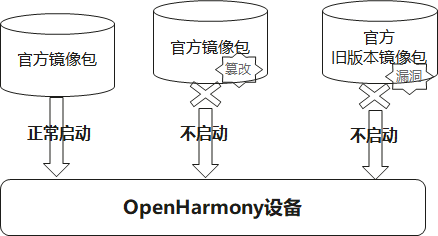
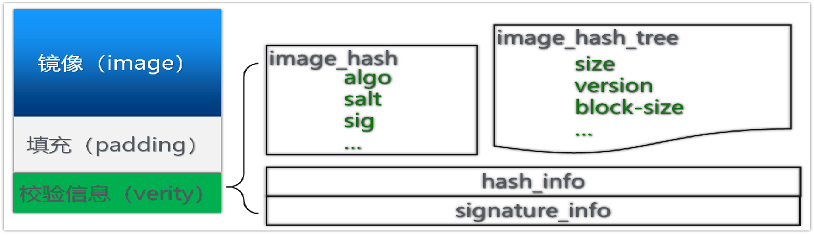
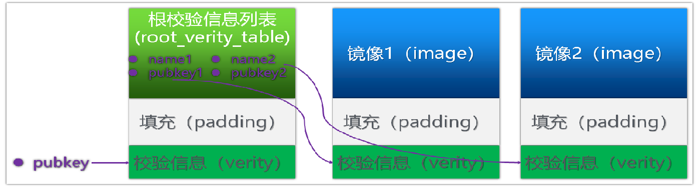
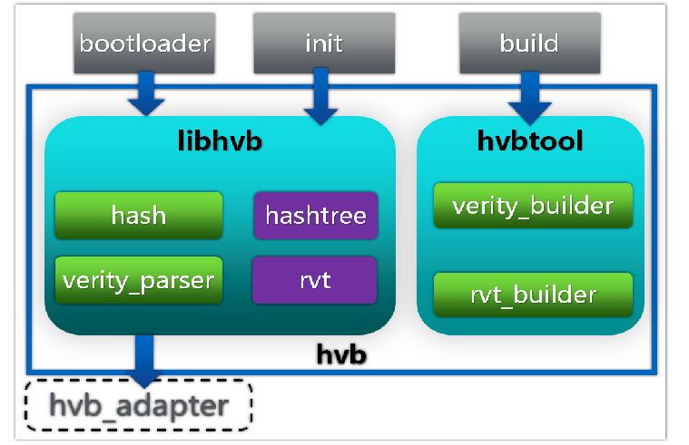
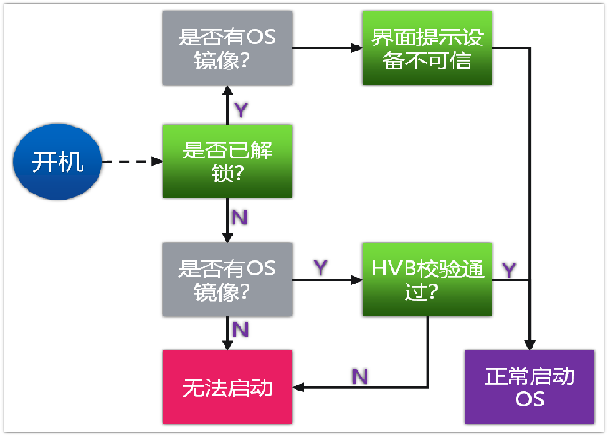

# 安全启动<a name="ZH-CN_TOPIC_0000001129033057"></a>

## 简介<a name="section469617221261"></a>

Open**H**armony **V**erified **B**oot (HVB)部件用于校验设备启动过程对系统镜像的完整性以及合法性；确保OpenHarmony设备启动的镜像包：

- 来源合法
- 不被篡改
- 无法回滚到有漏洞的历史版本



HVB安全启动使用到的基础安全算法包括以下两类：

- **完整性算法**

编译时为系统镜像计算完整性摘要数据，启动时执行相同的完整性算法计算出摘要进行对比，从而确定镜像的完整性。

- **签名算法**

通过对摘要信息进行签名校验，确保镜像的来源可信。此过程依赖设备OEM厂商在初始的bootloader启动时通过安全运行环境提供可行根，从而建立完整的信任链。

## 系统架构

### 基本概念

HVB主要用于校验系统镜像，根据镜像的类型分为整包校验和分块校验两种方式：

- 整包校验（hash）

整包校验适用于一次性加载的镜像，这种镜像只需要生成一个hash值即可，加载镜像时对整个镜像进行hash计算，与编译时的hash值进行对比确保完整性。

此校验方式的弊端是镜像过大时影响开机校验时间。

- 按需校验（hashtree）

按需校验适用于大的文件系统镜像包，由内核在访问存储块时进行完整性校验。由于是按存储块进行hash值计算的，因此需要在编译时构造哈希树（hashtree）加快校验速度。此方案可以不用在开机时对整个进行进行完整性校验，而只对hashtree进行校验，加快系统启动速度。

>  此方案依赖内核开启[dm-verity](https://www.kernel.org/doc/html/latest/admin-guide/device-mapper/verity.html)特性。

#### verity校验信息

为了实现安全启动，每个系统镜像都需要在末尾追加校验信息（verity），根据校验方式为两类，如下图所示：



verity校验信息主要包括

| **字段名称**   | **说明**                                                     |
| -------------- | ------------------------------------------------------------ |
| signature_info | verity信息的签名内容。verity签名内容可包含多份pubkey，signature值信息，以兼容老的bootloader产品。 |
| hash_info      | hash_info存放镜像的完整性信息，根据镜像校验类型可以是hash或hashtree信息。 |

#### Root Verity Table根校验信息列表

对于有多个镜像的系统，可以增加根校验信息列表（RVT, Root Verity Table）分区用于统一存放各个镜像verity信息的pubkey，如下图所示：



上游的bootloader只需要校验root_verity_table（**RVT**）的合法性，就可以通过该分区的pubkey列表逐个校验每个分区镜像的verity信息。

### 部件结构

如下图所示，HVB部件主要包括以下几个模块：



- libhvb是安全启动的校验库，工作在设备侧。该模块可供bootloader集成，完成初始的安全镜像校验；也会被系统init调用，完成dm-verity使能。
- hvbtool用于构造安全校验信息，由编译工具集成使用。


## 目录<a name="section15884114210197"></a>
仓目录结构如下：
```
base/startup/hvb/
├── libhvb         # libhvb模块代码
└── tools          # hvbtool工具代码
```


## 约束<a name="section12212842173518"></a>

目前仅支持标准系统设备。

## 说明<a name="section837771600"></a>

hvb特性的完整使能依赖以下几方面的适配：

### Bootloader适配

Bootloader中安全启动校验流程示例如下：



如上图所示，Bootloader中可判断：

- 设备是否解锁

Bootloader可通过可信的存储器来存放解锁标记。一般可通过可信信任根对解锁标记进行完整性校验，确保合法。

设备是否支持解锁以及解锁方式由厂商实现。

- 镜像是否可信

Bootloader通过可信根信息对RVT内容进行可信认证。同时，需要对镜像中的rollback_index进行安全存放；防止回滚到有安全漏洞的版本。


OEM厂商在Bootloader中可使用libhvb中的接口对单个镜像的verity信息进行校验；也可根据rvt信息对多个镜像的verity信息进行校验。

且需要适配[hvb_sysdeps.h](libhvb/include/hvb_sysdeps.h)中平台相关的函数。


Bootloader校验通过后，通过bootargs传递校验信息给内核，具体的参数定义如下：

| bootargs名称            | **说明**                                                     |
| ----------------------- | ------------------------------------------------------------ |
| ohos.boot.hvb.enable    | hvb使能开关：<br>false：不需要使能hvb<br>true：需使能HVB；使能时，bootloader需传递以下hvb详细参数： |
| ohos.boot.hvb.version   | 当前只支持1.0版本                                            |
| ohos.boot.hvb.hash_algo | 当前只支持sha256                                             |
| ohos.boot.hvb.digest    | HVB保护的所有用户态镜像以及RVT的verity信息摘要               |

[init](https://gitee.com/openharmony/startup_init_lite)部件启动时会根据上述参数使能内核dm-verity，从而实现对system.img等镜像的安全校验。

### Kernel适配

Kernel需要使能dm-verity功能，默认需要开启以下内核宏：

```shell
CONFIG_MD=y
CONFIG_BLK_DEV_DM_BUILTIN=y
CONFIG_BLK_DEV_DM=y
CONFIG_DM_BUFIO=y
CONFIG_DM_ZERO=y
CONFIG_DM_DELAY=m
CONFIG_DM_INIT=y
CONFIG_DM_UEVENT=y
CONFIG_DM_VERITY=y
CONFIG_DM_VERITY_VERIFY_ROOTHASH_SIG=y
CONFIG_DM_VERITY_FEC=y
```

### fstab适配

[init](https://gitee.com/openharmony/startup_init_lite)部件在挂载系统镜像时，会根据fstab配置的fs_mgr_flags选项决定哪些系统镜像需要使能hvb安全校验。如下所示，fs_mgr_flags添加上hvb表示该分区需要使能hvb安全校验：

```
#<src>                                                  <mnt_point> <type>   <mnt_flags and options>  <fs_mgr_flags>
/dev/block/platform/f8300000.ufs/by-name/system         /usr        ext4     ro,barrier=1             wait,required,hvb
```


## 相关仓<a name="section641143415335"></a>

**[startup\_init\_lite](https://gitee.com/openharmony/startup_init_lite)**

