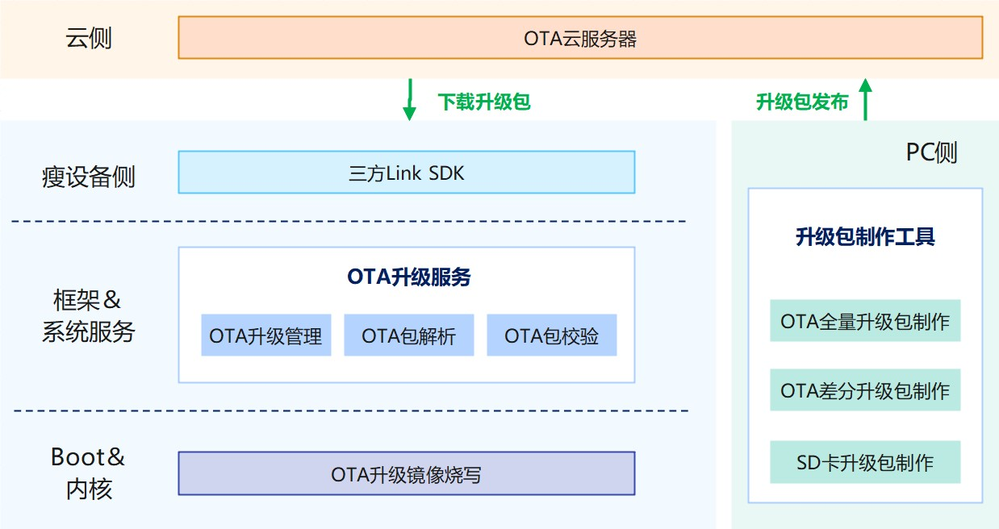

# OTA组件<a name="ZH-CN_TOPIC_0000001078451366"></a>

-   [简介](#section11660541593)
-   [目录](#section1464106163817)
-   [约束](#section1718733212019)
-   [说明](#section18867101215181)
    -   [使用说明](#section18867101215200)

-   [相关仓](#section68521336131912)

## 简介<a name="section11660541593"></a>

OTA（Over the Air）提供对设备远程升级能力，基于提供的接口进行二次开发后，可以让您的设备轻松支持OTA升级能力。升级子系统对用户屏蔽了底层芯片的差异，对外提供了统一的升级接口。

更多升级子系统相关概念，请参考：[升级子系统](https://gitee.com/openharmony/docs/blob/master/zh-cn/readme/%E5%8D%87%E7%BA%A7%E5%AD%90%E7%B3%BB%E7%BB%9F.md)

**图 1**  升级子系统架构图



## 目录<a name="section1464106163817"></a>

```
/base/update/sys_installer_lite
.
├── frameworks         # OTA升级实现，主要包括升级包解析验证、写入、升级的功能
│   ├── source         # updater组件代码存放目录
│   │   ├── updater    # updater组件代码目录
│   │   └── verify     # 效验算法代码目录
│   └── test           # 自测试代码存放目录
│       └── unittest   # 单元测试代码存放目录
├── hals               # 芯片适配层
└── interfaces         # 对外接口存放目录
    └── kits           # OTA升级接口
```

## 约束<a name="section1718733212019"></a>

升级子系统使用C语言编写，目前支持Hi3518EV300、Hi3516DV300、Hi3861开发板。如果您想接入其它芯片，通过实现vendor路径下的OpenHarmony集成接口，可以适配不同芯片的产品。目前仅支持全量包升级方式。

## 说明<a name="section18867101215181"></a>

### 使用说明<a name="section18867101215200"></a>

添加对升级子系统的依赖，以hi3516dv300开发板为例。

-   vendor\\hisilicon\\ipcamera\_hi3516dv300\_liteos\\config.json中添加update，在subsystem\_list字段下面添加：

    ```
    {
            "subsystem": "update",
            "components": [
              { "component": "hota", "features": [] }
            ]
     },
    ```


-   在build\\lite\\components下，添加update.json文件：

    ```
    "components": [
        {
          "component": "hota",
          "description": "",
          "optional": "false",
          "dirs": [
            "base/update/sys_installer_lite/frameworks",
            "base/update/sys_installer_lite/interfaces/kits"
          ],
          "targets": [
            "//base/update/sys_installer_lite/frameworks:sys_installer_lite"
          ],
      ......
    ```


-   添加测试代码，这里以test为例，将subsystem\_test加入到base\\update\\ota\_lite\\frameworks\\BUILD.gn中。

-   添加完上述的配置后，执行如下命令编译整个系统，烧录到3516芯片平台上即可体验OTA功能。

    ```
    hb set
    hb build
    ```


## 相关仓<a name="section68521336131912"></a>

[升级子系统](https://gitee.com/openharmony/docs/blob/master/zh-cn/readme/%E5%8D%87%E7%BA%A7%E5%AD%90%E7%B3%BB%E7%BB%9F.md)

[**update\_sys\_installer\_lite**](https://gitee.com/openharmony/update_sys_installer_lite)

[device\_hisilicon\_hardware](https://gitee.com/openharmony/device_hisilicon_hardware)

