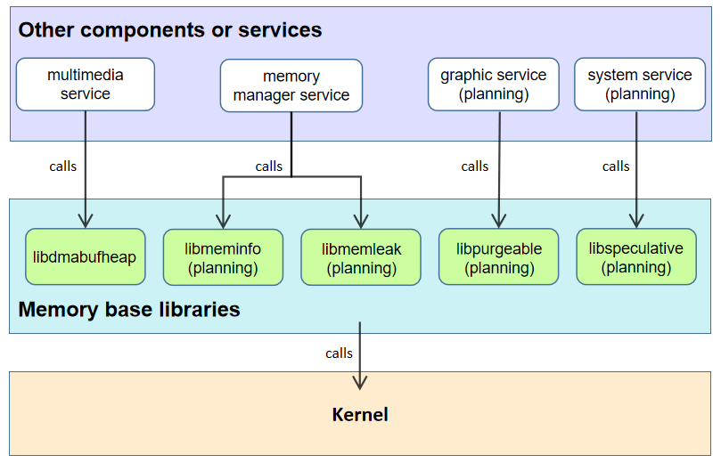

# The Part of Memory Base Libraries

-   [Introduction](#section_introduction)
-   [Architecture](#section_architecture)
-   [Directory Structure](#section_catalogue)
-   [Memory Base Libraries](#section_libraries)
    -   [libdmabufheap system library](#section_libdmabufheap)
    -   [libmeminfo system library (planning)](#section_libmeminfo)
    -   [libmemleak system library (planning)](#section_libmemleak)
    -   [libpurgeable system library](#section_libpurgeable)
    -   [libspeculative system library (planning)](#section_libspeculative)
-   [Usage Guidelines](#section_usage)
-   [Repositories Involved](#section_projects)

## Introduction<a name="section_introduction"></a>

The part of *Memory base libraries* belongs to the subsystem named *Utils Subsystem*. It provides the system library for upper-layer services to operate memory, ensuring the stability of upper-layer services.

## Architecture<a name="section_architecture"></a>

**Figure  1** Memory Base Libraries architecture



| Memory Base Libraries | User                  |
| -------------- | -------------------------- |
| libdmabufheap  | multimedia service      |
| libmeminfo     | memory manager service         |
| libmemleak     | memory manager service         |
| libpurgeable   | graphic service  |
| libspeculative | system service (planning) |

## Directory Structure<a name="section_catalogue"></a>

```
/utils/memory
├── libdmabufheap           # DMA (Direct Memory Access) memory allocation system library
│   ├── include             # DMA memory allocation system library header directory
│   ├── src                 # DMA memory allocation system library source directory
│   └── test                # DMA memory allocation system library usecase directory
├── libmeminfo              # Memory footprint management library
├── libmemleak              # Memory leak detection library
├── libpurgeable            # Purgeable memory management library
└── libspeculative          # Speculative memory management library
```

## Memory Base Libraries<a name="section_libraries"></a>

*Memory base libraries* is a component of the system library that integrates memory operations and manages them in a unified manner.

### libdmabufheap system library<a name="section_libdmabufheap"></a>

The memory system library provides interfaces for the multimedia service to allocate and share shared memory. By allocating and sharing memory between hardware devices and user space, zero-copy memory between devices and processes is implemented to improve execution efficiency.

### libmeminfo system library (planning)<a name="section_libmeminfo"></a>

It provides interfaces for memory usage queries. It is used for memory footprint query, low memory killing and other scenarios.

### libmemleak system library (planning)<a name="section_libmemleak"></a>

It cooperates with malloc_debug to detect memory leaks of native heap.

### libpurgeable system library<a name="section_libpurgeable"></a>

It provides a dedicated memory request interface for discardable type memory for multimedia related services. When the available memory of the system is insufficient, the purgeable memory is directly discarded by the system to achieve rapid memory recovery. When the application is used again, the purgeable memory that has been freed can be rebuilt.

### libspeculative system library (planning)<a name="section_libspeculative"></a>

It provides management interfaces for speculative-type memory. It is mainly used by system services for data pre-loading.

## Usage Guidelines<a name="section_usage"></a>

System developers can add or remove this part by configuring the product definition JSON file under **/productdefine/common/products** to enable or disable this part:

` "commonlibrary:memory_utils":{} `

## Repositories Involved<a name="section_projects"></a>

[utils](https://gitee.com/openharmony/utils)