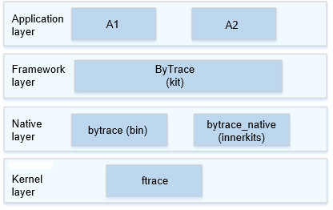

# ByTrace<a name="EN-US_TOPIC_0000001102209942"></a>

-   [Introduction](#section152771918494)
-   [Architecture](#section6808195518497)
-   [Directory Structure](#section1610792125019)
-   [Usage](#section18684185975017)
-   [Repositories Involved](#section1849151125618)

## Introduction<a name="section152771918494"></a>

ByTrace is a tool for you to trace processes and monitor performance. It encapsulates and extends the ftrace in the kernel and supports tracing in the user space. This tool provides APIs and commands:

1.  APIs: When developing an application, you can call ByTrace APIs in the application key code to perform tracing.
2.  Commands: You can enable the desired label to obtain the tracing information. With ByTrace, you can enable a user-space or kernel-space label you want to view (run the **bytrace -l** command to query all the supported labels) and run the corresponding commands to capture traces and dump them to a specified file.

## Architecture<a name="section6808195518497"></a>



## Directory Structure<a name="section1610792125019"></a>

```
/developtools/bytrace
├── bin           # ByTrace code
│   └── include   # Header files
│   └── src       # Source files
│   └── test      # Test cases
├── interfaces    # APIs
│   └── innerkits # Header files of internal subsystems
│   └── kits      # Header files exposed externally
├── script        # Scripts
```

## Usage<a name="section18684185975017"></a>

The following table lists the commands supported by ByTrace.

** Table 1** Commands supported by ByTrace

| Option | Description |
|---------|------------|
| -h, --help | Views the help Information. |
| -b n, --buffer_size n | Sets the size of the buffer (KB) for storing and reading traces. The default buffer size is 2048 KB. |
| -t n, --time n | Sets the ByTrace uptime in seconds, which depends on the time required for analysis. |
| --trace_clock clock | Sets the type of the clock for adding a timestamp to a trace, which can be boot (default), global, mono, uptime, or perf. |
| --trace_begin | Starts trace. |
| --trace_dump | Dumps traced data to a specified position (the default position is the console). |
| --trace_finish | Stops capturing traces and dumps traced data to a specified position (the default position is the console). |
| -l, --list_categories | Lists the ByTrace categories supported by the device. |
| --overwrite | Sets the action to take when the buffer is full. If this option is used, the latest traced data is discarded. |
| -o filename, --output filename | Outputs traced data to a specified file. |
| -z | Compresses traced data. |

The following are some example ByTrace commands:

-   Run the following command to query supported labels:

    ```
    bytrace -l
    ```

    or

    ```
    bytrace --list_categories
    ```


-   Run the following command to capture traces whose label is <strong>ability</strong>, with the buffer size set to 4096 KB and ByTrace uptime set to 10s:

    ```
    bytrace -b 4096 -t 10 --overwrite ability > /data/mytrace.ftrace
    ```


-   Run the following command to set the clock type for traces to <strong>mono</strong>:

    ```
    bytrace --trace_clock mono  -b 4096 -t 10 --overwrite ability > /data/mytrace.ftrace
    ```


-   Run the following command to compress the traced data:

    ```
    bytrace -z  -b 4096 -t 10 --overwrite ability > /data/mytrace.ftrace
    ```


## Repositories Involved<a name="section1849151125618"></a>

[Development Tools Subsystem](https://gitee.com/openharmony/docs/blob/master/en/readme/development-toolchain.md)

**developtools\_bytrace\_standard**
