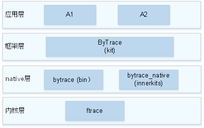

# bytrace组件<a name="ZH-CN_TOPIC_0000001102209942"></a>

-   [简介](#section152771918494)
-   [架构图](#section6808195518497)
-   [目录](#section1610792125019)
-   [说明](#section18684185975017)
-   [相关仓](#section1849151125618)

## 简介<a name="section152771918494"></a>

bytrace是开发人员用于追踪进程轨迹、查看性能的一种工具，主要对内核ftrace进行了封装和扩展，来支持用户态的打点。该工具主要分为两部分，API和命令行：

1.  bytrace向应用开发人员暴露了打点的API，开发应用过程中可以在关键代码处调用对应API进行打点；
2.  命令行部分通过使能对应的label，来获取打点信息。通过该工具可以打开想要查看的用户态和内核label（通过命令行“bytrace -l”，查看支持的所有label），然后通过命令行进行抓取trace信息到指定文件中，下文有具体使用指导。

## 架构图<a name="section6808195518497"></a>



## 目录<a name="section1610792125019"></a>

```
/developtools/bytrace
├── bin           # bytrace组件代码目录 
│   └── include   # 头文件目录
│   └── src       # 源文件目录
│   └── test      # 测试用例目录
├── interfaces    # 对外接口存放目录
│   └── innerkits # 对内部子系统暴露的头文件存放目录
│   └── kits      # 对外部暴露的头文件存放目录
├── script        # 脚本目录
```

## 说明<a name="section18684185975017"></a>

使用说明

bytrace当前支持如下命令：

**表 1**  命令行列表

| Option | Description |
|--------|------------|
| -h，--help | 查看option帮助 |
| -b n，--buffer_size n | 指定n(KB)内存大小用于存取trace日志，默认2048KB |
| -t n，--time n | 用来指定trace运行的时间（单位：s），取决于需要分析过程的时间 |
| --trace_clock clock | trace输出的时钟类型，一般设备支持boot、global、mono、uptime、perf等，默认为boot |
| --trace_begin | 启动抓trace |
| --trace_dump | 将数据输出到指定位置（默认控制台） |
| --trace_finish | 停止抓trace，并将数据输出到指定位置（默认控制台） |
| -l，--list_categories | 输出手机能支持的trace模块 |
| --overwrite | 当缓冲区满的时候，将丢弃最新的信息。（默认丢弃最老的日志） |
| -o filename，--output filename | 指定输出的目标文件名称 |
| -z | 抓取trace后进行压缩 |

以下是常用bytrace命令示例，供开发者参考：

-   查询支持的label。

    ```
    bytrace -l
    ```

    或者

    ```
    bytrace --list_categories
    ```


-   设置4M缓存，抓取10秒，抓取label为ability的trace信息。

    ```
    bytrace -b 4096 -t 10 --overwrite ability > /data/mytrace.ftrace
    ```


-   设置trace的输出时钟为mono。

    ```
    bytrace --trace_clock mono  -b 4096 -t 10 --overwrite ability > /data/mytrace.ftrace
    ```


-   抓取trace后进行压缩。

    ```
    bytrace -z  -b 4096 -t 10 --overwrite ability > /data/mytrace.ftrace
    ```


## 相关仓<a name="section1849151125618"></a>

[研发工具链子系统](https://gitee.com/openharmony/docs/blob/master/zh-cn/readme/%E7%A0%94%E5%8F%91%E5%B7%A5%E5%85%B7%E9%93%BE%E5%AD%90%E7%B3%BB%E7%BB%9F.md)

**developtools\_bytrace\_standard**

