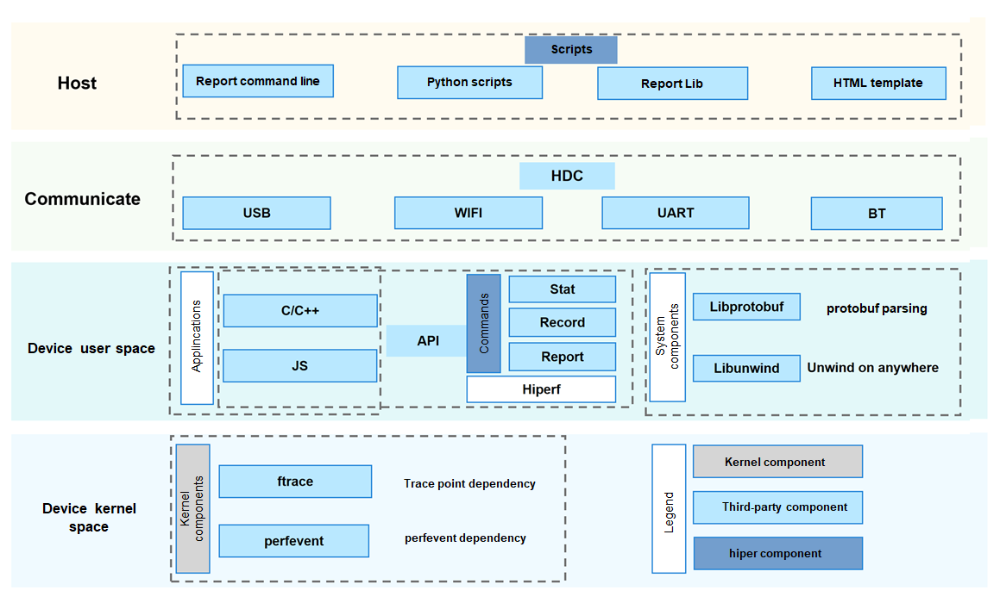
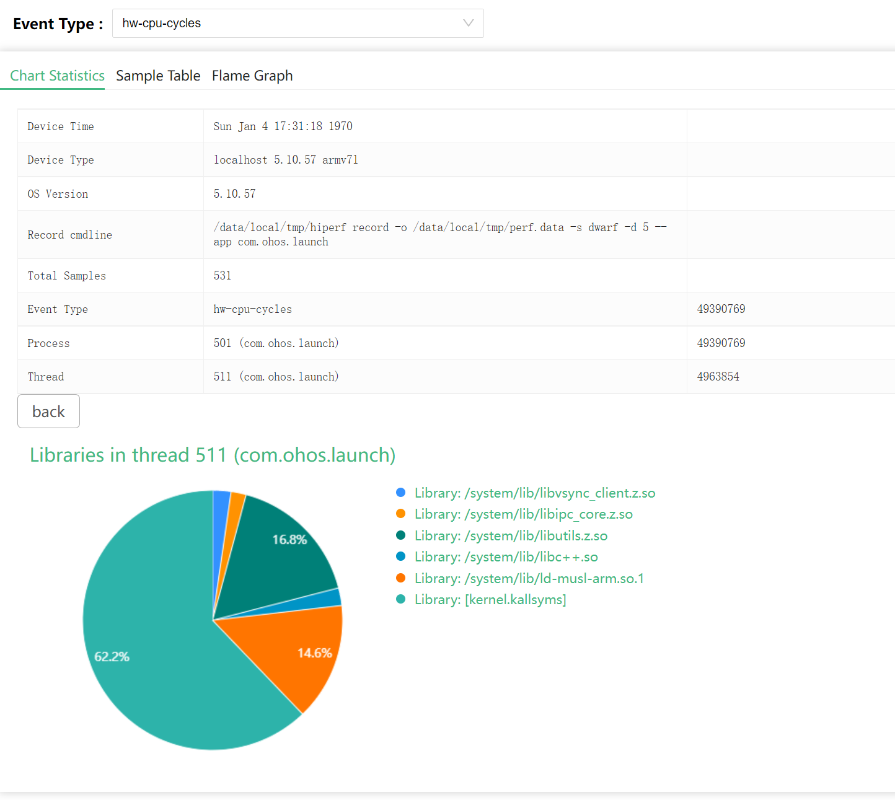
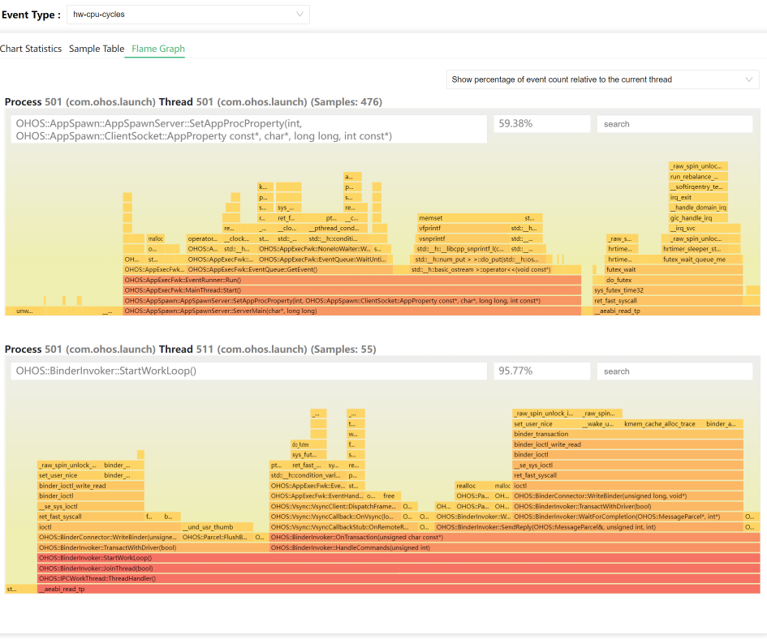

# hiperf


## Introduction

hiperf is a command-line debugging tool provided by OpenHarmony for developers. It can capture performance data of a specific program or the entire system, like the kernel's perf tool. hiperf can run on Windows, Linux, and macOS.

### Architecture



## Directory Structure

```
/developtools/hiperf
├── demo			# Demo program
│   ├── cpp			# C++ demo program, which demonstrates how to invoke APIs to simulate sampling scenarios.
│   └── js			# JS demo program, which demonstrates how to invoke APIs.
├── include			# Project header files.
│   └── nonlinux	# Header file for cross compilation (non-Linux platform)
├── interfaces		# APIs
│   ├── innerkits	# C APIs.
│   └── kits		# JS APIs
├── proto		    # Definition of the data structure exported to proto by the report command
├── script			# Host scripts, including HTML
│   └── test		# Unit test of the script
├── src				# Source code
└── test			# Unit test of the source code

```

## Constraints

hiperf must be used with Python 3.7.0 or later.

| Dependency | Version |
| -------- | ----- |
| Python   | 3.7.0 |
|          |       |


## Building

#### Basic Settings

- Ensure that the hiperf component name is in the JSON file of the Product Definition.
  - [Product Definition](https://gitee.com/openharmony/productdefine_common)
    - Add `"developtools:hiperf":{}`.


#### Build Commands

|Description |Parameter |
| -------------------------------------- | ----------------------------------- |
| Build only the binary executable files of the current device platform.    | --build-target hiperf_target        |
| Build all components (including unit tests) of all platforms. | --build-target hiperf_all           |
| Build the tool for x86_64 Linux.     | --gn-args "hiperf_target_host=true" |
| Build the unit test. | --build-target hiperf_unittest |
| Build the unit test interface (command line).     | --build-target hiperf_interfacetest |


#### Output ####

| Build Target | Running Platform | File Location | File Name |
| ----------------- | -------- | ----------------------------------------------------- | -------------------- |
| Dev command-line program  | arm      | out\ohos-arm-release\developtools\hiperf\hiperf       | hiperf               |
|                   | linux    | out\ohos-arm-release\clang_x64\developtools\hiperf    | hiperf               |
| Host command-line program | Linux    | out\ohos-arm-release\clang_x64\developtools\hiperf    | hiperf_host          |
|                   | Windows  | out\ohos-arm-release\mingw_x86_64\developtools\hiperf | hiperf_host.exe      |
| Dynamic library of the host | Linux | out\ohos-arm-release\clang_x64\developtools\hiperf | libhiperf_report.so |
|                   | Windows  | out\ohos-arm-release\mingw_x86_64\developtools\hiperf | libhiperf_report.dll |

You can also run **developtools/hiperf/script/package.sh** after the build to package the files to the **out** folder.

```
host/
└── developtools
    ├── hiperf
    │   ├── bin								  # All binary files
    │   │   ├── linux						   # Linux platform
    │   │   │   └── x86_64
    │   │   │       ├── hiperf_host				# Executable program run by the PC. The Report and Dump commands are supported.
    │   │   │       └── libhiperf_report.so		# Lib file run by the PC. It is used by the python script.
    │   │   ├── ohos
    │   │   │   └── arm						   # Arm platform
    │   │   │       └── hiperf				    # Executable program run by the board
    │   │   └── windows						   # Windows
    │   │       └── x86_64
    │   │           ├── hiperf_host.exe			# Executable program run by the PC
    │   │           └── libhiperf_report.dll	# Lib file run by the PC
    │   │
    │   │									  # Python files run by the PC
    │   ├── command_script.py					# Script of the hiperf commands, used to generate sampling data
    │   ├── hiperf_utils.py						# Utility class of hiperf
    │   ├── loadlib_test.py						# Lib test script
    │   ├── make_diff.py						# Script used to generate Diff data
    │   ├── make_report.py						# Script used to generate a report from the sampled data
    │   ├── recv_binary_cache.py				# Script used to collect the symbol table
    │   └── report.html						    # Template of the HTML display page
    └── hiperf.tar.gz						    # Package of the preceding files

```


#### hiperf with Debug Symbols

Find **exe.unstripped** and **lib.unstripped** in the **out** directory. For example:

out\ohos-arm-release\clang_x64\exe.unstripped\clang_x64\developtools\hiperf


## Usage

### Test Code

Test code is provided in **hiperf_example_cmd.cpp** to verify sampling functions of thread scheduling, memory allocation, and CPU load.

The code is located in:

```
hiperf\demo\cpp\hiperf_example_cmd.cpp
```

Help information about the test command:

```
 ./hiperf_example_cmd --help
this is a demo test command
  Use the following commands to simulate different scenarios
  --help
    this page
  --thread <number>
    setup the thread number, default is 5 second
  --time <time>
    setup run sec, default is 10 second
  --stack <level>
    setup stack level, default is 5
  --nowait
    setup skip the start, default wait the start
  --dynamic
    will run some code in each stack level
  --mmap
    will run mmap code in the loop
```


### Main Command Format

```
hiperf [options] COMMAND [args for command]
```


- [options]
  - Optional parameter.
  - Debugging commands, such as enabling the logging function.
- COMMAND
  - Mandatory parameter.
  - Name of a sub-function, for example, **record** or **report**.
- [args for command]
  - Parameters of the sub-function

### help

You can run the **--help** command to view help information.

```
--help [command]

[command] --help
```

Both formats are supported.

### Parameters

| Parameter                           | Description                        |
| ------------------------------- | -------------------------------- |
| --help [command]                | Displays the help information about the specified function.          |
| --debug                         | Enables the debug logs of the DEBUG level.       |
| --verbose                       | Enables the debug logs of the VERBOSE level.     |
| --much                          | Enables the debug logs of the MUCH level.        |
| --mixlog                        | Displays mixed debug logs to the screen (stdout).|
| --logtag <tagA [,tagB] [,tagC]> | Enables the debug logs of the MUCH level for the specified module.|
| --hilog                         | Prints logs to Hilog.               |
| --logpath                       | Specifies the log path.              |
| --nodebug                       | Stop printing any logs.                |

### list

The **list** command lists all the perf events supported by the performance monitoring unit (PMU).

The event names are used for the **-e** and **-g** parameters of the **stat** and **record** commands.

```
Usage: hiperf list [event type name]
```

List the hardware events supported by the PMU. The command also lists the events that are not supported by the PMU.

```
./hiperf list hw
```

### stat

The **stat** command monitors the specified application and periodically prints the values of performance counters.

```
Usage: hiperf stat [options] [command [command-args]]
       Collect performance counter information of running [command].
```

Monitor the performance counter of the process on CPU 0 for 3 seconds.

```
 ./hiperf stat -d 3 -c 0
```

### record

The **record** command samples the specified application and saves the sampling data to a file (**perf.data** by default).

```
Usage: hiperf record [options] [command [command-args]]
       Collect performance sampling information of running [command].
```

Sample all processes in the system for 3 seconds and display detailed log information.

```
	./hiperf record -d 3 -a --verbose
```

### dump

The **dump** command reads the **perf.data** file without processing it.

You can verify the correctness of the raw sampling data.

```
Usage:hiperf dump [option] \<filename\>
       Dump specific parts of specified file.
```

### report

The **report** command displays the sampling data (read from **perf.data**) and converts it to the required format (for example, JSON or ProtoBuf).

```
Usage: hiperf dump [option] \<filename\>
       Dump specific parts of specified file .
```

Output a common report, with the minimum display percentage of 1%.

```
./hiperf report --limit-percent 1
```

### Scripts

Run scripts to perform sampling operations (which can easily generate HTML reports).

##### Sampling

Run **command_script.py** to sample data. This script is the packaging script of the **report** command.

```
Usage: command_script.py [-h]
                         (-app PACKAGE_NAME | -lp LOCAL_PROGRAM | -cmd CMD | -p [PID [PID ...]] | -t [TID [TID ...]] | -sw)
                         [-a ABILITY] [-r RECORD_OPTIONS] [-lib LOCAL_LIB_DIR]
                         [-o OUTPUT_PERF_DATA] [--not_hdc_root]

Collect performance sampling information of running [command].
```

Sample the **com.ohos.launch** package.

```
python command_script.py -app com.ohos.launch
```

Sample the hdcd process.

```
python command_script.py -lp hdcd
```

##### Collecting Symbol Tables

Run **recv_binary_cache.py** to collect symbol tables. The tool searches for the ELF in the specified paths based on the related files and libraries recorded in **perf.data** and their **buildid**s.

```
Usage: recv_binary_cache.py [-h] [-i PERF_DATA]
                            [-l LOCAL_LIB_DIR [LOCAL_LIB_DIR ...]]

Recv binaries needed by perf.data from device to binary_cache directory.
```

The following specifies two symbol table paths.

```
python recv_binary_cache.py -l Z:\OHOS_MASTER\out\ohos-arm-release\lib.unstripped  Z:\OHOS_MASTER\out\ohos-arm-release\exe.unstripped
```

The symbol table files will be copied to the **binary_cache** folder.

The tool preferentially searches for the specified symbol table paths. If no path is specified, the tool copies the files in the device.

##### Displaying Sampled Data

Run **make_report.py** to display the sampled data in an HTML page.

```
Usage: make_report.py [-h] [-i PERF_DATA] [-r REPORT_HTML]

To make a report, you need to enter the data source and the path of the
report.
```

An HTML file is generated. The default file name is **hiperf_report.html**.

```
python make_report.py
```

- Displaying the home page



- Displaying the flame graph.



## Troubleshooting

#### Can't find hdc_std in PATH environment.

```
python command_script.py -lp ps
['../..\\..\\platform-tools\\hdc', 'version']
['hdc', 'version']
Traceback (most recent call last):
  File "command_script.py", line 367, in <module>
    main(parser_add_argument())
  File "command_script.py", line 361, in main
    profiler = PerformanceProfile(args)
  File "command_script.py", line 143, in __init__
    self.hdc = HdcInterface(root_authority=not args.not_hdc_root)
  File "Z:\OHOS_MASTER\out\host\developtools\hiperf\hiperf_utils.py", line 173, in __init__
    raise Exception("Can't find hdc in PATH environment.")
Exception: Can't find hdc_std in PATH environment.
```

Check whether the **PATH** environment variable contains the hdc executable file.

Run the following commands:

```
where hdc_std
Z:\OHOS_MASTER\developtools\hdc_standard\prebuilt\windows\hdc_std.exe
Z:\OHOS_STD_2.0\developtools\hdc_standard\prebuilt\windows\hdc_std.exe
```


## Repositories Involved

Development Toolchain Subsystem

[**developtools\hiperf**](https://gitee.com/openharmony/developtools_hiperf)

[developtools\developtools_profiler](https://gitee.com/openharmony/developtools_profiler)

[developtools\developtools_bytrace_standard](https://gitee.com/openharmony/developtools_bytrace_standard/)

[third_party\libunwind](https://gitee.com/openharmony/third_party_libunwind)

[third_party\protobuf](https://gitee.com/openharmony/third_party_protobuf)
