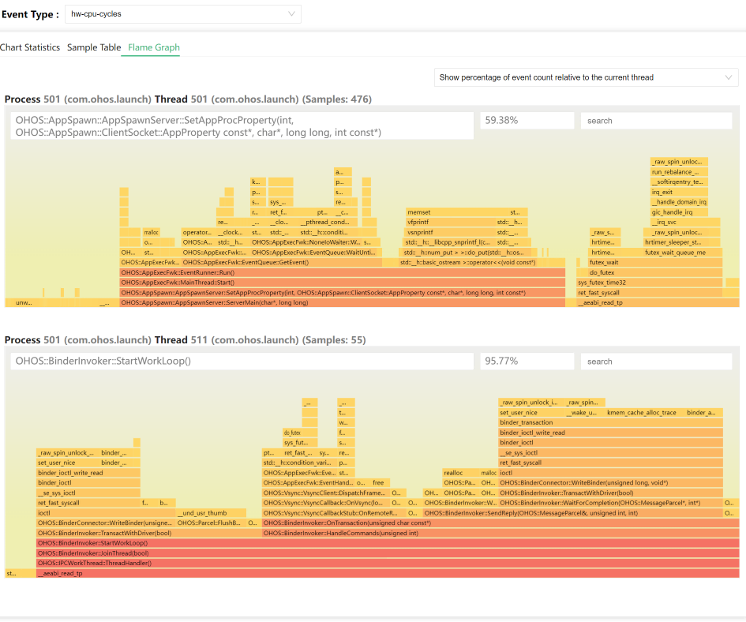

# hiperf 应用性能优化剖析组件

-   [简介](#简介)
    -   [架构](#架构)

-   [约束](#约束)
-   [编译构建](编译构建)
-   [目录](#目录)
    -   [使用说明](#使用说明)
    -   [接口说明](#接口说明)
-   [相关仓](相关仓)

## 简介

hiperf 是 OpenHarmony 为开发人员提供的用于调试的命令行工具，用于抓取特定程序或者系统的性能数据,类似内核的 perf  工具，该工具支持在 Windows/Linux/Mac 等操作系统上运行。

### 架构


## 目录

```
/developtools/hiperf
├── demo			# demo 程序
│   ├── cpp			# C++ demo 程序,示范了如何调用API和模拟的采样场景
│   └── js			# JS demo 程序,示范了如何调用API
├── include			# 工程的头文件
│   └── nonlinux	# 交叉编译的头文件(非linux平台)
├── interfaces		# 接口忘记
│   ├── innerkits	# C++ API 接口
│   └── kits		# JS API 接口
├── proto			# report 命令导出到proto的数据结构定义
├── script			# Host 脚本,包括 HTML
│   └── test		# 脚本的单元测试
├── src				# 源代码文件夹
└── test			# 源代码的单元测试

```

## 约束

运行环境条件约束如下

| 依赖组件 | 版本  |
| -------- | ----- |
| Python   | 3.7.0 |
|          |       |


## 编译构建

#### 基础配置

- 确保组件名在于产品形态配置的 json 中
  - [产品形态配置](https://gitee.com/openharmony/productdefine_common)
    - 加入 `"developtools:hiperf":{}` 即可


#### 编译命令

| 编译说明                               | 编译参数                            |
| -------------------------------------- | ----------------------------------- |
| 只编译当前设备平台的二进制执行文件     | --build-target hiperf_target        |
| 编译所有的平台的所有组件(包括单元测试) | --build-target hiperf_all           |
| 编译目标为 x86_64 Linux 平台的工具     | --gn-args "hiperf_target_host=true" |
| 编译单元测试                           | --build-target hiperf_unittest      |
| 编译单元测试的接口部分(命令行部分)     | --build-target hiperf_interfacetest |


#### 编译输出 ####

| 编译目标          | 运行平台 | 文件位置                                              | 文件名               |
| ----------------- | -------- | ----------------------------------------------------- | -------------------- |
| Dev 端命令行程序  | arm      | out\ohos-arm-release\developtools\hiperf\hiperf       | hiperf               |
|                   | linux    | out\ohos-arm-release\clang_x64\developtools\hiperf    | hiperf               |
| Host 端命令行程序 | linux    | out\ohos-arm-release\clang_x64\developtools\hiperf    | hiperf_host          |
|                   | windows  | out\ohos-arm-release\mingw_x86_64\developtools\hiperf | hiperf_host.exe      |
| Host 端动态库     | linux    | out\ohos-arm-release\clang_x64\developtools\hiperf    | libhiperf_report.so  |
|                   | windows  | out\ohos-arm-release\mingw_x86_64\developtools\hiperf | libhiperf_report.dll |

也可以在编译完成后

运行 developtools/hiperf/script/package.sh 打包到out文件夹中

```
host/
└── developtools
    ├── hiperf
    │   ├── bin									# 所有的二进制文件
    │   │   ├── linux							# linux 平台
    │   │   │   └── x86_64
    │   │   │       ├── hiperf_host				# PC运行的执行程序,支持Report和Dump命令
    │   │   │       └── libhiperf_report.so		# PC运行的LIB文件,供python脚本使用
    │   │   ├── ohos
    │   │   │   └── arm							# arm 平台
    │   │   │       └── hiperf					# 板端执行程序
    │   │   └── windows							# windows 平台
    │   │       └── x86_64
    │   │           ├── hiperf_host.exe			# PC运行的执行程序
    │   │           └── libhiperf_report.dll	# PC运行的LIB文件
    │   │
    │   │										# 下面都是python文件,在PC侧执行
    │   ├── command_script.py					# hiperf 命令行的包装脚本,产生采样数据
    │   ├── hiperf_utils.py						# 脚本自己的工具类
    │   ├── loadlib_test.py						# lib 测试脚本
    │   ├── make_diff.py						# 产生Diff数据的脚本
    │   ├── make_report.py						# 从采样数据产生报告的脚本
    │   ├── recv_binary_cache.py				# 收集符号表的脚本
    │   └── report.html							# HTML 展示页面的模板
    └── hiperf.tar.gz							# 上述文件的打包文件

```


#### 带调试符号的版本

- 在对应的平台out里面找 exe.unstripped 和 lib.unstripped,例如:

  - out\ohos-arm-release\clang_x64\exe.unstripped\clang_x64\developtools\hiperf


## 使用说明

### 测试代码

我们在 hiperf_example_cmd.cpp 里面提供了一些测试代码，

用来验证一些采样功能，比如线程调度，内存申请，CPU 负荷等等。

代码位于 

```
hiperf\demo\cpp\hiperf_example_cmd.cpp
```

测试命令帮助

```
 ./hiperf_example_cmd --help
this is a demo test command
  Use the following commands to simulate different scenarios
  --help
    this page
  --thread <number>
    setup the thread number, default is 5 second
  --time <time>
    setup run sec, default is 10 second
  --stack <level>
    setup stack level, default is 5
  --nowait
    setup skip the start, default wait the start
  --dynamic
    will run some code in each stack level
  --mmap
    will run mmap code in the loop
```


### 主要的命令格式

```
hiperf [options] COMMAND [args for command]
```


- [options]
  - 可选的参数
  - 主要是一些调试命令,如打开log等
- COMMAND
  - 必选参数
  - 子功能的名字,如recrod,report 等等
- [args for command]
  - 子功能的参数

### 帮助命令

可以用 --help 查看帮助

```
--help [command]

[command] --help
```

以上两种格式都是可以的

### 主命令参数

| 参数                            | 功能说明                         |
| ------------------------------- | -------------------------------- |
| --help [command]                | 显示指定功能的帮助信息           |
| --debug                         | 打开 DEBUG 级别的调试日志        |
| --verbose                       | 打开 VERBOSE 级别的调试日志      |
| --much                          | 打开 MUCH 级别的调试日志         |
| --mixlog                        | 混合调试日志输出到屏幕上(stdout) |
| --logtag <tagA [,tagB] [,tagC]> | 打开指定模块的MUCH级别的调试日志 |
| --hilog                         | 日志打印到Hilog中                |
| --logpath                       | 指定日志保存的路径               |
| --nodebug                       | 停止打印任何日志                 |

### list 命令

列出设备上支持的所有事件名称

事件名称用于 stat 和 record 的 -e 和 -g 参数

```
Usage: hiperf list [event type name]
```

下面列出了设备支持的HW事件,并且会提示哪些事件此设备不支持

```
./hiperf list hw
```

### stat 命令

监听指定目标程序，周期性打印性能计数器的值

```
Usage: hiperf stat [options] [command [command-args]]
       Collect performance counter information of running [command].
```

下面展示了一个 stats 监听本进程 在 CPU 0 上 3 秒的性能计数器命令

```
 ./hiperf stat -d 3 -c 0
```

### record 命令

采样指定目标程序,并且将采样数据保存到指定的文件中(默认为perf.data)

```
Usage: hiperf record [options] [command [command-args]]
       Collect performance sampling information of running [command].
```

对全系统所有进程采样3秒，并且显示详细的信息

```
./hiperf record -d 3 -a --verbose
```

### dump 命令

此命令主要用于以不加以处理的方式直接读取perf.data的数据

开发和测试人员可以核对其中的原始采样数据的正确性。

```
Usage: hiperf dump [option] \<filename\>
       Dump specific parts of specified file .
```

### report 命令

此命令主要用于展示相关采样数据（从perf.data中读取）

并且转换为用户需要的格式（比如Json或者ProtoBuf）

```
Usage: hiperf dump [option] \<filename\>
       Dump specific parts of specified file .
```

范例输出普通报告的命令，限制为占比不超过1%

```
./hiperf report --limit-percent 1
```

### 脚本

一般用户用脚本执行采样操作（因为可以简单的产生HTML报告）

##### 采样

由 command_script.py 完成，他是 report 命令的包装脚本

```
usage: command_script.py [-h]
                         (-app PACKAGE_NAME | -lp LOCAL_PROGRAM | -cmd CMD | -p [PID [PID ...]] | -t [TID [TID ...]] | -sw)
                         [-a ABILITY] [-r RECORD_OPTIONS] [-lib LOCAL_LIB_DIR]
                         [-o OUTPUT_PERF_DATA] [--not_hdc_root]

Collect performance sampling information of running [command].
```

对指定包名采样，包名是 com.ohos.launch

```
python command_script.py -app com.ohos.launch
```

对特定进程采样，进程名称是 hdcd

```
python command_script.py -lp hdcd
```

##### 收集符号表

由 recv_binary_cache.py 完成，他主要根据 perf.data 里面记录的相关文件和库，以及它们的 buildid 在用户指定的路径中去寻找对应的 ELF 作为符号表文件用于回栈或者打印函数名等。

```
usage: recv_binary_cache.py [-h] [-i PERF_DATA]
                            [-l LOCAL_LIB_DIR [LOCAL_LIB_DIR ...]]

Recv binaries needed by perf.data from device to binary_cache directory.
```

指定了2个符号表路径的位置

```
python recv_binary_cache.py -l Z:\OHOS_MASTER\out\ohos-arm-release\lib.unstripped  Z:\OHOS_MASTER\out\ohos-arm-release\exe.unstripped
```

对应的符号表文件会复制到 binary_cache 文件夹里面

优先检查用户给出的符号表位置，如果没有则复制设备中的文件

##### 展示

由 make_report.py 完成，将采样后的数据导出为HTML展示页面

```
usage: make_report.py [-h] [-i PERF_DATA] [-r REPORT_HTML]

To make a report, you need to enter the data source and the path of the
report.
```

产生HTML文件，默认的文件名是 hiperf_report.html

```
python make_report.py
```

- 展示页面首页


- 展示页面火焰图



## 常见故障说明

#### Can't find hdc_std in PATH environment.

```
python command_script.py -lp ps
['../..\\..\\platform-tools\\hdc', 'version']
['hdc', 'version']
Traceback (most recent call last):
  File "command_script.py", line 367, in <module>
    main(parser_add_argument())
  File "command_script.py", line 361, in main
    profiler = PerformanceProfile(args)
  File "command_script.py", line 143, in __init__
    self.hdc = HdcInterface(root_authority=not args.not_hdc_root)
  File "Z:\OHOS_MASTER\out\host\developtools\hiperf\hiperf_utils.py", line 173, in __init__
    raise Exception("Can't find hdc in PATH environment.")
Exception: Can't find hdc_std in PATH environment.
```

请确认 PATH 环境变量中有 hdc 的执行文件

确认方法

```
where hdc_std
Z:\OHOS_MASTER\developtools\hdc_standard\prebuilt\windows\hdc_std.exe
Z:\OHOS_STD_2.0\developtools\hdc_standard\prebuilt\windows\hdc_std.exe
```


## 相关仓

研发工具链子系统

[**developtools\hiperf**](https://gitee.com/openharmony/developtools_hiperf)

[developtools\developtools_profiler](https://gitee.com/openharmony/developtools_profiler)

[developtools\developtools_bytrace_standard](https://gitee.com/openharmony/developtools_bytrace_standard/)

[third_party\libunwind](https://gitee.com/openharmony/third_party_libunwind)

[third_party\protobuf](https://gitee.com/openharmony/third_party_protobuf)
