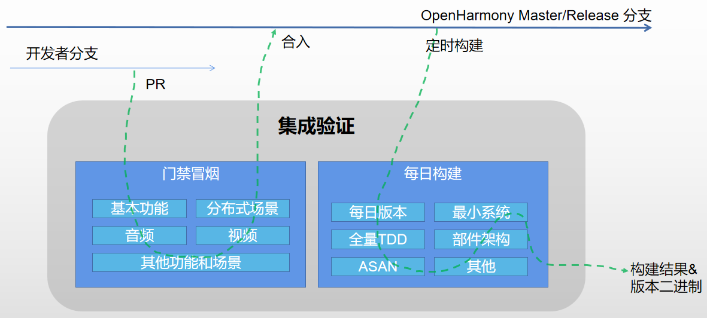

# 集成验证部件

## 简介
集成验证包含门禁冒烟和每日构建两个功能：
- 门禁冒烟对开发者的提交进行基本功能、部件功能和按场景的端到端测试；
- 每日构建定时取master和release分支代码进行版本归档、全量TDD测试、最小系统测试和部件化的架构看护检查。

**图1** 集成验证架构图



## 目录

```undefined
/developtools/integration_verification
├── cases                       # 用例
│   ├── daily                   # 每日构建
│   │   └── mini_system         # 最小系统测试
│   └── smoke                   # 门禁冒烟
│       ├── audio               # 音频用例
│       ├── basic               # 基础功能用例
│       │   ├── screenshot32
│       │   └── screenshot64
│       ├── distributed         # 分布式场景端到端用例
│       └── video               # 视频用例
├── test                        # 自测试用例
└── tools                       # 公共工具集
    └── rom_ram_analyzer        # ROM/RAM分析工具
```

## 说明

### 使用说明
#### 关联仓和冒烟用例
当新建仓或仓对应系统功能发生变化时，通常需要在门禁中添加和修改冒烟用例的关联。关联关系通过cases/smoke/repo_cases_matrix.csv文件配置，文件第一列为仓名，从第二列为部件名称，第三列开始为不同形态的开发板（包括虚拟开发板），仓与开发板的交集中填写测试用例名称。示例如下：

| repoistory | bundle     | board1                | board2                | ...  |
| ---------- | ---------- | --------------------- | --------------------- | ---- |
| repo1      | component1 | test_case1            | test_case1;test_case2 | ...  |
| repo2      | component2 | test_case1;test_case2 | test_case1            | ...  |

一般一个测试用例对应一个可执行文件，在门禁构建时产生和烧录设备。

## 相关仓

[**developtools\_integration\_verification**](https://gitee.com/openharmony/developtools_integration_verification/blob/master/README_zh.md)