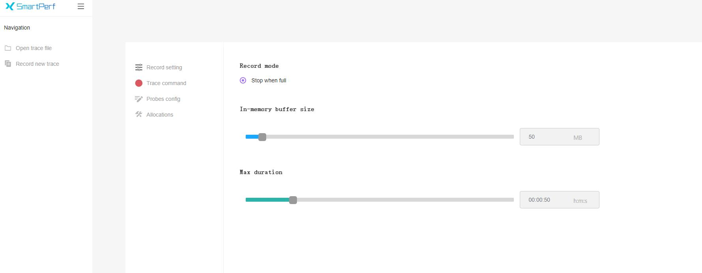
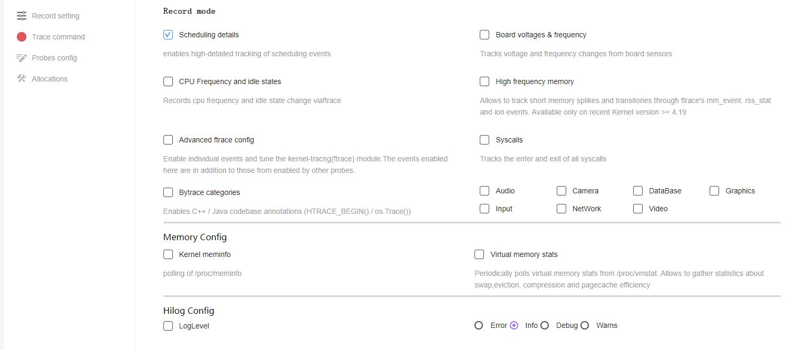
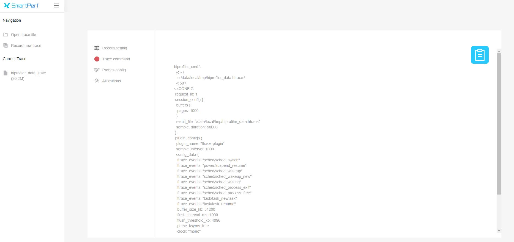
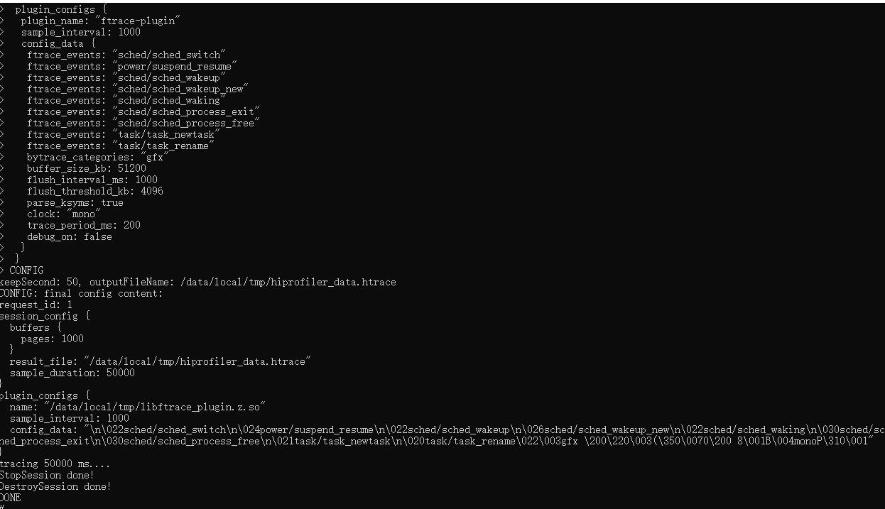
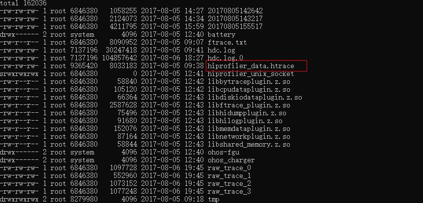

# 1.hiprofiler_cmd 使用说明
## 1.1参数说明
 执行hiprofiler_cmd 为调优业务的离线命令行抓取工具，具体使用方法及命令行参数介绍如下。

可以使用`-h`或者`--help`参数查看命令的使用描述信息：

```sh
# ./hiprofiler_cmd -h
help :
  --getport        -q     : get grpc address
  --config         -c     : start trace by config file
  --time           -t     : trace time
  --out            -o     : output file name
  --help           -h     : make some help
```

其余参数使用说明如下：
* `-q`或者`--getport`选项，用于查询服务的端口信息；
* `-c`或者`--config`选项，用于指定配置文件；
* `-t`或者`--time`选项，用于指定抓取时间，单位是秒；
* `-o`或者`--out`选项，用于指定输出的离线数据文件名；
* `-h`或者`--help`选项，用于输出帮助信息；

# 2.使用具体场景

说明：
* Record setting:设置trace的抓取模式，buffer size大小，抓取时长
* Trace command:生成的抓取命令行
* Probes config:trace的抓取参数配置
* Allocations:Nativehook的抓取参数配置
## 2.1命令行的生成和trace文件的抓取
点击Probes config，如选择抓取Scheduling details,再点击Record setting，设置buffer size大小，抓取时长

如下图，就会根据上面的配置生成抓取命令,点击复制按钮，会将命令行复制

进入设备，在执行命令前，需要手动拉起hiprofilerd，hiprofiler_plugins，如果要抓取nativehook数据，还要手动拉起native_daemon，进程都拉起后执行命令

执行完成后，进入指定目录查看，如/data/local/tmp下就会生成trace文件
