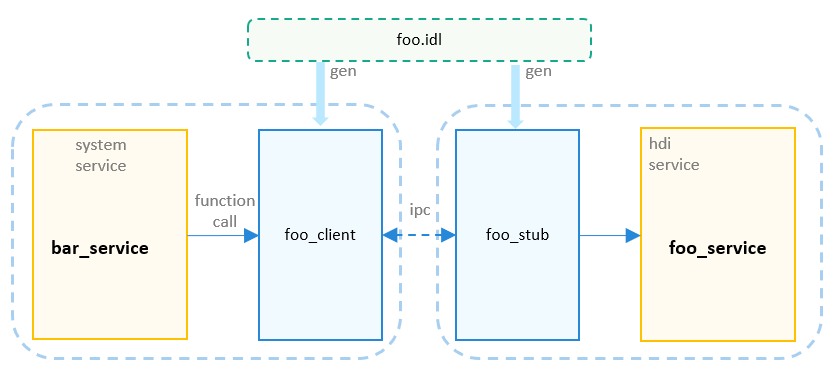

# Peripheral Driver HDI Definition

## Introduction

This repository is used to manage the hardware device interface (HDI) definition of each module. The HDIs are defined in the interface definition language (IDL) and saved in the `.idl` format.


**Figure 1** HDI definition process



Define an HDI in the IDL and saved it in the `.idl` format. Then, the `.idl` file will be compiled and converted into the function interface declaration and IPC-related process code in C or C++. You only need to implement service functionalities based on the `ifoo.h` generated. The `//drivers/hdf_core/adapter/uhdf2/hdi.gni` template integrates code generation and compilation. You can write the `BUILD.gn` file based on this template to generate client and server code and compile the code into a shared library (.so file).

## Directory Structure

```
├── README.en.md
├── README.md
├── sensor                          # Sensor HDI definition.
│   └── v1_0                        # Sensor HDI v1.0 definition.
│       ├── BUILD.gn                # Sensor idl build script.
│       ├── ISensorCallback.idl     # Sensor callback interface definition.
│       ├── ISensorInterface.idl    # Sensor interface definition.
│       └── SensorTypes.idl         # Sensor data type definition.
├── audio                           # Audio HDI definition.
│   └── ...
├── camera                          # Camera HDI definition.
├── codec                           # Codec HDI definition.
├── display                         # Display HDI definition.
├── format                          # Format HDI definition.
├── input                           # Input HDI definition.
├── misc                            # Miscellaneous HDI definition.
├── usb                             # USB HDI definition.
└── wlan                            # WLAN HDI definition.
```

## How to Use

1. Create an `.idl` file in the IDL.

    - Create the module/version interface directory by referring to the directory structure. The initial version is defined as `v1_0`, for example, `drivers/interface/foo/v1.0/`.

    - Define the interface `IFoo.idl`.
        ```
        package ohos.hdi.foo.v1_0;

        import ohos.hdi.foo.v1_0.IFooCallback;
        import ohos.hdi.foo.v1_0.MyTypes;

        interface IFoo {
            Ping([in] String sendMsg, [out] String recvMsg);

            GetData([out] struct FooInfo info);

            SendCallbackObj([in] IFooCallback cbObj);
        }
        ```
    - If customized data types are used in `interface`, define the data types in `MyTypes.idl`.
        ```
        package ohos.hdi.foo.v1_0;

        enum FooType {
            FOO_TYPE_ONE = 1,
            FOO_TYPE_TWO,
        };

        struct FooInfo {
            unsigned int id;
            String name;
            enum FooType type;
        };
        ```
    - If a callback from the server is required, define the callback class `IFooCallback.idl`.
        ```
        package ohos.hdi.foo.v1_0;

        [callback] interface IFooCallback {
            PushData([in] String message);
        }
        ```

2. Write `BUILD.gn` for the `idl` file.
    - Add the `BUILD.gn` file to the `drivers/interface/foo/v1.0/` directory. The file content is as follows:
        ```
        import("//drivers/hdf_core/adapter/uhdf2/hdi.gni")   # Template to be imported for compiling the .idl file.
        hdi("foo") {                                # Target .so files (libfoo_client_v1.0.z.so and libfoo_stub_v1.0.z.so) to be generated.
            package = "ohos.hdi.foo.v1_0"                    # Package name, which must match the .idl path.
            module_name = "foo"                     # moduleName that determines the driver descriptor (struct HdfDriverEntry) in the driver file.
            sources = [                             # .idl files to compile.
                "IFoo.idl",                         # Interface .idl file.
                "IFooCallback.idl",                 # .idl file for callbacks.
                "MyTypes.idl",                      # .idl file for customized data types.
            ]
            language = "cpp"                        # Generate C or C++ code from the .idl files. You can select `c` or `cpp`.
        }
        ```

3. Implement the HDI service.

    After the .idl files are compiled, intermediate code is generated in the `out/[product_name]/gen/drivers/interfaces/foo/v1_0` directory.

    - Implement the HDI service APIs.

        Implement the service interface based on the `foo_interface_service.h` file that is automatically generated, and compile the related source code to `FooService.z.so`.

        Implement the service interface.
        ```
        namespace OHOS {
        namespace HDI {
        namespace Foo {
        namespace V1_0 {

        class FooService: public IFoo { // Inherit from the interface class and implement the interface.
        public:
            virtual ~FooService() {}

            int32_t Ping(const std::string& sendMsg, std::string& recvMsg) override;
            int32_t FooService::GetData(FooInfo& info) override;
            int32_t FooService::SendCallbackObj(const sptr<IFooCallback>& cbObj) override;
        };

        } // namespace V1_0
        } // namespace Foo
        } // namespace Hdi
        } // namespace OHOS
        ```
        Implement the service instantiation interface.
        ```
        #ifdef __cplusplus
        extern "C" {
        #endif /* __cplusplus */

        Hdi::Foo::V1_0::IFooInterface *FooInterfaceServiceConstruct();

        void FooInterfaceServiceRelease(Hdi::Foo::V1_0::IFooInterface *obj);

        #ifdef __cplusplus
        }
        #endif /* __cplusplus */
        ```

    - Implement the driver entry.

        The HDI services are published based on the user-mode Hardware Driver Foundation (HDF). Therefore, a driver entry needs to be implemented. The reference driver implementation code is generated in the **out** directory, for example, `out/gen/xxx/foo_interface_driver.cpp`. You can use this file or modify the file based on service requirements.
        Then, compile the driver entry source code as `libfoo_driver.z.so`. (The .so file name must match that in the HDF configuration source.)

4. Publish the HDI service.

    Declare the HDI service in the HDF configuration source (HCS). The following uses the Hi3516D V300 board as an example. The HCS path is `vendor/hisilicon/Hi3516DV300/hdf_config/uhdf/device_info.hcs`. Add the following configuration:
    ```
    fooHost :: host {
            hostName = "fooHost";
            priority = 50;
            fooDevice :: device {
                device0 :: deviceNode {
                    policy = 2;
                    priority = 100;
                    preload = 2;
                    moduleName = "libfoo_driver.z.so";
                    serviceName = "foo_service";
                }
            }
        }
    ```

5. Invoke the HDI service.

    - Add the following dependency to **BUILD.gn** on the client:
    `//drivers/interface/foo/v1.0:libfoo_proxy_1.0"`

    - Invoke the HDI interface in the code (CPP is used as an example.)
        ```
        #include <v1_0/ifoo_interface.h>

        int WorkFunc(void) {
            sptr<IFoo> foo = OHOS::HDI::Foo::V1_0::Foo::Get(); // Use the built-in static method of the Foo object to obtain the client instance of the service.
            if (foo == nullptr) {
                // If the HDI service does not exist, handle the error.
            }

            foo->Bar(); // Do interface call.
        }
        ```
        If a service has multiple instances, you can use the `Hdi::Foo::V1_0::Foo::GetInstance(const std::string& serviceName)` method to obtain the instance.

## Conventions

1. Rules for naming .idl files

    - Name an .idl file in UpperCamelCase style, which is the same as the interface name. Generally, the file name starts with the letter I.
    - The interface description file name extension is .idl.

1. Interface naming rules

    | Type| Style|
    | -----  | ------- |
    | Class, struct, enum, union, and package names | UpperCamelCase|
    | Methods| UpperCamelCase|
    | Function parameters and member variables in a class, struct, or union| lowerCamelCase|
    | Macros, constants (const), and enumerated values| All uppercase letters, separated by underscores (_)|

1. Interface version naming rules

    The HDI interface version is defined in [major].[minor] format.
    - Different major versions indicate that the interfaces are incompatible.
    - The same major version and different minor versions indicate that the interfaces are compatible. However, the interface name, parameter type/quantity, and return value type/quantity in an earlier minor version cannot be changed.

## Repositories Involved

[Drive Subsystem](https://gitee.com/openharmony/docs/blob/master/en/readme/driver-subsystem.md)


[HDF adapter](https://gitee.com/openharmony/drivers_adapter/blob/master/README.md)


[Peripheral](https://gitee.com/openharmony/drivers_peripheral/blob/master/README.md)
