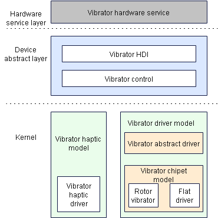

# Vibrator

## Introduction

The vibrator driver model provides and implements vibrator-related Hardware Device Interfaces (HDIs). It supports vibration of the following types: 

- One-shot vibration for a specified duration (**StartOnce**). 
- Vibration with the specified effect (**StartEffect**). The effect is configured in the HDF Configuration Source (HCS). 
- Vibration with the specified duration, intensity, and frequency (**EnableVibratorModulation**).

**Figure 1** Vibrator driver model



## Directory Structure

The directory structure of the vibrator module is as follows:

```
/drivers/peripheral/vibrator
├── chipset          # Driver code of the vibrator module
├── hal              # HAL code
│   ├── include      # HAL header files
│   └── src          # HAL code implementation
├── interfaces       # Driver APIs provided for upper-layer services
│   └── include      # APIs exposed externally
└── test             # Test code
    └── unittest     # Unit test code
```

## Usage

### Available APIs

The APIs provided for the vibrator are used to start and stop vibration. The following table describes these APIs.

**Table 1** Main APIs of the vibrator module

| API                                                      | Description                                                    |
| ------------------------------------------------------------ | ------------------------------------------------------------ |
| int32_t  StartOnce(uint32_t duration)                        | Starts vibration for a given **duration**.          |
| int32_t  Start(const char *effectType)                       | Starts vibration with a given effect, which is specified by **effectType**.  |
| int32_t  Stop(enum VibratorMode mode)                        | Stops vibration based on the specified vibration mode.                                |
| int32_t EnableVibratorModulation(uint32_t duration, int32_t intensity, int32_t frequency) | Starts vibration with a given **duration**, **intensity**, and **frequency**.|
| int32_t GetVibratorInfo(struct VibratorInfo **vibratorInfo); | Obtains vibrator information, including whether the intensity and frequency can be set and the intensity and frequency range.|

### How to Use

The sample code is as follows:

```c++
#include "vibrator_if.h"

enum VibratorMode {
    VIBRATOR_MODE_ONCE   = 0,    // Start one-shot vibration for a specified period.
    VIBRATOR_MODE_PRESET = 1,    // Start periodic vibration with the preset effect.
};

void VibratorSample(void)
{
    int32_t startRet;
    int32_t endRet;
    uint32_t g_duration = 1000;
    uint32_t g_sleepTime1 = 2000;
    uint32_t g_sleepTime2 = 5000;
    int32_t g_intensity1 = 30;
    int32_t g_frequency1 = 200;
    const char *g_timeSequence = "haptic.clock.timer";
    struct VibratorInfo *g_vibratorInfo = nullptr;
    /* Create a VibratorInterface instance. */
    struct VibratorInterface *g_vibratorDev = NewVibratorInterfaceInstance();
    if (g_vibratorDev == NULL) {
        return;
    }
    /* Obtain vibrator information, including whether the intensity and frequency can be set and the intensity and frequency range. */
    startRet = g_vibratorDev->GetVibratorInfo(&g_vibratorInfo);
    if (startRet != 0) {
        return;
    }
    /* Start vibration with the specified duration. */
    startRet = g_vibratorDev->StartOnce(g_duration);
    if (startRet != 0) {
        return;
    }
    OsalMSleep(g_sleepTime1);
    /* Stop vibration based on the specified vibration mode. */
    endRet = g_vibratorDev->Stop(VIBRATOR_MODE_ONCE);
    if (endRet != 0) {
        return;
    }
    /* Start vibration with the preset effect. */
    startRet = g_vibratorDev->Start(g_timeSequence);
    if (endRet != 0) {
        return;
    }
    OsalMSleep(g_sleepTime2);
    /* Stop vibration based on the specified vibration mode. */
    endRet = g_vibratorDev->Stop(VIBRATOR_MODE_PRESET);
    if (endRet != 0) {
        return;
    }
    /* Start vibration based on the specified duration, intensity, and frequency. */
    startRet = g_vibratorDev->EnableVibratorModulation(g_duration, g_intensity1, g_frequency1);
    if (endRet != 0) {
        return;
    }
    OsalMSleep(g_sleepTime1);
    /* Stop vibration based on the specified vibration mode. */
    startRet = g_vibratorDev->Stop(VIBRATOR_MODE_ONCE);
    if (endRet != 0) {
        return;
    }
    /* Release the VibratorInterface instance. */
    ret = FreeVibratorInterfaceInstance();
    if (ret != 0) {
        return;
    }
}
```

## Repositories Involved

[Drive Subsystem](https://gitee.com/openharmony/docs/blob/master/en/readme/driver-subsystem.md)

[drivers_hdf_core](https://gitee.com/openharmony/drivers_hdf_core/blob/master/README_zh.md)

[drivers_peripheral](https://gitee.com/openharmony/drivers_peripheral)
