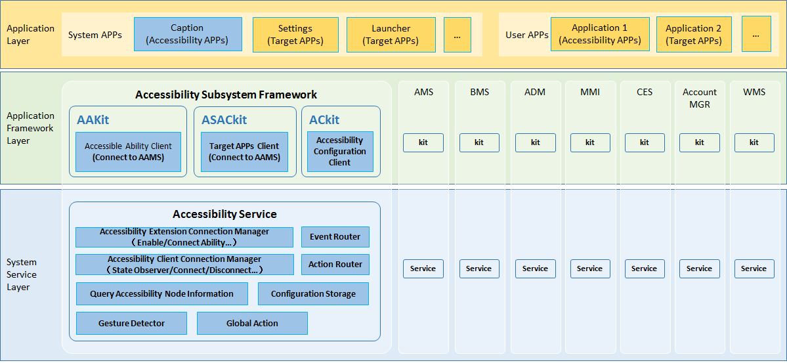

# Accessibility

-   [Introduction](#intro)
-   [Architecture](#architecture)
-   [Directory Structure](#files)
-   [Usage](#usage)
-   [Repositories Involved](#relevant)

## Introduction<a name="intro"></a>

The accessibility framework provides a standard mechanism for exchanging information between applications and accessibility applications and supports the development of accessibility applications to enhance the accessibility experience. The typical use cases are as follows:

1. Allow people with disabilities to use applications. For example, provide the screen reader for people with visual impairments.
1. Provide the capability to interact with applications. For example, offer the UI automatic test framework and the capability to develop accessibility applications based on UI responses.

## Architecture


**Application Layer**：

- Use Accessibility-Extension-Ability to develop applications with accessible capabilities.
-  General applications are integrated into accessible target applications from  ACE, and use accessible capabilities.
- The system settings application allows you to turn on/off for accessible capabilities.

**Application Framework Layer**：

- AAkit： Accessible Ability development kit, which supports Native and TS language development, is  used to build an accessible ability execution environment.

- ASACkit：Accessibility System Ability Client development kit, which supports Native and TS language development, provides the ability to use accessible capabilities for applications.

- ACkit：Accessibility Configuration development kit, which supports Native and TS  language development and provides the ability to set accessible capability switches for system applications.

**System Service Layer**：

- AccessibilityService： Service is management of accessible-ability connections, and the server connected by the accessibility client  (ASAKit), and connects other system layer services to provide  accessibility input capability.

## Directory Structure<a name="files"></a>

```
/foundation/barrierfree/accessibility
├── common
│   ├── interface           # Accessibility-service interface
│   └── log                 # Hilog adaption
├── figures                 # Figures of README
├── frameworks
│   ├── aafwk               # AccessibleAbility-Kit implementation code
│   ├── acfwk               # AccessibilityConfiguration-Kit implementation code
│   ├── asacfwk             # AccessibleAbilityClient-Kit implementation code
│   └── common              # Common data-types and constants
├── interfaces
│   ├── innerkits           # Internal C/C++ APIs of Accessibility
│   └── kits                # Developer TS APIs of Accessibility
│       ├── js              # TS APIs
│       └── napi            # Implementation of TS APIs
├── resources               # Resource files of accessibility
├── sa_profile              # SA-Configuration files of accessibility
└── services
    ├── aams                # Accessibility-service code
    ├── etc                 # Configuration files of accessibility-service
    └── test                # Test-code of accessibility-service
```

## Usage<a name="usage"></a>

[1. accessibility configuration](https://gitee.com/openharmony/docs/blob/master/zh-cn/application-dev/reference/apis/js-apis-accessibility-config.md)

[2. accessibility extension](https://gitee.com/openharmony/docs/blob/master/zh-cn/application-dev/reference/apis/js-apis-accessibility-extension-context.md)

[3. accessibility](https://gitee.com/openharmony/docs/blob/master/zh-cn/application-dev/reference/apis/js-apis-accessibility.md)

## Repositories Involved<a name="relevant"></a>

**accessibility**

[accessibility](https://gitee.com/openharmony/accessibility)
