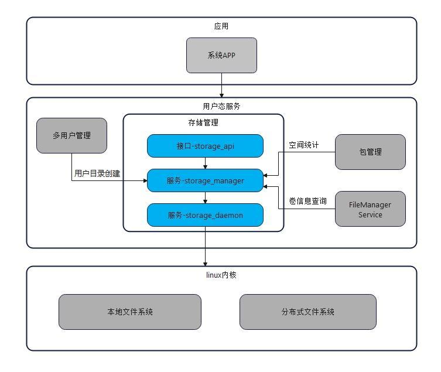

# 存储管理服务

## 简介
存储管理服务提供外置存储卡挂载管理、文件加解密、磁盘和卷的查询与管理、用户目录管理和空间统计等功能，为系统和应用提供基础的存储查询、管理能力。

 **图1**  存储管理服务子系统架构图 
  

 **部件描述：** 

|  **部件名称**   | **简介**                                 |
|  -------------  | ---------------------------------------- |
| storage_api      | 为应用提供一套查询、管理存储和用户的接口API。 |
| storage_manager  | 提供卷、磁盘的相关查询能力和管理能力，多用户数据目录管理接口及以应用或用户为维度的存储空间统计查询能力。 |
| storage_daemon   | 提供分区挂载能力，与内核层的交互能力、设备上下线监听能力及目录加解密能力。|

 **外部依赖描述：** 
|  **部件名称**   | **简介**                                 |
|  -------------  | ---------------------------------------- |
| 多用户管理      | 负责管理用户，并调用storage_manager提供的能力管理相应用户的数据目录。 |
| 包管理          | 负责提供包的管理功能。为storage_manager提供指定用户、指定包名对应的空间大小。 |
| 媒体库服务| 负责提供媒体文件信息，为storage_manager提供指定用户的各类媒体文件的空间大小。 |
| 公共文件访问框架            | 负责提供对文件的管理功能。需要storage_manager提供的卷信息。 |

## 目录
```
/foundation/storage/storage_services
│── interface                   // 接口声明
│  ├── innerkits                // 对内接口声明
│  └── kits                     // 对外接口声明
│── services                    // 服务实现
│  ├── storage_manager          // 非常驻manager服务实现
│  └── storage_daemon           // 常驻daemon服务实现
```

## 约束

接口支持情况：storage_daemon所有接口仅支持storage_manager服务进行调用。

## 相关仓
[多用户管理](http:////gitee.com/openharmony/account_os_account)  
[包管理](http://gitee.com/openharmony/appexecfwk_standard)  
[媒体库服务](https://gitee.com/openharmony/multimedia_medialibrary_standard)  
[公共文件访问框架](https://gitee.com/openharmony/filemanagement_user_file_service)  
[文件访问接口](https://gitee.com/openharmony/filemanagement_file_api)  
[分布式文件服务](https://gitee.com/openharmony/filemanagement_dfs_service)  
[应用文件服务](https://gitee.com/openharmony/filemanagement_app_file_service)  
[**存储管理服务**](https://gitee.com/openharmony/filemanagement_storage_service)  