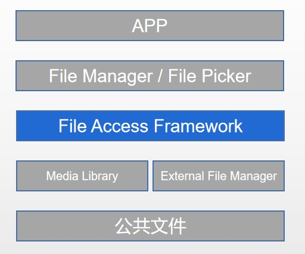

# 公共文件访问框架

## 简介

公共文件访问框架(FileAccessFramework)提供了一套公共文件访问和管理的接口。

公共文件访问框架中FileAccessFramework向下对接底层文件管理服务，如medialibrary、externalFileManager。FileAccessFramework向上对接应用，提供对公共文件操作的基础能力，如图1。

支持能力列举如下：
- 查询、创建、删除、打开、移动、重命名用户公共文件路径下媒体文件和文档文件。媒体文件包括图片、音频、视频, 通过相册方式呈现。文档文件则以目录树方式呈现。

- 查询、创建、删除、打开、移动、重命名共享盘设备上的文件。文件以目录树方式呈现。

- 查询、创建、删除、打开、移动、重命名外置存储设备上的文件。文件以目录树方式呈现。

**图 1**  公共文件访问框架架构图


## 目录

仓目录结构如下:
```
/foundation/storage/user_file_service
├── figures                                     # 插图文件
├── service                                     # 服务实现
│   ├── etc                                     # 内部接口实现
│   ├── src                                     # 内部接口实现
├── interfaces                                  # 接口代码
│   ├── innerkits                               # 内部 Native 接口
│   └── kits                                    # 外部 JS 接口
├── BUILD.gn                                    # 编译入口
└── bundle.json                                 # 部件描述文件
```

## 约束
接口支持情况：FileAccessFramework 所有接口目前仅支持文件管理器和文件选择器，且需要基于stage模型。

## 相关仓
[媒体库服务](https://gitee.com/openharmony/multimedia_medialibrary_standard)  
[存储管理服务](https://gitee.com/openharmony/filemanagement_storage_service)  
[文件访问接口](https://gitee.com/openharmony/filemanagement_file_api)  
[多用户管理](http:////gitee.com/openharmony/account_os_account)  
[**公共文件访问框架**](https://gitee.com/openharmony/filemanagement_user_file_service)  


