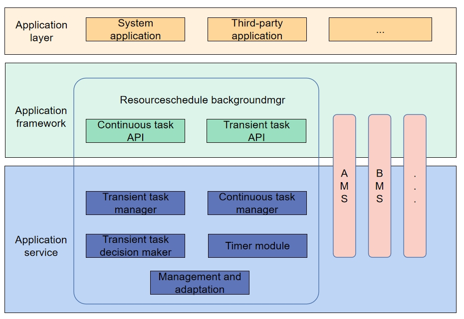

# Background Task Manager

-   [Introduction](#section11660541593)
-   [Directory Structure](#section161941989596)
-   [Transient Tasks](#section1312121216216)
    -   [Available APIs](#section114564657874)
    -   [Usage Guidelines](#section129654513264)
        -   [Restrictions on Using Transient Tasks](#section1551164914237)
-   [Continuous Tasks](#section18532577761)
    -   [Available APIs](#section19389218787)
    -   [Usage Guidelines](#section17228995140)
        -   [Restrictions on Using Continuous Tasks](#section18958419455)

-   [Repositories Involved](#section1371113476307)

## Introduction<a name="section11660541593"></a>

In the resource scheduling subsystem, the background task management is responsible for managing background tasks, and provides interfaces for application, cancellation and query of background tasks.



## Directory Structure<a name="section161941989596"></a>

```
/foundation/resourceschedule/background_task_mgr
├── frameworks       # Frameworks
├── interfaces
│   ├── innerkits    # Internal APIs
│   └── kits         # External APIs
├── sa_profile       # SA profile
├── services         # Services
└── utils            # Utilities

```
## Transient Tasks<a name="section1312121216216"></a>

### Available APIs<a name="section114564657874"></a>

| API                                                                                      |     Description   |
|------------------------------------------------------------------------------------------|-------------------|
| function requestSuspendDelay(reason:string, callback:Callback\<void>): DelaySuspendInfo; | Request a suspend delay |
| function cancelSuspendDelay(requestId:number): void;                                     | Cancel the suspend delay |
| function getRemainingDelayTime(requestId:number, callback:AsyncCallback\<number>):void;  | Get remaining delay time(callback) |
| function getRemainingDelayTime(requestId:number): Promise\<number>;                      | Get remaining delay time(Promise) |

### Usage Guidelines<a name="section129654513264"></a>

As mentioned above, applications and service modules with transient tasks have their suspension delayed so that their running is not affected by background lifecycle management within the specified time frame.

- Note: Applications and service modules can request transient tasks only for temporary tasks. The time quota is 3 minutes per time and 10 minutes per day. The system allocates the time frame based on the application scenario and system status.

#### Restrictions on Using Transient Tasks<a name="section1551164914237"></a>

- **When to request**：An application can request a transient task only when it is running in the foreground or before it is suspended in the background. Otherwise, the application may be suspended, resulting in request failure. By default, an application has 6–12 seconds of running time (subject to the application scenario) before it is suspended in the background.
- **Timeout**：The system notifies the application of the suspension delay which is about to timeout by using a callback. The application must then cancel the delayed suspension if timeout . Otherwise, the application will be forcibly killed.
- **When to cancel**：The requesting application shall cancel the suspension delay when the transient task is complete. Do not wait for the request is forcibly canceled by the system.Otherwise,the time frame allowed for the application to run in the background will be affected.
- **Quota mechanism**：To prevent abuse of the keepalive, each application has a certain quota every day (dynamically adjusted based on user habits). After using up the quota, an application cannot request transient tasks. Therefore, applications should cancel their suspension delay immediately after the transient tasks are complete, to avoid quota consumption. (Note: The quota refers to the requested duration and does not include the time when the application runs in the background.)

## Continuous Tasks<a name="section18532577761"></a>

### Available APIs<a name="section19389218787"></a>

| API                                                                                   | Description     |
|------------------------------------------------------------------------------------------|-------------|
| function startBackgroundRunning(context: Context, bgMode: BackgroundMode, wantAgent: WantAgent, callback: AsyncCallback&lt;void&gt;): void; | When the service is started, apply to the system for continuousterm tasks so that the service keeps running in the background (callback). |
| function startBackgroundRunning(context: Context, bgMode: BackgroundMode, wantAgent: WantAgent): Promise&lt;void&gt;;                       | When the service is started, apply to the system for continuous tasks so that the service keeps running in the background (promise). |
| function stopBackgroundRunning(context: Context, callback: AsyncCallback&lt;void&gt;): void;                                                | Stopping continuous tasks running in background（callback） |
| function stopBackgroundRunning(context: Context): Promise&lt;void&gt;;                                                                      | Stopping continuous tasks running in background（promise） |

### Usage Guidelines<a name="section17228995140"></a>

Continuous tasks guarantee the life cycle of services that users can intuitively feel and need to run in the background. For example, services need to play sound and continuously navigate in the background. Users can intuitively perceive the background service behaviors and use the background mode corresponding to continuous tasks to ensure the running of services in the background and support applications to complete operation in the background.

OpenHarmony offers 9 kinds of background modes for businesses that need to do continuous tasks in the background

| BackgroundMode | interface parameters | Instructions | The prompt in notification bar | note |
| -------- | ------- | -------- | -------- | -------- |
| dataTransfer | DATA_TRANSFER | Download, back up, share, and transfer data through the network or peer device etc | Running data transfer task |  |
| audioPlayback | AUDIO_PLAYBACK | Audio output | Running audio playback task |  |
| audioRecording | AUDIO_RECORDING | Audio input | Running recording task |  |
| location | LOCATION | Positioning and navigation | Running location task |  |
| bluetoothInteraction | BLUETOOTH_INTERACTION | Bluetooth transmission | Running bluetooth related task |  |
| multiDeviceConnection | MULTI_DEVICE_CONNECTION | Distributed interconnection task | Running distributed task |  |
| wifiInteraction | WIFI_INTERACTION | WLAN transmission | Running WLAN related task | SystemApi，only supported for system app |
| voip | VOIP | Voice over Internet Phone | Running voip task | SystemApi，only supported for system app |
| taskKeeping | TASK_KEEPING | Computing tasks | Running computing task | only supported in particular device |

#### Restrictions on Using Continuous Tasks<a name="section18958419455"></a>

- If  user selects aware services (such as broadcasting, navigation, and uploading and downloading), the background mode is triggered. When a task is started, the system forcibly displays a notification to remind the user.
- If the task ends, the application should actively exit background mode. If the system detects that an application does not use resources in the corresponding background mode during background running, it suspends.
- Do not apply for continuous tasks improperly. The type of the continuous tasks must match the service type of the application. If a task is executed that does not match the requested type, the system detects it and suspends it.
- A continuous task is intended to be executed in the background for a long time. If an application applies for a continuous task but does not actually run or execute such a task, the system detects and suspends it.
- A ability can only apply to run one continuous task at a time.

## Repositories Involved<a name="section1371113476307"></a>

Resource Schedule subsystem

**background\_task\_mgr**

notification_ans_standard

notification_common_event_service

appexecfwk_standard

account_os_account