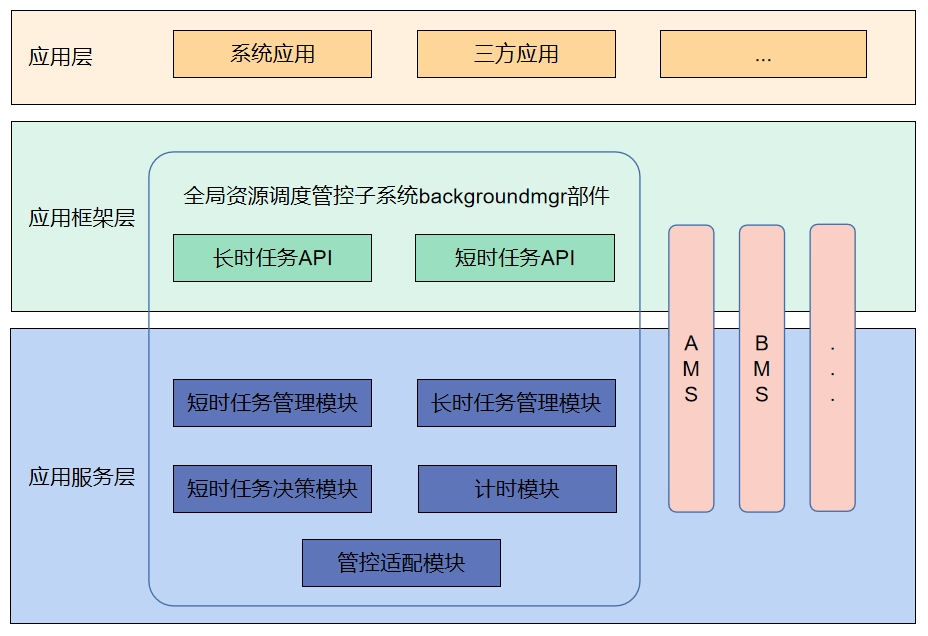

# 后台任务管理

-   [简介](#section11660541593)
-   [目录](#section161941989596)
-   [短时任务](#section1312121216216)
    -   [接口说明](#section114564657874)
    -   [使用说明](#section129654513264)
        -   [短时任务使用约束](#section1551164914237)
-   [长时任务](#section18532577761)
    -   [接口说明](#section19389218787)
    -   [使用说明](#section17228995140)
        -   [长时任务使用约束](#section18958419455)
-   [能效资源](#section18532577850)
    -   [接口说明](#section19389218896)
    -   [使用说明](#section17228995230)
        -   [能效资源使用约束](#section18958419327)

-   [相关仓](#section1371113476307)

## 简介<a name="section11660541593"></a>

在资源调度子系统中后台任务管理负责管理后台任务，并提供后台任务的申请、取消和查询等接口。



## 目录<a name="section161941989596"></a>

```
/foundation/resourceschedule/background_task_mgr
├── frameworks       # 接口实现
├── interfaces
│   ├── innerkits    # 对内接口目录
│   └── kits         # 对外接口目录
├── sa_profile       # 组件服务配置
├── services         # 组件服务实现
└── utils            # 组件工具实现

```
## 短时任务<a name="section1312121216216"></a>

### 接口说明<a name="section114564657874"></a>

| 接口名                                                                                   | 接口描述     |
|------------------------------------------------------------------------------------------|-------------|
| function requestSuspendDelay(reason:string, callback:Callback\<void>): DelaySuspendInfo; | 申请延迟挂起 |
| function cancelSuspendDelay(requestId:number): void;                                     | 取消延迟挂起 |
| function getRemainingDelayTime(requestId:number, callback:AsyncCallback\<number>):void;  | 获取延迟挂起剩余时间（callback形式） |
| function getRemainingDelayTime(requestId:number): Promise\<number>;                      | 获取延迟挂起剩余时间（Promise形式） |

### 使用说明<a name="section129654513264"></a>

退到后台的应用有不可中断且短时间能完成的任务时，可以使用短时任务机制，该机制允许应用在后台短时间内完成任务，保障应用业务运行不受后台生命周期管理的影响。

- 注意：短时任务仅针对应用的临时任务提供资源使用生命周期保障，限制单次最大使用时长为3分钟，全天使用配额默认为10分钟（具体时长系统根据应用场景和系统状态智能调整）。

#### 短时任务使用约束<a name="section1551164914237"></a>

- **申请时机**：允许应用在前台时，或退后台在被挂起之前（应用退到后台默认有6~12秒的运行时长，具体时长由系统根据具体场景决定）申请延迟挂起，否则可能被挂起（Suspend），导致申请失败。
- **超时**：延迟挂起即将超时（Timeout），系统通过回调知会应用，应用需要取消对应的延迟挂起。如果超时不取消，该应用会被强制杀掉。
- **取消时机**：任务完成后申请方应用应该主动取消延迟挂起，不要等到系统回调后再取消，否则会影响该应用的后台允许运行时长配额。
- **配额机制**：为了防止应用滥用保活，或者申请后不取消，每个应用每天都会有一定配额（会根据用户的使用习惯动态调整），配额消耗完就不再允许申请短时任务，所以应用完成短时任务后立刻取消延迟挂起，避免消耗配额。（注，这个配额指的是申请的时长，系统默认应用在后台运行的时间不计算在内。）

## 长时任务<a name="section18532577761"></a>

### 接口说明<a name="section19389218787"></a>

| 接口名                                                                                   | 接口描述     |
|------------------------------------------------------------------------------------------|-------------|
| function startBackgroundRunning(context: Context, bgMode: BackgroundMode, wantAgent: WantAgent, callback: AsyncCallback&lt;void&gt;): void; | 服务启动后，向系统申请长时任务，使服务一直保持后台运行（callback形式） |
| function startBackgroundRunning(context: Context, bgMode: BackgroundMode, wantAgent: WantAgent): Promise&lt;void&gt;;                       | 服务启动后，向系统申请长时任务，使服务一直保持后台运行（promise形式） |
| function stopBackgroundRunning(context: Context, callback: AsyncCallback&lt;void&gt;): void;                                                | 停止后台长时任务的运行（callback形式） |
| function stopBackgroundRunning(context: Context): Promise&lt;void&gt;;                                                                      | 停止后台长时任务的运行（promise形式） |

### 使用说明<a name="section17228995140"></a>

长时任务给用户能够直观感受到的且需要一直在后台运行的业务提供后台运行生命周期的保障。比如：业务需要在后台播放声音、需要在后台持续导航定位等。此类用户可以直观感知到的后台业务行为，可以通过使用长时任务对应的后台模式保障业务在后台的运行，支撑应用完成在后台的业务。

OpenHarmony提供了九种后台模式，供需要在后台做长时任务的业务使用

| BackgroundMode | 接口参数 | 说明 | 通知栏显示提示 | 备注 |
| -------- | -------- | -------- | -------- | -------- |
| dataTransfer | DATA_TRANSFER | 通过网络/对端设备进行数据下载、备份、分享、传输等 | 正在运行数据传输任务 |  |
| audioPlayback | AUDIO_PLAYBACK | 音频输出 | 正在运行音频播放任务 |  |
| audioRecording | AUDIO_RECORDING | 音频输入 | 正在运行录音任务 |  |
| location | LOCATION | 定位、导航 | 正在运行定位任务 |  |
| bluetoothInteraction | BLUETOOTH_INTERACTION | 蓝牙传输 | 正在运行蓝牙相关任务 |  |
| multiDeviceConnection | MULTI_DEVICE_CONNECTION | 分布式互联任务 | 正在运行分布式任务 |  |
| wifiInteraction | WIFI_INTERACTION | WLAN传输 | 正在运行WLAN相关任务 | SystemApi，仅对System权限应用开放 |
| voip | VOIP | 音视频电话、VOIP | 正在运行通话相关任务 | SystemApi，仅对System权限应用开放 |
| taskKeeping | TASK_KEEPING | 计算任务 | 正在运行计算任务 | 仅在特定设备生效 |

#### 长时任务使用约束<a name="section18958419455"></a>

- 如果用户选择可感知业务（如播音、导航、上传下载等），触发对应后台模式，在任务启动时，系统会强制弹出通知提醒用户。
- 如果任务结束，应用应主动退出后台模式。若在后台运行期间，系统检测到应用并未使用对应后台模式的资源，则会被挂起（Suspend）。
- 避免不合理地申请后台长时任务，长时任务类型要与应用的业务类型匹配。如果执行的任务和申请的类型不匹配，也会被系统检测到并被挂起（Suspend）。
- 长时任务是为了真正在后台长时间执行某个任务，如果一个应用申请了长时任务，但在实际运行过程中，并未真正运行或执行此类任务时，也会被系统检测到并被挂起（Suspend）。
- 每个Ability同一时刻只能申请运行一个长时任务。

## 能效资源<a name="section18532577850"></a>

### 接口说明<a name="section19389218896"></a>

| 接口名                                      | 接口描述                                       |
| ---------------------------------------- | ---------------------------------------- |
| applyEfficiencyResources(request: EfficiencyResourcesRequest): boolean | 申请能效资源。 |
| resetAllEfficiencyResources():void | 释放申请的能效资源   |

### 使用说明<a name="section17228995230"></a>

能效资源可以分为四种：CPU资源；WORK_SCHEDULER资源；软件资源(COMMON_EVENT, TIMER)；硬件资源(GPS, BLOOTOOTH, AUDIO)。
应用或进程申请能效资源后能够获得相应特权，例如：申请CPU资源后可以不被挂起；申请WORK_SCHEDULER资源后不受延迟任务执行频率约束，且任务执行时间增加；申请软件、硬件资源后，相关资源在挂起状态下不被代理。

| 参数名                     | 参数值  | 描述                    |
| ----------------------- | ---- | --------------------- |
| CPU                     | 1    | CPU资源，申请后不被挂起             |
| COMMON_EVENT            | 2    | 公共事件，申请后挂起状态下不被代理掉  |
| TIMER                   | 4    | 计时器，申请后挂起状态下不被代理掉    |
| WORK_SCHEDULER          | 8    | 延迟任务，申请后有更长的执行时间      |
| BLUETOOTH               | 16   | 蓝牙相关，申请后挂起状态下不被代理掉  |
| GPS                     | 32   | GPS相关，申请后挂起状态下不被代理掉  |
| AUDIO                   | 64   | 音频资源，申请后挂起状态下不被代理掉 |

#### 能效使用约束<a name="section18958419327"></a>

- 能效资源申请或者释放可以由进程或者应用发起，由应用发起的释放在释放的时候会释放所有资源，包括进程申请的资源。由进程发起的资源释放对应用申请的资源没有影响。
- 同时申请同一类持久资源和非持久资源，持久资源会覆盖非持久资源。在超时时不会释放资源。
- WORK_SCHEDULER资源的申请和释放都必须由应用来进行，不能以进程的身份申请。
- 在应用死亡时，会清空除了WORK_SCHEDULER之外的所有资源申请记录；在应用被卸载时，会清空所有的资源申请记录。

## 相关仓<a name="section1371113476307"></a>

资源调度子系统

**[resourceschedule_background_task_mgr](https://gitee.com/openharmony/resourceschedule_background_task_mgr)**

[notification_ans_standard](https://gitee.com/openharmony/notification_ans_standard)

[notification_ces_standard](https://gitee.com/openharmony/notification_ces_standard)

[appexecfwk_standard](https://gitee.com/openharmony/appexecfwk_standard)

[account_os_account](https://gitee.com/openharmony/account_os_account)

[resourceschedule_work_scheduler](https://gitee.com/openharmony/resourceschedule_work_scheduler)