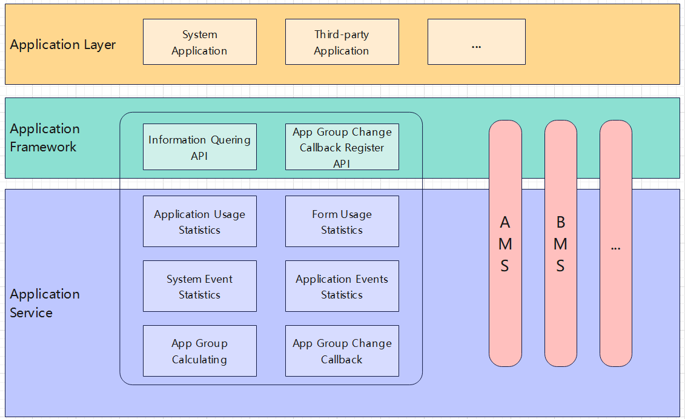

# Device usage statistics<a name="EN-US_TOPIC_0000001115588558"></a>

-   [Introduction](#section11660541593)
-   [Directory Structure](#section161941989596)
-   [Instruction](#section1312121216216)
    -   [Available APIs](#section1551164914237)
    -   [Usage Guidelines](#section129654513264)

-   [Repositories Involved](#section1371113476307)

## Introduction<a name="section11660541593"></a>

The **device usage statistics** includes app usage, notification usage, system usage and other usage statistics. For example, application usage statistics is used to save
and query application usage details, event log data and application grouping.The application records (usage history statistics and usage event records) cached by
the component will be periodically refreshed to the database for persistent storage.



## Directory Structure<a name="section161941989596"></a>

```
/foundation/resourceschedule/device_usage_statistics
├── BUILD.gn                           # Module compilation script
├── LICENSE                            # Open source protocol
├── adapter                            # Adaptation directory
├── bundle.json                        # Component decoupling and compiling script
├── frameworks                         # Framework layer directory
├── interfaces
│   ├── innerkits                      # Internal interface directory
│   └── kits                           # External interface directory
├── services                           # Service layer directory
└── test                               # Testing case directory
```

## Instruction<a name="section1312121216216"></a>

### Available APIs<a name="section1551164914237"></a>

Device usage statistics interfaces include app usage, notification usage, system usage and other interfaces.
Taking app usage interface as an example, the main exposed interfaces are as follows.

<a name="table775715438253"></a>
<table><thead align="left"><tr id="row12757154342519"><th class="cellrowborder" valign="top" width="60%" id="mcps1.1.3.1.1"><p id="p1075794372512"><a name="p1075794372512"></a><a name="p1075794372512"></a>API name</p>
</th>
<th class="cellrowborder" valign="top" width="50%" id="mcps1.1.3.1.2"><p id="p375844342518"><a name="p375844342518"></a><a name="p375844342518"></a>API description</p>
</th>
</tr>
</thead>
<tbody><tr id="row1975804332517"><td class="cellrowborder" valign="top" width="50%" headers="mcps1.1.3.1.1 "><p id="p5758174313255"><a name="p5758174313255"></a><a name="p5758174313255"></a>queryBundleActiveStates(begin: number, end: number, callback: AsyncCallback&lt;Array&lt;BundleActiveState&gt;&gt;): void</p>
<td class="cellrowborder" valign="top" width="50%" headers="mcps1.1.3.1.2 "><p id="p14758743192519"><a name="p14758743192519"></a><a name="p14758743192519"></a>Queries the event collection of all applications through time interval(callback).</p>
<tbody><tr id="row1975804332517"><td class="cellrowborder" valign="top" width="50%" headers="mcps1.1.3.1.1 "><p id="p5758174313255"><a name="p5758174313255"></a><a name="p5758174313255"></a>queryBundleActiveStates(begin: number, end: number): Promise&lt;Array&lt;BundleActiveState&gt;&gt;</p>
<td class="cellrowborder" valign="top" width="50%" headers="mcps1.1.3.1.2 "><p id="p14758743192519"><a name="p14758743192519"></a><a name="p14758743192519"></a>Queries the event collection of all applications through time interval(Promise).</p>
<tr id="row2758943102514"><td class="cellrowborder" valign="top" width="50%" headers="mcps1.1.3.1.1 "><p id="p107581438250"><a name="p107581438250"></a><a name="p107581438250"></a>queryBundleStateInfos(begin: number, end: number, callback: AsyncCallback&lt;BundleActiveInfoResponse&gt;): void</p>
<td class="cellrowborder" valign="top" width="50%" headers="mcps1.1.3.1.2 "><p id="p8758743202512"><a name="p8758743202512"></a><a name="p8758743202512"></a>Uses the start and end time to query the application usage time statistics(callback).</p>
<tr id="row2758943102514"><td class="cellrowborder" valign="top" width="50%" headers="mcps1.1.3.1.1 "><p id="p107581438250"><a name="p107581438250"></a><a name="p107581438250"></a>queryBundleStateInfos(begin: number, end: number): Promise&lt;BundleActiveInfoResponse&gt;</p>
<td class="cellrowborder" valign="top" width="50%" headers="mcps1.1.3.1.2 "><p id="p8758743202512"><a name="p8758743202512"></a><a name="p8758743202512"></a>Uses the start and end time to query the application usage time statistics(Promise).</p>
<tr id="row09311240175710"><td class="cellrowborder" valign="top" width="50%" headers="mcps1.1.3.1.1 "><p id="p159328405571"><a name="p159328405571"></a><a name="p159328405571"></a>queryCurrentBundleActiveStates(begin: number, end: number, callback: AsyncCallback&lt;Array&lt;BundleActiveState&gt;&gt;): void</p>
<td class="cellrowborder" valign="top" width="50%" headers="mcps1.1.3.1.2 "><p id="p493294018574"><a name="p493294018574"></a><a name="p493294018574"></a>Queries the event collection of the current application through the time interval(callback).</p>
<tr id="row09311240175710"><td class="cellrowborder" valign="top" width="50%" headers="mcps1.1.3.1.1 "><p id="p159328405571"><a name="p159328405571"></a><a name="p159328405571"></a>queryCurrentBundleActiveStates(begin: number, end: number): Promise&lt;Array&lt;BundleActiveState&gt;&gt;</p>
<td class="cellrowborder" valign="top" width="50%" headers="mcps1.1.3.1.2 "><p id="p493294018574"><a name="p493294018574"></a><a name="p493294018574"></a>Queries the event collection of the current application through the time interval(Promise).</p>
<tr id="row09311240175710"><td class="cellrowborder" valign="top" width="50%" headers="mcps1.1.3.1.1 "><p id="p159328405571"><a name="p159328405571"></a><a name="p159328405571"></a>queryBundleStateInfoByInterval(byInterval: IntervalType, begin: number, end: number, callback: AsyncCallback&lt;Array&lt;BundleStateInfo&gt;&gt;): void</p>
<td class="cellrowborder" valign="top" width="50%" headers="mcps1.1.3.1.2 "><p id="p493294018574"><a name="p493294018574"></a><a name="p493294018574"></a>Queries application usage duration statistics by time interval(callback).</p>
<tr id="row09311240175710"><td class="cellrowborder" valign="top" width="50%" headers="mcps1.1.3.1.1 "><p id="p159328405571"><a name="p159328405571"></a><a name="p159328405571"></a>queryBundleStateInfoByInterval(byInterval: IntervalType, begin: number, end: number): Promise&lt;Array&lt;BundleStateInfo&gt;&gt;</p>
<td class="cellrowborder" valign="top" width="50%" headers="mcps1.1.3.1.2 "><p id="p493294018574"><a name="p493294018574"></a><a name="p493294018574"></a>Queries application usage duration statistics by time interval(Promise).</p>
<tr id="row09311240175710"><td class="cellrowborder" valign="top" width="50%" headers="mcps1.1.3.1.1 "><p id="p159328405571"><a name="p159328405571"></a><a name="p159328405571"></a>queryAppUsagePriorityGroup(callback: AsyncCallback&lt;number&gt;): void</p>
<td class="cellrowborder" valign="top" width="50%" headers="mcps1.1.3.1.2 "><p id="p493294018574"><a name="p493294018574"></a><a name="p493294018574"></a>Query the priority group of the application.</p>
<tr id="row09311240175710"><td class="cellrowborder" valign="top" width="50%" headers="mcps1.1.3.1.1 "><p id="p159328405571"><a name="p159328405571"></a><a name="p159328405571"></a>queryAppUsagePriorityGroup(): Promise&lt;number&gt;</p>
<td class="cellrowborder" valign="top" width="50%" headers="mcps1.1.3.1.2 "><p id="p493294018574"><a name="p493294018574"></a><a name="p493294018574"></a>Query the priority group of the application.</p>
<tr id="row09311240175710"><td class="cellrowborder" valign="top" width="50%" headers="mcps1.1.3.1.1 "><p id="p159328405571"><a name="p159328405571"></a><a name="p159328405571"></a>isIdleState(bundleName: string, callback: AsyncCallback&lt;boolean&gt;): void</p>
<td class="cellrowborder" valign="top" width="50%" headers="mcps1.1.3.1.2 "><p id="p493294018574"><a name="p493294018574"></a><a name="p493294018574"></a>Judges whether the application of the specified bundle name is currently idle(callback).</p>
<tr id="row09311240175710"><td class="cellrowborder" valign="top" width="50%" headers="mcps1.1.3.1.1 "><p id="p159328405571"><a name="p159328405571"></a><a name="p159328405571"></a>isIdleState(bundleName: string): Promise&lt;boolean&gt;</p>
<td class="cellrowborder" valign="top" width="50%" headers="mcps1.1.3.1.2 "><p id="p493294018574"><a name="p493294018574"></a><a name="p493294018574"></a>Judges whether the application of the specified bundle name is currently idle(Promise).</p>
<tr id="row09311240175710"><td class="cellrowborder" valign="top" width="50%" headers="mcps1.1.3.1.1 "><p id="p159328405571"><a name="p159328405571"></a><a name="p159328405571"></a>queryBundleActiveEventStates(begin: number, end: number, callback: AsyncCallback&lt;Array&lt;BundleActiveEventState&gt;&gt;): void</p>
<td class="cellrowborder" valign="top" width="50%" headers="mcps1.1.3.1.2 "><p id="p493294018574"><a name="p493294018574"></a><a name="p493294018574"></a>Query the statistical information of system events (sleep, wake-up, unlock and screen lock) according to the start and end time(callback).</p>
<tr id="row09311240175710"><td class="cellrowborder" valign="top" width="50%" headers="mcps1.1.3.1.1 "><p id="p159328405571"><a name="p159328405571"></a><a name="p159328405571"></a>queryBundleActiveEventStates(begin: number, end: number): Promise&lt;Array&lt;BundleActiveEventState&gt;&gt;</p>
<td class="cellrowborder" valign="top" width="50%" headers="mcps1.1.3.1.2 "><p id="p493294018574"><a name="p493294018574"></a><a name="p493294018574"></a>Query the statistical information of system events (sleep, wake-up, unlock and screen lock) according to the start and end time(Promise).</p>
<tr id="row09311240175710"><td class="cellrowborder" valign="top" width="50%" headers="mcps1.1.3.1.1 "><p id="p159328405571"><a name="p159328405571"></a><a name="p159328405571"></a>queryAppNotificationNumber(begin: number, end: number, callback: AsyncCallback&lt;Array&lt;BundleActiveEventState&gt;&gt;): void</p>
<td class="cellrowborder" valign="top" width="50%" headers="mcps1.1.3.1.2 "><p id="p493294018574"><a name="p493294018574"></a><a name="p493294018574"></a>Query the application notification times according to the start and end time(callback).</p>
<tr id="row09311240175710"><td class="cellrowborder" valign="top" width="50%" headers="mcps1.1.3.1.1 "><p id="p159328405571"><a name="p159328405571"></a><a name="p159328405571"></a>queryAppNotificationNumber(begin: number, end: number): Promise&lt;Array&lt;BundleActiveEventState&gt;&gt;</p>
<td class="cellrowborder" valign="top" width="50%" headers="mcps1.1.3.1.2 "><p id="p493294018574"><a name="p493294018574"></a><a name="p493294018574"></a>Query the application notification times according to the start and end time(Promise).</p>
<tr id="row09311240175710"><td class="cellrowborder" valign="top" width="50%" headers="mcps1.1.3.1.1 "><p id="p159328405571"><a name="p159328405571"></a><a name="p159328405571"></a>getRecentlyUsedModules(callback: AsyncCallback&lt;Array&lt;BundleActiveModuleInfo&gt;&gt;): void</p>
<td class="cellrowborder" valign="top" width="50%" headers="mcps1.1.3.1.2 "><p id="p493294018574"><a name="p493294018574"></a><a name="p493294018574"></a>Query FA usage records. The maximum returned quantity does not exceed the value set by 1000.(callback)</p>
<tr id="row09311240175710"><td class="cellrowborder" valign="top" width="50%" headers="mcps1.1.3.1.1 "><p id="p159328405571"><a name="p159328405571"></a><a name="p159328405571"></a>getRecentlyUsedModules(maxNum: number, callback: AsyncCallback&lt;Array&lt;BundleActiveModuleInfo&gt;&gt;): void</p>
<td class="cellrowborder" valign="top" width="50%" headers="mcps1.1.3.1.2 "><p id="p493294018574"><a name="p493294018574"></a><a name="p493294018574"></a>Query FA usage records. The maximum returned quantity does not exceed the value set by maxnum. FA usage records are sorted from near to far. The maximum maxnum is 1000.(callback)
<tr id="row09311240175710"><td class="cellrowborder" valign="top" width="50%" headers="mcps1.1.3.1.1 "><p id="p159328405571"><a name="p159328405571"></a><a name="p159328405571"></a>getRecentlyUsedModules(maxNum?: number): Promise&lt;Array&lt;BundleActiveModuleInfo&gt;&gt;</p>
<td class="cellrowborder" valign="top" width="50%" headers="mcps1.1.3.1.2 "><p id="p493294018574"><a name="p493294018574"></a><a name="p493294018574"></a>Query FA usage records. The maximum returned quantity does not exceed the value set by maxnum. FA usage records are sorted from near to far. The maximum maxnum is 1000. If the maxnum parameter is not filled in, the default maxnum is 1000(Promise).</p>
<tr id="row09311240175710"><td class="cellrowborder" valign="top" width="50%" headers="mcps1.1.3.1.1 "><p id="p159328405571"><a name="p159328405571"></a><a name="p159328405571"></a>queryAppUsagePriorityGroup(bundleName : string, callback: AsyncCallback&lt;number&gt;): void</p>
<td class="cellrowborder" valign="top" width="50%" headers="mcps1.1.3.1.2 "><p id="p493294018574"><a name="p493294018574"></a><a name="p493294018574"></a>Query the group of the current application or the application of specified bundlename.</p>
<tr id="row09311240175710"><td class="cellrowborder" valign="top" width="50%" headers="mcps1.1.3.1.1 "><p id="p159328405571"><a name="p159328405571"></a><a name="p159328405571"></a>queryAppUsagePriorityGroup(bundleName : string): Promise&lt;number&gt;</p>
<td class="cellrowborder" valign="top" width="50%" headers="mcps1.1.3.1.2 "><p id="p493294018574"><a name="p493294018574"></a><a name="p493294018574"></a>Query the group of the current application or the application of specified bundlename.</p>
<tr id="row09311240175710"><td class="cellrowborder" valign="top" width="50%" headers="mcps1.1.3.1.1 "><p id="p159328405571"><a name="p159328405571"></a><a name="p159328405571"></a>setBundleGroup(bundleName: string, newGroup: GroupType, callback: AsyncCallback&lt;void&gt;): void</p>
<td class="cellrowborder" valign="top" width="50%" headers="mcps1.1.3.1.2 "><p id="p493294018574"><a name="p493294018574"></a><a name="p493294018574"></a>Set the group of the specified application as the group provided by the parameter(callback).</p>
<tr id="row09311240175710"><td class="cellrowborder" valign="top" width="50%" headers="mcps1.1.3.1.1 "><p id="p159328405571"><a name="p159328405571"></a><a name="p159328405571"></a>setBundleGroup(bundleName: string, newGroup: GroupType): Promise&lt;void&gt;</p>
<td class="cellrowborder" valign="top" width="50%" headers="mcps1.1.3.1.2 "><p id="p493294018574"><a name="p493294018574"></a><a name="p493294018574"></a>Set the group of the specified application as the group provided by the parameter(Promise).</p>
<tr id="row09311240175710"><td class="cellrowborder" valign="top" width="50%" headers="mcps1.1.3.1.1 "><p id="p159328405571"><a name="p159328405571"></a><a name="p159328405571"></a>registerGroupCallBack(callback: Callback&lt;BundleActiveGroupCallbackInfo&gt;, callback: AsyncCallback&lt;void&gt;): void</p>
<td class="cellrowborder" valign="top" width="50%" headers="mcps1.1.3.1.2 "><p id="p493294018574"><a name="p493294018574"></a><a name="p493294018574"></a>Register callback for application group change(callback).</p>
<tr id="row09311240175710"><td class="cellrowborder" valign="top" width="50%" headers="mcps1.1.3.1.1 "><p id="p159328405571"><a name="p159328405571"></a><a name="p159328405571"></a>registerGroupCallBack(callback: Callback&lt;BundleActiveGroupCallbackInfo&gt;): Promise&lt;void&gt;</p>
<td class="cellrowborder" valign="top" width="50%" headers="mcps1.1.3.1.2 "><p id="p493294018574"><a name="p493294018574"></a><a name="p493294018574"></a>Register callback for application group change(Promise).</p>
<tr id="row09311240175710"><td class="cellrowborder" valign="top" width="50%" headers="mcps1.1.3.1.1 "><p id="p159328405571"><a name="p159328405571"></a><a name="p159328405571"></a>unRegisterGroupCallBack(callback: AsyncCallback&lt;void&gt;): void</p>
<td class="cellrowborder" valign="top" width="50%" headers="mcps1.1.3.1.2 "><p id="p493294018574"><a name="p493294018574"></a><a name="p493294018574"></a>Unregister the registered application group callback(callback).</p>
<tr id="row09311240175710"><td class="cellrowborder" valign="top" width="50%" headers="mcps1.1.3.1.1 "><p id="p159328405571"><a name="p159328405571"></a><a name="p159328405571"></a>unRegisterGroupCallBack(): Promise&lt;void&gt;</p>
<td class="cellrowborder" valign="top" width="50%" headers="mcps1.1.3.1.2 "><p id="p493294018574"><a name="p493294018574"></a><a name="p493294018574"></a>Unregister the registered application group callback(Promise).</p>
</td>
</tr>
</tbody>
</table>


### Usage Guidelines<a name="section129654513264"></a>

There are many interfaces for device usage statistics. Take app usage interface as an example to introduce the interface logic.

- **device usage statistics saving time**:
>1.  refreshing is triggered every 30 minutes;
>2.  refreshing is triggered when system time changes;
>3.  refreshing is triggered from the next day;
- **app querying interface**:
>1.  Query the event collection of all applications according to the start and end time;
>2.  Query the usage duration of the application according to the start and end time;
>3.  Query the event collection of the current application according to the start and end time;
>4.  Query the usage duration of the application according to the type of interval (day, week, month, year) and the start and end time;
>5.  Query the priority group of the application;
>6.  Judge whether the specified application is currently idle;
>7.  Query the statistical information of system events (sleep, wake-up, unlock and screen lock) according to the start and end time;
>8.  Query the application notification times according to the start and end time;
>9.  Query FA usage records. The maximum returned quantity does not exceed the value set by maxnum. FA usage records are sorted from near to far. The maximum maxnum is 1000. If the maxnum parameter is not filled in, the default maxnum is 1000;
>10.  Query the group of the current application or the application of specified bundlename；
>11.  Set the group of the specified application as the group provided by the parameter；
>12.  Register callback for application group change；
>13.  Unregister the registered application group callback；

## Repositories Involved<a name="section1371113476307"></a>

resource schedule subsystem

**device\_usage\_statistics**

resource_schedule_service

appexecfwk_standard

relational_store