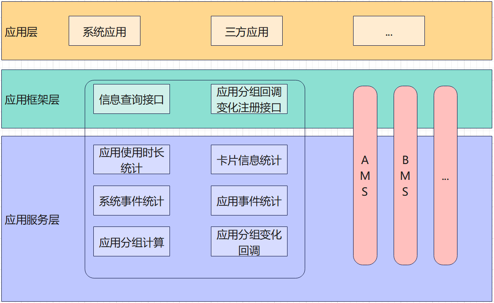

# 设备使用信息统计<a name="ZH-CN_TOPIC_0000001115588558"></a>
-   [简介](#section11660541593)
-   [目录](#section161941989596)
-   [说明](#section1312121216216)
    -   [接口说明](#section1551164914237)
    -   [使用说明](#section129654513264)

-   [相关仓](#section1371113476307)

## 简介<a name="section11660541593"></a>

设备使用信息统计，包括app usage/notification usage/system usage等使用统计。例如应用使用信息统计，用于保存和查询应用使用详情（app usage）、事件日志数据（event log）、应用分组（bundle group）情况。
部件缓存的应用记录（使用历史统计和使用事件记录）会在事件上报后30分钟内刷新到数据库持久化保存。



## 目录<a name="section161941989596"></a>

```
/foundation/resourceschedule/device_usage_statistics
├── BUILD.gn                           # 模块编译脚本
├── LICENSE                            # 开源协议
├── adapter                            # 适配目录
├── bundle.json                        # 部件化解耦及编译脚本
├── frameworks                         # 框架层目录
├── interfaces
│   ├── innerkits                      # 对内接口目录
│   └── kits                           # 对外接口目录
├── services                           # 服务层目录
└── test                               # 测试用例目录
```

## 说明<a name="section1312121216216"></a>

### 接口说明<a name="section1551164914237"></a>

设备使用信息统计接口，包括app usage/notification usage/system usage等接口，以app usage接口为例，对外提供主要接口如下。

<a name="table775715438253"></a>
<table><thead align="left"><tr id="row12757154342519"><th class="cellrowborder" valign="top" width="73%" id="mcps1.1.3.1.1"><p id="p1075794372512"><a name="p1075794372512"></a><a name="p1075794372512"></a>接口名</p>
</th>
<th class="cellrowborder" valign="top" width="50%" id="mcps1.1.3.1.2"><p id="p375844342518"><a name="p375844342518"></a><a name="p375844342518"></a>接口描述</p>
</th>
</tr>
</thead>
<tbody>
<tr id="row1975804332517"><td class="cellrowborder" valign="top" width="50%" headers="mcps1.1.3.1.1 "><p id="p5758174313255"><a name="p5758174313255"></a><a name="p5758174313255"></a>queryBundleEvents(begin: number, end: number, callback: AsyncCallback&lt;Array&lt;BundleEvents&gt;&gt;): void</p>
<td class="cellrowborder" valign="top" width="50%" headers="mcps1.1.3.1.2 "><p id="p14758743192519"><a name="p14758743192519"></a><a name="p14758743192519"></a>通过指定起始和结束时间查询所有应用的事件集合（callback形式）。</p>
<tr id="row1975804332517"><td class="cellrowborder" valign="top" width="50%" headers="mcps1.1.3.1.1 "><p id="p5758174313255"><a name="p5758174313255"></a><a name="p5758174313255"></a>queryBundleEvents(begin: number, end: number): Promise&lt;Array&lt;BundleEvents&gt;&gt;</p>
<td class="cellrowborder" valign="top" width="50%" headers="mcps1.1.3.1.2 "><p id="p14758743192519"><a name="p14758743192519"></a><a name="p14758743192519"></a>通过指定起始和结束时间查询所有应用的事件集合（Promise形式）。</p>
<tr id="row2758943102514"><td class="cellrowborder" valign="top" width="50%" headers="mcps1.1.3.1.1 "><p id="p107581438250"><a name="p107581438250"></a><a name="p107581438250"></a>queryBundleStatsInfos(begin: number, end: number, callback: AsyncCallback&lt;BundleStatsMap&gt;): void</p>
<td class="cellrowborder" valign="top" width="50%" headers="mcps1.1.3.1.2 "><p id="p8758743202512"><a name="p8758743202512"></a><a name="p8758743202512"></a>通过指定起始和结束时间查询应用使用时长统计信息（callback形式）。</p>
<tr id="row2758943102514"><td class="cellrowborder" valign="top" width="50%" headers="mcps1.1.3.1.1 "><p id="p107581438250"><a name="p107581438250"></a><a name="p107581438250"></a>queryBundleStatsInfos(begin: number, end: number): Promise&lt;BundleStatsMap&gt;</p>
<td class="cellrowborder" valign="top" width="50%" headers="mcps1.1.3.1.2 "><p id="p8758743202512"><a name="p8758743202512"></a><a name="p8758743202512"></a>通过指定起始和结束时间查询应用使用时长统计信息（Promise形式）。</p>
<tr id="row09311240175710"><td class="cellrowborder" valign="top" width="50%" headers="mcps1.1.3.1.1 "><p id="p159328405571"><a name="p159328405571"></a><a name="p159328405571"></a>queryCurrentBundleEvents(begin: number, end: number, callback: AsyncCallback&lt;Array&lt;BundleEvents&gt;&gt;): void</p>
<td class="cellrowborder" valign="top" width="50%" headers="mcps1.1.3.1.2 "><p id="p493294018574"><a name="p493294018574"></a><a name="p493294018574"></a>通过指定起始和结束时间查询当前应用的事件集合（callback形式）。</p>
<tr id="row09311240175710"><td class="cellrowborder" valign="top" width="50%" headers="mcps1.1.3.1.1 "><p id="p159328405571"><a name="p159328405571"></a><a name="p159328405571"></a>queryCurrentBundleEvents(begin: number, end: number): Promise&lt;Array&lt;BundleEvents&gt;&gt;</p>
<td class="cellrowborder" valign="top" width="50%" headers="mcps1.1.3.1.2 "><p id="p493294018574"><a name="p493294018574"></a><a name="p493294018574"></a>通过指定起始和结束时间查询当前应用的事件集合（Promise形式）。</p>
<tr id="row09311240175710"><td class="cellrowborder" valign="top" width="50%" headers="mcps1.1.3.1.1 "><p id="p159328405571"><a name="p159328405571"></a><a name="p159328405571"></a>queryBundleStatsInfoByInterval(byInterval: IntervalType, begin: number, end: number, callback: AsyncCallback&lt;Array&lt;BundleStatsInfo&gt;&gt;): void</p>
<td class="cellrowborder" valign="top" width="50%" headers="mcps1.1.3.1.2 "><p id="p493294018574"><a name="p493294018574"></a><a name="p493294018574"></a>通过指定时间段间隔（天、周、月、年）查询应用使用时长统计信息（callback形式）。</p>
<tr id="row09311240175710"><td class="cellrowborder" valign="top" width="50%" headers="mcps1.1.3.1.1 "><p id="p159328405571"><a name="p159328405571"></a><a name="p159328405571"></a>queryBundleStatsInfoByInterval(byInterval: IntervalType, begin: number, end: number): Promise&lt;Array&lt;BundleStatsInfo&gt;&gt;</p>
<td class="cellrowborder" valign="top" width="50%" headers="mcps1.1.3.1.2 "><p id="p493294018574"><a name="p493294018574"></a><a name="p493294018574"></a>通过指定时间段间隔（天、周、月、年）查询应用使用时长统计信息（Promise形式）。</p>
<tr id="row09311240175710"><td class="cellrowborder" valign="top" width="50%" headers="mcps1.1.3.1.1 "><p id="p159328405571"><a name="p159328405571"></a><a name="p159328405571"></a>isIdleState(bundleName: string, callback: AsyncCallback&lt;boolean&gt;): void</p>
<td class="cellrowborder" valign="top" width="50%" headers="mcps1.1.3.1.2 "><p id="p493294018574"><a name="p493294018574"></a><a name="p493294018574"></a>判断指定Bundle Name的应用当前是否是空闲状态（callback形式）。</p>
<tr id="row09311240175710"><td class="cellrowborder" valign="top" width="50%" headers="mcps1.1.3.1.1 "><p id="p159328405571"><a name="p159328405571"></a><a name="p159328405571"></a>isIdleState(bundleName: string): Promise&lt;boolean&gt;</p>
<td class="cellrowborder" valign="top" width="50%" headers="mcps1.1.3.1.2 "><p id="p493294018574"><a name="p493294018574"></a><a name="p493294018574"></a>判断指定Bundle Name的应用当前是否是空闲状态（Promise形式）。</p>
<tr id="row09311240175710"><td class="cellrowborder" valign="top" width="50%" headers="mcps1.1.3.1.1 "><p id="p159328405571"><a name="p159328405571"></a><a name="p159328405571"></a>queryDeviceEventStats(begin: number, end: number, callback: AsyncCallback&lt;Array&lt;DeviceEventStats&gt;&gt;): void</p>
<td class="cellrowborder" valign="top" width="50%" headers="mcps1.1.3.1.2 "><p id="p493294018574"><a name="p493294018574"></a><a name="p493294018574"></a>根据起止时间查询系统事件（休眠、唤醒、解锁、锁屏）统计信息（callback形式）。</p>
<tr id="row09311240175710"><td class="cellrowborder" valign="top" width="50%" headers="mcps1.1.3.1.1 "><p id="p159328405571"><a name="p159328405571"></a><a name="p159328405571"></a>queryDeviceEventStats(begin: number, end: number): Promise&lt;Array&lt;DeviceEventStats&gt;&gt;</p>
<td class="cellrowborder" valign="top" width="50%" headers="mcps1.1.3.1.2 "><p id="p493294018574"><a name="p493294018574"></a><a name="p493294018574"></a>根据起止时间查询系统事件（休眠、唤醒、解锁、锁屏）统计信息（Promise形式）。</p>
<tr id="row09311240175710"><td class="cellrowborder" valign="top" width="50%" headers="mcps1.1.3.1.1 "><p id="p159328405571"><a name="p159328405571"></a><a name="p159328405571"></a>queryNotificationEventStats(begin: number, end: number, callback: AsyncCallback&lt;Array&lt;DeviceEventStats&gt;&gt;): void</p>
<td class="cellrowborder" valign="top" width="50%" headers="mcps1.1.3.1.2 "><p id="p493294018574"><a name="p493294018574"></a><a name="p493294018574"></a>根据起止时间查询应用通知次数（callback形式）。</p>
<tr id="row09311240175710"><td class="cellrowborder" valign="top" width="50%" headers="mcps1.1.3.1.1 "><p id="p159328405571"><a name="p159328405571"></a><a name="p159328405571"></a>queryNotificationEventStats(begin: number, end: number): Promise&lt;Array&lt;DeviceEventStats&gt;&gt;</p>
<td class="cellrowborder" valign="top" width="50%" headers="mcps1.1.3.1.2 "><p id="p493294018574"><a name="p493294018574"></a><a name="p493294018574"></a>根据起止时间查询应用通知次数（Promise形式）。</p>
<tr id="row09311240175710"><td class="cellrowborder" valign="top" width="50%" headers="mcps1.1.3.1.1 "><p id="p159328405571"><a name="p159328405571"></a><a name="p159328405571"></a>queryModuleUsageRecords(callback: AsyncCallback&lt;Array&lt;HapModuleInfo&gt;&gt;): void</p>
<td class="cellrowborder" valign="top" width="50%" headers="mcps1.1.3.1.2 "><p id="p493294018574"><a name="p493294018574"></a><a name="p493294018574"></a>查询FA使用记录。返回数量最大不超过1000设置的值，FA使用记录由近及远排序（callback形式）。</p>
<tr id="row09311240175710"><td class="cellrowborder" valign="top" width="50%" headers="mcps1.1.3.1.1 "><p id="p159328405571"><a name="p159328405571"></a><a name="p159328405571"></a>queryModuleUsageRecords(): Promise&lt;Array&lt;HapModuleInfo&gt;&gt;</p>
<td class="cellrowborder" valign="top" width="50%" headers="mcps1.1.3.1.2 "><p id="p493294018574"><a name="p493294018574"></a><a name="p493294018574"></a>查询FA使用记录。返回数量最大不超过1000设置的值，FA使用记录由近及远排序（Promise形式）。</p>
<tr id="row09311240175710"><td class="cellrowborder" valign="top" width="50%" headers="mcps1.1.3.1.1 "><p id="p159328405571"><a name="p159328405571"></a><a name="p159328405571"></a>queryModuleUsageRecords(maxNum: number, callback: AsyncCallback&lt;Array&lt;HapModuleInfo&gt;&gt;): void</p>
<td class="cellrowborder" valign="top" width="50%" headers="mcps1.1.3.1.2 "><p id="p493294018574"><a name="p493294018574"></a><a name="p493294018574"></a>查询FA使用记录。返回数量最大不超过maxNum设置的值，FA使用记录由近及远排序，maxNum最大为1000（callback形式）。</p>
<tr id="row09311240175710"><td class="cellrowborder" valign="top" width="50%" headers="mcps1.1.3.1.1 "><p id="p159328405571"><a name="p159328405571"></a><a name="p159328405571"></a>queryModuleUsageRecords(maxNum: number): Promise&lt;Array&lt;HapModuleInfo&gt;&gt;</p>
<td class="cellrowborder" valign="top" width="50%" headers="mcps1.1.3.1.2 "><p id="p493294018574"><a name="p493294018574"></a><a name="p493294018574"></a>查询FA使用记录。返回数量最大不超过maxNum设置的值，FA使用记录由近及远排序，maxNum最大为1000（Promise形式）。</p>
<tr id="row09311240175710"><td class="cellrowborder" valign="top" width="50%" headers="mcps1.1.3.1.1 "><p id="p159328405571"><a name="p159328405571"></a><a name="p159328405571"></a>queryAppGroup(callback: AsyncCallback&lt;number&gt;): void</p>
<td class="cellrowborder" valign="top" width="50%" headers="mcps1.1.3.1.2 "><p id="p493294018574"><a name="p493294018574"></a><a name="p493294018574"></a>查询当前应用的使用优先级分组（callback形式）。</p>
<tr id="row09311240175710"><td class="cellrowborder" valign="top" width="50%" headers="mcps1.1.3.1.1 "><p id="p159328405571"><a name="p159328405571"></a><a name="p159328405571"></a>queryAppGroup(): Promise&lt;number&gt;</p>
<td class="cellrowborder" valign="top" width="50%" headers="mcps1.1.3.1.2 "><p id="p493294018574"><a name="p493294018574"></a><a name="p493294018574"></a>查询当前应用的使用优先级分组（Promise形式）。</p>
<tr id="row09311240175710"><td class="cellrowborder" valign="top" width="50%" headers="mcps1.1.3.1.1 "><p id="p159328405571"><a name="p159328405571"></a><a name="p159328405571"></a>queryAppGroup(bundleName : string, callback: AsyncCallback&lt;number&gt;): void</p>
<td class="cellrowborder" valign="top" width="50%" headers="mcps1.1.3.1.2 "><p id="p493294018574"><a name="p493294018574"></a><a name="p493294018574"></a>查询指定bundleName的应用的优先级分组（callback形式）。</p>
<tr id="row09311240175710"><td class="cellrowborder" valign="top" width="50%" headers="mcps1.1.3.1.1 "><p id="p159328405571"><a name="p159328405571"></a><a name="p159328405571"></a>queryAppGroup(bundleName : string): Promise&lt;number&gt;</p>
<td class="cellrowborder" valign="top" width="50%" headers="mcps1.1.3.1.2 "><p id="p493294018574"><a name="p493294018574"></a><a name="p493294018574"></a>查询指定bundleName的应用的使用优先级分组（Promise形式）。</p>
<tr id="row09311240175710"><td class="cellrowborder" valign="top" width="50%" headers="mcps1.1.3.1.1 "><p id="p159328405571"><a name="p159328405571"></a><a name="p159328405571"></a>setAppGroup(bundleName: string, newGroup: GroupType, callback: AsyncCallback&lt;void&gt;): void</p>
<td class="cellrowborder" valign="top" width="50%" headers="mcps1.1.3.1.2 "><p id="p493294018574"><a name="p493294018574"></a><a name="p493294018574"></a>将指定应用的分组设置为参数提供的分组（callback形式）。</p>
<tr id="row09311240175710"><td class="cellrowborder" valign="top" width="50%" headers="mcps1.1.3.1.1 "><p id="p159328405571"><a name="p159328405571"></a><a name="p159328405571"></a>setAppGroup(bundleName: string, newGroup: GroupType): Promise&lt;void&gt;</p>
<td class="cellrowborder" valign="top" width="50%" headers="mcps1.1.3.1.2 "><p id="p493294018574"><a name="p493294018574"></a><a name="p493294018574"></a>将指定应用的分组设置为参数提供的分组（Promise形式）。</p>
<tr id="row09311240175710"><td class="cellrowborder" valign="top" width="50%" headers="mcps1.1.3.1.1 "><p id="p159328405571"><a name="p159328405571"></a><a name="p159328405571"></a>registerAppGroupCallBack(callback: Callback&lt;AppGroupCallbackInfo&gt;, callback: AsyncCallback&lt;void&gt;): void</p>
<td class="cellrowborder" valign="top" width="50%" headers="mcps1.1.3.1.2 "><p id="p493294018574"><a name="p493294018574"></a><a name="p493294018574"></a>给应用分组变化注册回调（callback形式）。</p>
<tr id="row09311240175710"><td class="cellrowborder" valign="top" width="50%" headers="mcps1.1.3.1.1 "><p id="p159328405571"><a name="p159328405571"></a><a name="p159328405571"></a>registerAppGroupCallBack(callback: Callback&lt;AppGroupCallbackInfo&gt;): Promise&lt;void&gt;</p>
<td class="cellrowborder" valign="top" width="50%" headers="mcps1.1.3.1.2 "><p id="p493294018574"><a name="p493294018574"></a><a name="p493294018574"></a>给应用分组变化注册回调（Promise形式）。</p>
<tr id="row09311240175710"><td class="cellrowborder" valign="top" width="50%" headers="mcps1.1.3.1.1 "><p id="p159328405571"><a name="p159328405571"></a><a name="p159328405571"></a>unRegisterAppGroupCallBack(callback: AsyncCallback&lt;void&gt;): void</p>
<td class="cellrowborder" valign="top" width="50%" headers="mcps1.1.3.1.2 "><p id="p493294018574"><a name="p493294018574"></a><a name="p493294018574"></a>将已注册过的应用分组回调解除注册（callback形式）。</p>
<tr id="row09311240175710"><td class="cellrowborder" valign="top" width="50%" headers="mcps1.1.3.1.1 "><p id="p159328405571"><a name="p159328405571"></a><a name="p159328405571"></a>unRegisterAppGroupCallBack(): Promise&lt;void&gt;</p>
<td class="cellrowborder" valign="top" width="50%" headers="mcps1.1.3.1.2 "><p id="p493294018574"><a name="p493294018574"></a><a name="p493294018574"></a>将已注册过的应用分组回调解除注册（Promise形式）。</p>
</td>
</td>
</tr>
</tbody>
</table>


### 使用说明<a name="section129654513264"></a>

设备使用信息统计接口众多，以应用使用详情（app usage）接口为例，介绍接口逻辑。

- **应用使用统计信息落盘时机**：
>1.  每隔30分钟触发一次刷新；
>2.  系统时间变更触发一次刷新；
>3.  下一天开始触发一次刷新；
- **应用查询接口**：
>1.  根据起止时间查询所有应用的事件集合；
>2.  根据起止时间查询应用的使用时长；
>3.  根据起止时间查询当前应用的事件集合；
>4.  根据interval（日、周、月、年）类型和起止时间查询应用的使用时长；
>5.  查询当前应用的优先级分组；
>6.  判断指定应用当前是否是空闲状态；
>7.  根据起止时间查询系统事件（休眠、唤醒、解锁、锁屏）统计信息；
>8.  根据起止时间查询应用通知次数；
>9.  查询FA使用记录。返回数量最大不超过maxNum设置的值，FA使用记录由近及远排序，maxNum最大为1000，若不填写maxNum参数，则maxNum默认为1000;
>10.  查询当前应用或指定bundlename对应的应用的分组；
>11.  将指定应用的分组设置为参数提供的分组；
>12.  给应用分组变化注册回调；
>13.  将已注册过的应用分组回调解除注册；

## 相关仓<a name="section1371113476307"></a>

全局资源调度子系统

**[resourceschedule_device_usage_statistics](https://gitee.com/openharmony/resourceschedule_device_usage_statistics)**

[resourceschedule_resource_schedule_service](https://gitee.com/openharmony/resourceschedule_resource_schedule_service)

[appexecfwk_standard](https://gitee.com/openharmony/appexecfwk_standard)

[distributeddatamgr_appdatamgr](https://gitee.com/openharmony/distributeddatamgr_appdatamgr)

