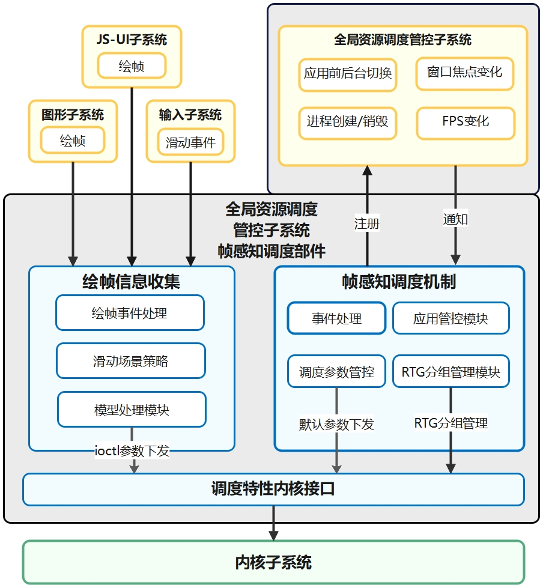

# 智能感知调度部件


## 简介<a name="section_introduction"></a>

智能感知调度部件位于全局资源调度管控子系统中，通过帧感知调度机制，更新进程调度分组。通过获取应用的生命周期状态、应用绘帧等信息，调节内核调度参数，从而控制内核调度行为，保障系统进程调度供给。


## 目录<a name="section_catalogue"></a>

```
//foundation/resourceschedule/frame_aware_sched
├── common                                  # 部件通用工具类
│   └── include
│       ├── frame_info_const.h              # 绘帧过程信息
│       ├── frame_aware_constants.h         # 通用参数配置
│       ├── frame_aware_log_domain.h        # 封装hilog，用于日志打印
│       └── single_instance.h               # 封装了单例模式的类模板
│
├── interfaces
│   └── innerkits                           # 对内接口目录
│
├── frameworks
│   └── core
│       ├── frame_aware_collector           # 应用绘帧信息收集组件
│       └── frame_aware_policy              # 帧感知调度机制组件
│
├── profiles                                # 组件配置文件
└── test                                    # 自测试用例目录
```


## 框架<a name="section_frameworks"></a>

智能感知调度部件根据执行时所属线程进行划分，可包含两大组件，即运行在App进程的绘帧信息收集组件和运行在系统服务进程的帧感知调度机制组件，每个组件分为若干模块。

- **绘帧信息收集组件**：主要分为帧事件处理模块、滑动场景策略模块以及模型处理模块，三者构成绘帧核心策略。其中：

  绘帧事件处理模块，主要负责统筹JS-UI子系统及Graphic子系统的绘帧子过程的消息信息并分发。

  模型处理模块，主要负责提供各个子过程的调节调度算法。

  滑动场景策略模块，主要负责针对滑动场景，使用模型处理模块的算法接口提供应用主线程绘帧策略，进行场景化精细调度。

- **帧感知调度机制组件**：主要分为事件处理模块、应用管控模块、调度参数管控模块和RTG（Related-Thread-Group）分组管理模块，四者构成应用线程调度机制。其中：
  
  事件处理模块，主要负责注册接收来自全局资源管控子系统的消息，诸如应用前后台切换、窗口焦点变化等，并分发消息给应用管控模块和RTG分组模块。
 
  应用管控模块，主要负责统一管理事件处理模块的应用消息。
 
  RTG分组管理模块，即调用内核接口设置，根据应用状态设置RTG分组实现线程调度管理。
 
  调度参数管控模块，主要负责读取默认调度参数配置。

两个组件中的事件处理模块，均统筹了智能感知调度部件所要对外相应的事件，而调度特性内核接口模块则负责将管控调度命令以帧的频率下发，两个组件相互合作，共同保障系统线程的性能供给。




### 绘帧信息收集<a name="section_strategy"></a>

应用绘帧感知主要负责调节内核调度的参数，进行线程负载的缩放。当用户在APP界面滑动时，识别出应用的关键线程（诸如绘帧主线程、渲染线程），感知应用绘帧子过程的执行情况，根据是否超时来判断是否调整内核调度参数，进行实时的资源供给，进行优先调度。

- 根据屏幕刷新率，判断当前帧率信息，根据越接近绘帧结束时刻，越加大关键线程的资源供给。


- 根据界面绘帧图形渲染过程中的各个子阶段的时长，调节资源供给。


- 对可能发生丢帧卡顿的高概率事件，增加资源供给。


### 帧感知调度机制<a name="section_mechanism"></a>

应用线程调度机制，作为应用绘帧感知实现的基础，主要负责管控线程组及线程优先级，实现应用线程的统一管理，保证整个系统性能。

**核心思想**：分组，即根据不同线程组提供不同的供给能力。把用户敏感度线程添加进同一个线程组，在应用启动、前后台切换等多个应用变化场景，提供资源优先供给。


## 使用说明<a name="section_instructions"></a>

系统开发者可以通过配置productdefine/common/products下的产品定义json文件，增加或移除本部件，来启用或停用本部件：

```
"resourceschedule:frame_aware_sched":{}
```


## 相关仓<a name="section_related_repositories"></a>

- [resource_schedule_service](https://gitee.com/openharmony/resourceschedule_resource_schedule_service)
- [ace_ace_engine]( https://gitee.com/openharmony/ace_ace_engine)
- [graphic_graphic_2d](https://gitee.com/openharmony/graphic_graphic_2d)
- [aafwk_standard](https://gitee.com/openharmony/aafwk_standard ) 
- **frame_aware_sched**


