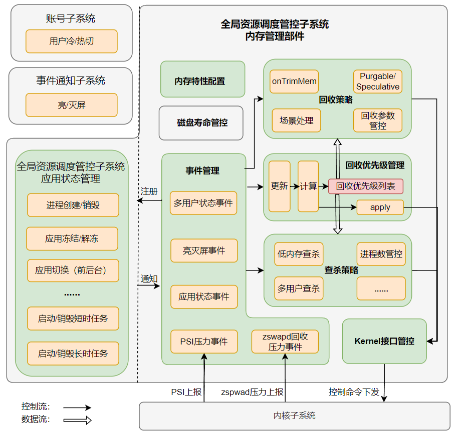

# The Part of Memory Manager

-   [ Introduction](#section_introduction)
-   [ Directory Structure](#section_catalogue)
-   [Framework](#section_framework)
    -   [The List of Process Reclaim Priority ](#section_prio)
    -   [reclaim strategy/kill strategy](#section_reclaim)
-   [ Usage Guidelines](#section_usage)
-   [ Repositories Involved](#section_projects)

##  Introduction<a name="section_introduction"></a>

The part of *Memory Manager* belongs to the subsystem named *Resource Schedule Subsystem*. 

In order to ensure the memory supply, it will reclaim the memory of some processes or even kill these processes in a certain order named *Reclaim Priority*. The calculation and update of *Reclaim Priority* is triggered by the state changes of the applications in the system.

##  Directory Structure<a name="section_catalogue"></a>

```
/foundation/resourceschedule/memmgr
├── common           						# common header files
├── sa_profile       						# System ability xml
├── services
|   └── memmgrservice
|       ├── include
|       |   ├── event						# even center
|       |   ├── reclaim_priority_manager	# calculate the Reclaim Priority
|       |   ├── reclaim_strategy			# reclaim the memory of process by its
|       |   |                                 Reclaim Priority
|       |   └── kill_strategy				# kill the process by its Reclaim Priority
|       └── src
|           ├── event
|           ├── reclaim_priority_manager
|           ├── reclaim_strategy
|           └── kill_strategry
└── test 									# usercase for test
```
## Framework<a name="section_framework"></a>

*Memory Manager* updates the *Reclaim Priority* and triggers the reclaim and kill behaviors based on some events. The framework of *Memory Manager* is shown in the following picture, which includes the following modules.

1. *Event Center*: monitor all external events concerned by this part. The monitors in *Event Center* are registered by calling the interfaces provided by other subsystems, and events about applications and users will be received and notified to *Reclaim Priority Manager*, *Reclaim Strategy* and *Kill Strategy*.
2. *Reclaim Priority Manager*: based on the notifications from the *Event Center*, calculate the sorted list of *Reclaim Priority* ,and provide an interface to *Reclaim Strategy* and *Kill Strategy* for querying this list.

3. *Reclaim Strategy*: according to the list of *Reclaim Priority*, adjust the reclaim parameters (the memory waterline, the reclaim ratio of file page / anonymous page, the compaction / swap-out ratio, etc.) and coordinate different reclaim mechanisms to work together to ensure the performance of memory supply under low and medium memory pressure.

4. *Kill Strategy*: as the logical end of reclaim, it ensures the memory supply under heavy memory pressure according to the list of *Reclaim Priority*.

5. *Kernel Interface*: as an interface to interact with the kernel, issue control commands such as reclaim parameters and kill to the kernel.

6. *Memory Configuration Manager*: read and maintain the configurations required by the *Memory Manager*.

7. *Disk Life Manager* (under planning): limit the amount of data written to the disk to ensure the device lifetime of it.



### The List of Process Reclaim Priority<a name="section_prio"></a>

The list of process *Reclaim Priority* provides the sorted list for reclaim and kill between processes. The value and description of the *Reclaim Priority* defined by this part are shown in the following table:

| Reclaim Priority                                                            | Description |
|------------------------------------------------------------------------------------------|-------------|
| -1000 | Processes with this priority will never be killed by the *Kill Strategy*. |
| 0 | foreground process |
| 100 | process that is running any transient task |
| 200 | perceptible process |
| 600 | frozen process |
| 800    | suspended process                |

### Reclaim Strategy/Kill Strategy<a name="section_reclaim"></a>

As the logical end of reclaim, kill is essentially for the same purpose as reclaim, so they can use the same list of *Reclaim Priority*. At the same time, they should be called reasonably to ensure the function and performance of memory supply under different memory pressures.

- *Reclaim Strategy*: is the most important in vertical memory management, and controls a variety of different memory reclaim mechanisms, which need to be coordinated to work together. For example, the reclaim of the *Purgeable / Speculative Memory* (under planning) is prior to other types of memory, and the trigger time of reclaim should precede the low memory killing.

  Hotspot files can be cached in memory to improve performance under low memory pressure. (under planning)

  Reclaim processes (kswapd, zswapd, etc.) will work under the guidance of configuration (waterline, reclaim parameters) when under medium memory pressure. (under planning)

  There are corresponding processing for single point special key events. In order to meet the requirements of large memory application, *pre-reclaim* will be started with configuration (under planning). The basic actions of reclaim processes should be stopped before killing to avoid invalid reclaim.

- *Kill Strategy*: works under the heavy memory pressure, and is triggered by psi (pressure stall information) memory pressure event. Some low priority processes are selected from the list of *Reclaim Priority* and killed according to the memory waterline.

  The default corresponding relationship between the memory waterline for killing and the process reclaim priority is shown in the following table, and it can be modified by changing the XML file

  according to the RAM configuration, screen size and so on. (under planning)
  
  | Memory Waterline for killing | process reclaim priority |
  | ---------------------------- | ------------------------ |
  | 500 MB                       | 800                      |
  | 400 MB                       | 600                      |
  | 300 MB                       | 200                      |
  | 200 MB                       | 100                      |
  | 100 MB                       | 0                        |

###  Usage Guidelines<a name="section_usage"></a>

System developers can add or remove this part by configuring the product definition JSON file under **/productdefine/common/products** to enable or disable this part:

` "resourceschedule:plugins/memmgr":{} `

##  Repositories Involved<a name="section_projects"></a>

Resource Schedule subsystem

resource_schedule_service


