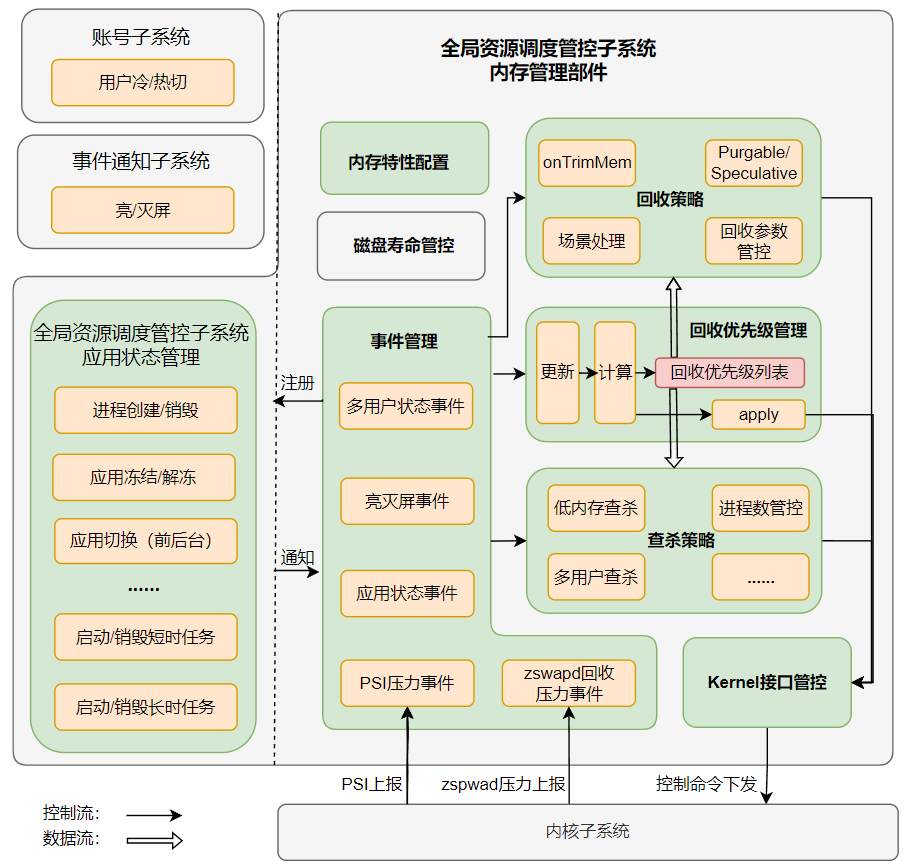

# 内存管理部件

- [内存管理部件](#内存管理部件)
	- [简介<a name="section_introduction"></a>](#简介)
	- [目录<a name="section_catalogue"></a>](#目录)
	- [框架<a name="section_framework"></a>](#框架)
		- [进程回收优先级列表<a name="section_prio"></a>](#进程回收优先级列表)
		- [回收策略/查杀策略<a name="section_reclaim"></a>](#回收策略查杀策略)
	- [使用说明<a name="section_usage"></a>](#使用说明)
	- [参数配置说明<a name="section_usage"></a>](#参数配置说明)
		- [availbufferSize](#availbuffersize)
		- [ZswapdParam](#zswapdparam)
		- [killConfig](#killconfig)
		- [nandlife](#nandlife)
	- [相关仓<a name="section_projects"></a>](#相关仓)

## 简介<a name="section_introduction"></a>

内存管理部件位于全局资源调度管控子系统中，基于应用的生命周期状态，更新进程回收优先级列表，通过内存回收、查杀等手段管理系统内存，保障内存供给。

## 目录<a name="section_catalogue"></a>

```
/foundation/resourceschedule/memmgr
├── common           						# 部件通用工具类
│   ├── include
│   │   ├── kernel_interface.h				# 封装了与Kernel交互的接口
│   │   ├── memmgr_log.h					# 封装了hilog，用于日志打印
│   │   └── single_instance.h				# 封装了单例模式的类模板
│   └── src
│       └── kernel_interface.cpp
│
|
├── sa_profile       						# 组件服务配置
|
├── services         						# 组件服务实现
|   └── memmgrservice    					# 对内接口目录
|       ├── include
|       |   ├── event						# 事件注册中心目录
|       |   ├── reclaim_priority_manager	# 进程回收优先级管理目录
|       |   ├── reclaim_strategy			# 回收策略目录
|       |   └── kill_strategy				# 查杀策略目录
|       └── src
|           ├── event
|           ├── reclaim_priority_manager
|           ├── reclaim_strategy
|           └── kill_strategry
|
└── test 									# 自测试用例目录
```
## 框架<a name="section_framework"></a>

内存管理部件主要基于事件触发回收优先级更新，并基于回收优先级管理内存回收和查杀，其框架如下所示（下图虚线右侧为本部件），主要分为如下几个模块：

1、事件管理模块：统筹管理本部件所要对外响应的事件。主要功能为调用其他子系统提供的接口注册事件监听，并将事件通知到回收优先级管理模块、回收策略模块和查杀策略模块。

2、回收优先级管理模块：基于事件管理模块的应用和用户的事件通知，给出进程的回收和查杀的先后顺序列表，并向回收策略和查杀策略提供查询此列表的接口。

3、回收策略模块：根据回收优先级列表，调整回收内存水线、文件页/匿名页回收比例、压缩/换出比例等回收参数，以及协调不同回收机制协同工作，保障内存中低负载下的供给性能。

4、查杀策略模块：作为回收的逻辑末端，根据回收优先级列表，保障内存重负载下的内存供给。

5、Kernel接口管控模块：负责将回收参数、查杀等管控命令下发到Kernel。

6、内存特性配置：读取回收策略模块、查杀策略模块等需要的配置文件。

7、磁盘寿命管控（规划中）：控制磁盘写入量，以保障磁盘寿命。



### 进程回收优先级列表<a name="section_prio"></a>

进程回收优先级列表，提供了进程间回收和查杀的先后顺序列表。本部件定义的进程回收优先级及其对应的描述如下表所示：

| 优先级                                                                                   | 描述     |
|------------------------------------------------------------------------------------------|-------------|
| -1000 | 系统进程，属于该优先级的进程不会被查杀策略查杀，支持白名单配置 |
| -800 | 常驻进程，属于该优先级的进程可以被查杀，但优先级较低，且被杀后可以再被拉起，支持白名单配置 |
| 0 | 前台应用。 |
| 100 | 正在进行后台短时任务的应用; 或者有被进程关联的extension进程 |
| 200 | 后台可感知应用，如正在执行导航、播放音乐等长时任务的应用 |
| 260 | 连接着分布式设备的后台应用 |
| 400 | 普通后台应用及无被任何进程关联的extension进程 |


### 回收策略/查杀策略<a name="section_reclaim"></a>

查杀作为回收的逻辑末端，与回收策略一脉相承，因此两者使用相同的进程回收优先级列表，同时也要协同管控，协调两者触发时机，共同保障不同内存负载下的内存供给功能和性能。

- **回收策略**：回收策略是垂直内存管理的重中之重。回收策略管控了多种不同的内存回收机制，需要协调好不同机制，例如Purgeable/Speculative内存（规划中）的回收要先于其他内存，再例如回收触发时机要先于低内存查杀。

  在内存低负载时，可以将热点文件cache在内存中以提升性能（规划中）。

  内存中负载时，配置kswapd/zswapd等回收进程的内存水线（阈值）以及相应的回收参数，指导kswapd/zswapd工作。

  对于如下单点关键事件，例如大内存需求的相机场景，可以通过“场景处理”模块单点配置，根据业务需求预回收（规划中）；再例如查杀场景，要停止kswapd/zswapd的基本动作，避免无效回收。

- **查杀策略**：查杀主要负责内存重负载场景。由内存压力事件（ Pressure Stall Information ）触发，根据查杀内存水线，从进程回收优先级列表中选择低优先级进程进行清理。

  默认的查杀内存水线与可杀进程回收优先级对应关系如下表所示。未来，系统开发者和产品开发者可以根据内存RAM（Random Access Memory）规格、屏幕尺寸等需求通过修改xml配置修改该对应关系（xml配置暂不支持，规划中）。

  | 查杀内存水线 | 进程回收优先级 |
  | ------------ | -------------- |
  | 500 MB       | 400            |
  | 400 MB       | 300            |
  | 300 MB       | 200            |
  | 200 MB       | 100            |
  | 100 MB       | 0              |


## 使用说明<a name="section_usage"></a>

系统开发者可以通过配置productdefine/common/products下的产品定义json文件，增加或移除本部件，来启用或停用本部件。

` "resourceschedule:memmgr":{} `

## 参数配置说明<a name="section_usage"></a>

产品可通过memmgr_config.xml来配置本模块相关参数，路径为/etc/memmgr/memmgr_config.xml

xml样例:

```
<?xml version="1.0" encoding="UTF-8"?>
<Memmgr>
	<reclaimConfig>
		<availbufferSize>
			<availBuffer>800</availBuffer>
			<minAvailBuffer>750</minAvailBuffer>
			<highAvailBuffer>850</highAvailBuffer>
			<swapReserve>200</swapReserve>
		</availbufferiSize>
		<ZswapdParam id="1">
			<minScore>0</minScore>
			<maxScore>500</maxScore>
			<mem2zramRatio>60</mem2zramRatio>
			<zran2ufsRation>10</zran2ufsRation>
			<refaultThreshold>50</refaultThreshold>
		</ZswapdParam>
		<ZswapdParam id="2">
			<minScore>501</minScore>
			<maxScore>1000</maxScore>
			<mem2zramRatio>70</mem2zramRatio>
			<zran2ufsRation>20</zran2ufsRation>
			<refaultThreshold>60</refaultThreshold>
		</ZswapdParam>
	</reclaimConfig>
	<killConfig>
		<killLevel id="1">
			<memoryMB>500</memoryMB>
			<minPriority>400</minPriority>
		</killLevel>
		<killLevel id="2">
			<memoryMB>400</memoryMB>
			<minPriority>300</minPriority>
		</killLevel>
	</killConfig>
	<nandlife>
		<dailySwapOutQuotaMB>50</dailySwapOutQuotaMB>
		<totalSwapOutQuotaMB>199</totalSwapOutQuotaMB>
	</nandlife>
</Memmgr>
```

功能参考: [详见Enhanced SWAP特性介绍](https://gitee.com/openharmony/docs/blob/master/zh-cn/device-dev/kernel/kernel-standard-mm-eswap.md)

### availbufferSize

| 节点名                                                                                   | 功能说明     | 默认值 |
|------------------------------------------------------------------------------------------|-------------|-------------|
| availBuffer | 期望的内存正常状态buffer值 |800|
| minAvailBuffer | 检测到当前的buffer低于min_avail_buffers时则会唤醒zswapd进行匿名页回收 |750|
| highAvailBuffer | 期望的回收量为high_avail_buffers与当前系统buffer值的差值 |850|
| swapReserve | 交换分区空闲容量的阈值 |200|


限制:
* 0 <= minAvailBuffer <= availBuffer <= highAvailBuffer <= memTotal
* 0 <=swapReserve <=memTotal

### ZswapdParam

| 节点名                                                                                   | 功能说明     | 默认值 |
|------------------------------------------------------------------------------------------|-------------|-------------|
| minScore | 期望的内存正常状态buffer值 |0|
| maxScore | 检测到当前的buffer低于min_avail_buffers时则会唤醒zswapd进行匿名页回收 |1000|
| mem2zramRatio | 内存压缩到ZRAM的比率 |60|
| zran2ufsRation | ZRAM换出到ESwap的比率 |10|
| refaultThreshold | refault的阈值 |50|

限制:
* 0<=minScore<=1000
* 0<=maxScore<=1000
* 0<=ub_mem2zram_ratio<=100
* 0<=ub_zram2ufs_ratio<=100
* 0<=refault_threshold<=100

### killConfig
内存查杀相关配置

| 节点名                                                                                   | 功能说明     | 默认值 |
|------------------------------------------------------------------------------------------|-------------|-------------|
| killLevel | 查杀级别 |无|
| memoryMB | 查杀目标内存阈值 |无|
| minPriority | 可被查杀的adj最小值 |无|

### nandlife
寿命管控相关配置
| 节点名                                                                                   | 功能说明     | 默认值 |
|------------------------------------------------------------------------------------------|-------------|-------------|
| dailySwapOutQuotaMB | 每日换出量限制（单位MB），应为正数 |0|
| totalSwapOutQuotaMB | 总换出量限制（单位MB），应为正数 |0|

## 相关仓<a name="section_projects"></a>

全局资源调度子系统

resource_schedule_service


