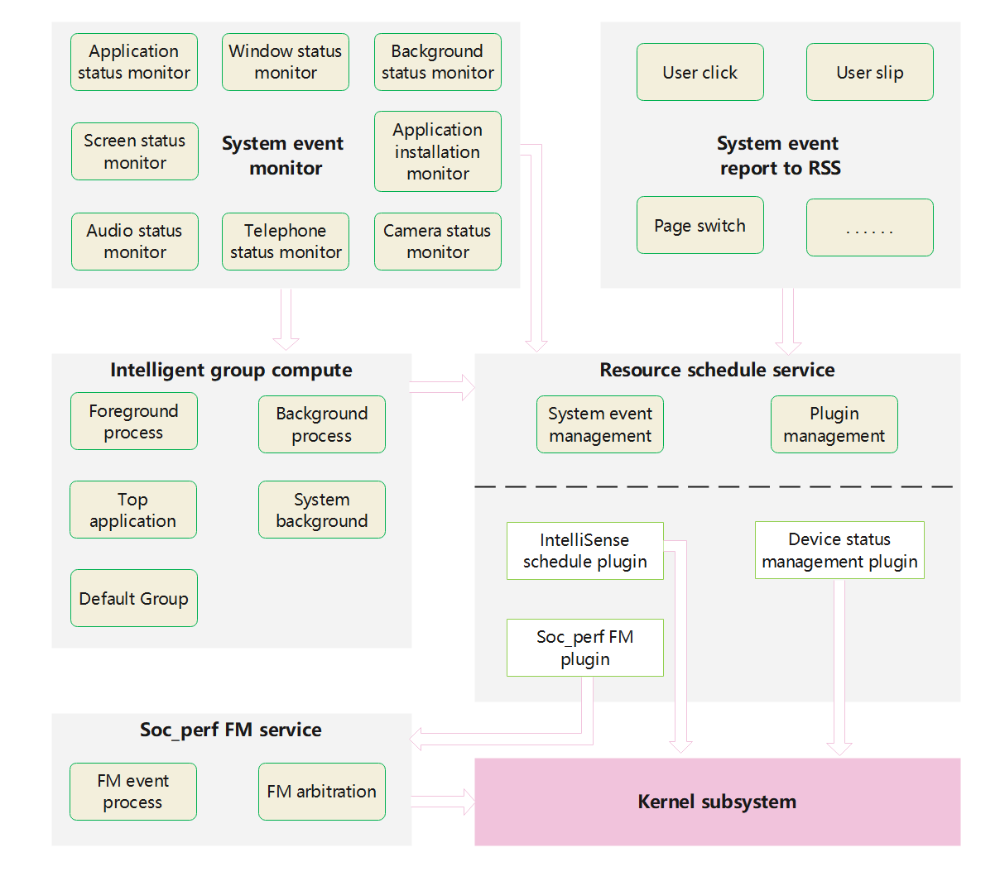

# Resource Schedule Service

- [Resource Schedule Service](#resource-schedule-service)
  - [Introduction<a name="section11660541593"></a>](#introduction)
  - [Directory Structure<a name="section161941989596"></a>](#directory-structure)
  - [How to write a plugin<a name="section1312121216216"></a>](#how-to-write-a-plugin)
    - [Available APIs<a name="section114564657874"></a>](#available-apis)
    - [Usage Guidelines<a name="section129654513264"></a>](#usage-guidelines)
      - [Restrictions on Using Transient Tasks<a name="section1551164914237"></a>](#restrictions-on-using-transient-tasks)
  - [Cgroup Schedule Policy](#cgroup-schedule-policy)
    - [Basic Policy](#basic-policy)
    - [Policy Configuration](#policy-configuration)
    - [Restrictions](#restrictions)
  - [SocPerf](#socperf)
    - [Interfaces](#interfaces)
    - [Configs](#configs)
  - [Repositories Involved<a name="section1371113476307"></a>](#repositories-involved)

## Introduction<a name="section11660541593"></a>

In the resourceschedule subsystem, it provides the awareness and distribution of system events, such as application start, exit, screen on and off, etc.
If you need to obtain system events and perform related resource schedule, you can choose to join the resource schedule service in the form of a plugin.

In resource schedule subsystem, the module of cgroup schedule decides the group schedule policy of each process by analyzing application state, window status and background task status. And with proper configuration, it can bind each process to certain cgroup node. These schedule policies can be used to gain better performance. And this module forward different kinds of events to plugin manager and then be distributed to subscribers.

Resource_schedule_service is an engine that receives events, decides schedule policies and executes schedule mechanisms. It's architecture is shown as follows:
 
It consists of the following important parts:
1. Event manager, which includes the function of using external interfaces to sense system events, as well as the function of using listening forms to sense system events.
2. Application intelligent grouping, which receives the event of application life cycle change and decides the priority of application grouping, is the fundamental basis for global resource schedule.
3. Plugin manager, which is responsible for loading the resource schedule plugin corresponding to the product, receiving system and application events, and distributing events to the plugin according to the plugin subscription.
4. Soc_perf service, which receives frequency modulation events from the related plugin, arbitration the frequency value, and finally uses the kernel interface to set the CPU frequency.

Resource_schedule_service policy is mainly used to extend and schedule the system's global resources with related plugins. Plugins run in the form of dynamic-link, and different users can choose different plugin combinations. At present, the existing plugins include: intelligent perception schedule plugin, device's status management plugin, and soc_perf plugin.The soc_perf plugin is implemented in resource_schedule_service code repository, while the other two plugins are implemented in other code repositories. However, system events are used as the basis for setting schedule policies to the system kernel.

## Directory Structure<a name="section161941989596"></a>

```
</foundation/resourceschedule/resource_schedule_service>
├── cgroup_sched
|   ├── common
|   │   └── include                   # common header files
|   ├── framework
|   │   ├── process_group             # utils to set cgroup by pid
|   │   ├── sched_controller          # cgroup schedule
|   │   └── utils                     # adaption interface to forwarding data
|   │       ├── include
|   │       │   └── ressched_utils.h  # event report header files
|   │       └── ressched_utils.cpp    # event report interface
|   ├── interfaces                    # Init/Denit/Query interface for rss
|   │   └── innerkits                 # Interface APIs
|   └── profiles                      # config files
└── ressched
|   ├── common                     # Common header file
|   ├── interfaces
|   │   └── innerkits              # Interface APIs
|   │       └── ressched_client    # Report data in process
|   ├── plugins                    # Plugin code
|   ├── profile                    # Plugin switch xml and plugin private xml
|   ├── sa_profile                 # System ability xml
|   ├── sched_controller           # event receive
|   |   ├── common_event           # event receive common interface
|   |   └── observer               # callback event receive
|   |       ├── audio_observer     # audio framework event callback
|   |       ├── camera_observer    # camera event callback
|   |       └── telephony_observer # telephony event callback
|   └── services
|       ├── resschedmgr
|       │   ├── pluginbase         # Plugin struct definition
|       │   └── resschedfwk        # Resource schedule framework
|       └── resschedservice        # Resource schedule service
└── soc_perf
    ├── configs                     # socperf config file
    ├── include
    |       ├── client              # socperf client header files
    |       ├── server              # socperf server header files
    |       └── server              # socperf core code header files
    ├── src
    |    ├── client                 # socperf Client interfaces
    |    ├── server                 # socperf Server codes
    |    └── server                 # core code, arbitrate and take effects
    └── sa_profile                  # System ability xml

```
## How to write a plugin<a name="section1312121216216"></a>

### Available APIs<a name="section114564657874"></a>

| API                                                                           | Description                      |
|-------------------------------------------------------------------------------|----------------------------------|
| function OnPluginInit(std::string& libName): bool;                            | plugin init                      |
| function OnPluginDisable(): void;                                             | plugin disable                   |
| function OnDispatchResource(const std::shared_ptr\<ResData\>& data):void;       | dispatch resource event          |

### Usage Guidelines<a name="section129654513264"></a>

When the plugin is initialized, specify the events that need to be registered for monitoring. When these events occur, the framework will be distributed to each plugin in turn,

At this point, the plugin needs to quickly process message reception for resource schedule (if time-consuming tasks need to be processed by another thread), and the processing is completed, return.

#### Restrictions on Using Transient Tasks<a name="section1551164914237"></a>

1. The plugin can be implemented with C/C++.

2. The event processing of the plugin must be completed quickly. If it exceeds 1ms, warning will be printed.
If it exceeds 10ms, the framework thinks the plugin is abnormal and reports an error.

## Cgroup Schedule Policy

### Basic Policy

| Scene  | Schedule policy  |
|----------|-------|
| Currently focused oreground application and processes with same uid  | top_app  |
| Foreground visible processes, include unfocused window process in split mode, float window process, foundation process  | foreground  |
| system level daemon processes. Assign system schedule policy to them when started,   | system  |
| Background application and processes with same uid | background |
| kernel processes, most native processes and others have not mensioned | root |

### Policy Configuration

Each schedule policy is configured in a json file, and is bound to different cgroup.
```
  "Cgroups": [
    {
      "controller": "cpu",
      "path": "/dev/cpuctl",
      "sched_policy": {
        "sp_default": "",
        "sp_background": "background",
        "sp_foreground": "foreground",
        "sp_system_background": "system-background",
        "sp_top_app": "top-app"
      }
    },
    {
      "controller": "cpuset",
      "path": "/dev/cpuset",
      "sched_policy": {
        "sp_default": "",
        "sp_background": "background",
        "sp_foreground": "foreground",
        "sp_system_background": "system-background",
        "sp_top_app": "top-app"
      }
    }
  ]
```

### Restrictions

Configuration file: cgroup_action_config.json
Every schedule policy defined should be configured.

Introduction to each config item：

| Item | Description |
|--------|--------|
|controller|cgroup controller: cpuset, cpuctl, blkio etc.|
|path|Absolute path of current cgroup|
|sched_policy|Binding between each schedule policy and cgroup|
|sp_xx|Different kinds of schedule policy|

## SocPerf

### Interfaces

Supported SocPerf interfaces description

| Interface  | Description  |
|----------|-------|
| PerfRequest(int32_t cmdId, const std::string& msg) | Used for Performace boost freq |
| PerfRequestEx(int32_t cmdId, bool onOffTag, const std::string& msg) | Used for Performace boost freq and support ON/OFF |
| PowerLimitBoost(bool onOffTag, const std::string& msg) | Used for Power limit freq which cannot be boosted |
| ThermalLimitBoost(bool onOffTag, const std::string& msg) | Used for Thermal limit freq which cannot be boosted |
| LimitRequest(int32_t clientId, const std::vector<int32_t>& tags, const std::vector<int64_t>& configs, const std::string& msg) | Used for Power or Thermal limit freq and multiple freq items can be set together |

All interfaces are based on the key parameter cmdID, cmdID connects scenes and configs, which is used to boost freq or limit freq.
Interface with parameter onOffTag means it support ON/OFF event. Normally, these interfaces are used for long-term event,
which needs user to turn on or turn off manually.
Parameter msg is used for extra information, like client's pid and tid.

### Configs

Config files description

| File  | Description  |
|----------|-------|
| socperf_resource_config.xml | Define resource which can be modify，such as CPU/GPU/DDR/NPU |
| socperf_boost_config.xml | Config file used for Performace boost |

All xml files are different for particular products.
For specific product, all resources which could be modify are defined in socperf_resource_config.xml. Each resource has its own resID.
The cmdID in the socperf_boost_config.xml/socperf_resource_config.xml/socperf_thermal_config.xml must be different.

## callback event receive
Now support audio frameWork event、 telephony event、camera event callback

audio frameWork contains renserState change、 ringMode change、 volumeKey change

telphony change

camera change

## Repositories Involved<a name="section1371113476307"></a>
- [windowmanager](https://gitee.com/openharmony/windowmanager)
- [communication_ipc](https://gitee.com/openharmony/communication_ipc)
- [hiviewdfx_hilog](https://gitee.com/openharmony/hiviewdfx_hilog)
