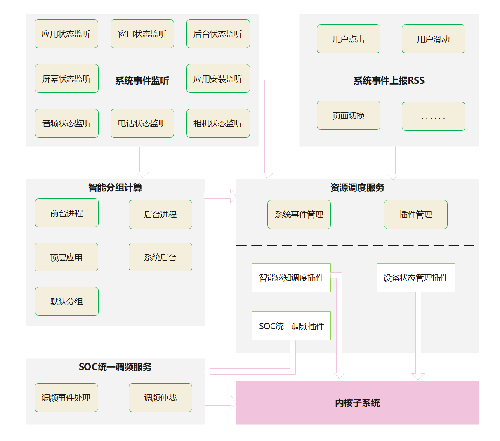

# 资源调度服务

- [资源调度服务](#资源调度服务)
  - [简介<a name="section11660541593"></a>](#简介)
  - [目录<a name="section161941989596"></a>](#目录)
  - [如何编写一个插件<a name="section1312121216216"></a>](#如何编写一个插件)
    - [接口说明<a name="section114564657874"></a>](#接口说明)
    - [使用说明<a name="section129654513264"></a>](#使用说明)
      - [插件事件处理约束<a name="section1551164914237"></a>](#插件事件处理约束)
  - [分组策略](#分组策略)
    - [基础分组策略](#基础分组策略)
    - [策略配置](#策略配置)
    - [配置约束](#配置约束)
  - [统一调频](#统一调频)
    - [调频接口说明](#调频接口说明)
    - [调频配置说明](#调频配置说明)
    - [调频使用举例](#调频使用举例)
  - [相关仓<a name="section1371113476307"></a>](#相关仓)

## 简介<a name="section11660541593"></a>

在资源调度子系统中，提供系统事件的感知以及分发，例如应用启动、退出、亮灭屏等。如果需要获取系统事件，并且进行相关资源调度，那么可以选择以插件形式加入资源调度服务中。

作为资源调度子系统的子模块，智能分组模块通过系统内应用前后台切换、用户焦点输入、后台任务的执行状态，决策进程的分组调度策略，并支持通过配置将调度策略映射到不同的CGROUP分组，为系统的性能、功耗均衡调度提供决策依据。同时该模块向资源调度框架转发应用状态、焦点状态、后台任务状态等系统事件，供插件订阅。

resource_schedule_service是接收事件，决策调度策略和执行调度机制的引擎，其架构图示如下：
 
其中包括以下几个重要组成部分：
1、事件管理器，包含了使用对外接口直接感知系统事件，以及使用监听形式感知系统事件功能。
2、应用智能分组，该组件接收应用生命周期变更的事件，决策应用的分组优先级，是全局资源调度的根本依据。
3、插件管理器，负责产品对应资源调度插件的加载，接收系统和应用的事件，并根据插件的订阅情况将事件分发给插件。
4、SOC统一调频服务，该服务主要是从SOC统一调频插件中接收调频事件，进行相关的调频仲裁，最终使用内核接口设置CPU频率策略。

resource_schedule_service主要通过插件的形式进行扩展和实现系统全局资源的调度功能，插件以动态链接的形式运行，不同产品可以选择不同的插件进行加载。目前已知的插件有智能感知调度插件、设备状态管理插件、SOC统一调频插件。其中SOC统一调频插件的服务包含在resource_schedule_service中，而另外两个插件的服务包含在其它仓内，最终都是根据系统事件设置调度策略到内核中进行实施。

## 目录<a name="section161941989596"></a>

```
/foundation/resourceschedule/resource_schedule_service
├── cgroup_sched
|   ├── common
|   │   └── include                   # 公共头文件
|   ├── framework                     # 主体代码
|   │   ├── process_group             # 分组设置接口
|   │   ├── sched_controller          # 分组计算
|   │   └── utils                     # RSS数据转发适配接口
|   │       ├── include
|   │       │   └── ressched_utils.h  # 事件上报头文件
|   │       └── ressched_utils.cpp    # 事件上报接口
|   ├── interfaces                    # 供RSS初始化、查询分组接口
|   │   └── innerkits                 # 对外接口目录
|   └── profiles                      # 配置文件
└── ressched
|   ├── common                     # 公共头文件
|   ├── interfaces
|   │   └── innerkits              # 对外接口目录
|   │       └── ressched_client    # 外部同步事件通知接口
|   ├── plugins                    # 插件代码实现
|   ├── profile                    # 插件开关以及私有配置
|   ├── sa_profile                 # 系统元能力配置
|   ├── sched_controller           # 事件采集
|   |   ├── common_event           # 事件采集公共接口
|   |   └── observer               # 监听事件采集
|   |       ├── audio_observer     # 音频事件监听回调
|   |       ├── camera_observer    # 相机事件监听回调
|   |       └── telephony_observer # 电话状态监听回调
|   └── services
|       ├── resschedmgr
|       │   ├── pluginbase         # 插件结构定义
|       │   └── resschedfwk        # 资源调度服务框架实现
|       └── resschedservice        # 资源调度服务层
└── soc_perf
    ├── configs                     # 调频配置文件
    ├── include
    |       ├── client              # SocPerf客户端头文件
    |       ├── server              # SocPerf服务端头文件
    |       └── server              # SocPerf核心逻辑代码头文件
    ├── src
    |    ├── client                 # SocPerf客户端代码，给调用者使用的接口
    |    ├── server                 # SocPerf服务器代码，用于接受客户端发送的调频请求
    |    └── server                 # SocPerf核心业务逻辑代码，仲裁并生效最终的调频结果
    └── sa_profile                  # 系统元能力配置

```
## 如何编写一个插件<a name="section1312121216216"></a>

### 接口说明<a name="section114564657874"></a>

| 接口名                                                                        | 接口描述                         |
|-------------------------------------------------------------------------------|----------------------------------|
| function OnPluginInit(std::string& libName): bool;                            | 插件初始化                       |
| function OnPluginDisable(): void;                                             | 插件退出                         |
| function OnDispatchResource(const std::shared_ptr\<ResData\>& data):void;       | 获取分发的事件                   |

### 使用说明<a name="section129654513264"></a>

插件初始化的时候，指定需要注册监听的事件。在这些事件发生的时候，框架会依次分发给各个插件，
此时插件需要快速处理消息接收进行资源调度（需要有耗时任务则需另起线程处理），处理完成后返回。

#### 插件事件处理约束<a name="section1551164914237"></a>

1、插件可以用C/C++实现。

2、插件的事件处理，必须快速完成，超过1ms会打印相关告警，超过10ms，框架认为插件异常而进行插件退出操作。

## 分组策略

### 基础分组策略

| 场景描述  | 分组策略  |
|----------|-------|
| 前台焦点应用，UID相同的进程  | top_app  |
| 前台可见的，包括分屏场景下的非焦点应用进程、悬浮窗对应的进程、foundation进程等  | foreground  |
| 一些系统级后台常驻进程，不由分组计算主动设置。在rc/cfg文件中写定，直接写入system分组   | system  |
| 退到后台的前一个应用，及其相关的进程  | background |
| OS内核和其他native进程，以及上面没有涉及到的一些进程 | root |

### 策略配置

通过JSON配置文件，对每个分组策略，绑定指定的CGROUP分组。
```
  "Cgroups": [
    {
      "controller": "cpu",
      "path": "/dev/cpuctl",
      "sched_policy": {
        "sp_default": "",
        "sp_background": "background",
        "sp_foreground": "foreground",
        "sp_system_background": "system-background",
        "sp_top_app": "top-app"
      }
    },
    {
      "controller": "cpuset",
      "path": "/dev/cpuset",
      "sched_policy": {
        "sp_default": "",
        "sp_background": "background",
        "sp_foreground": "foreground",
        "sp_system_background": "system-background",
        "sp_top_app": "top-app"
      }
    }
  ]
```

### 配置约束

策略配置路径：cgroup_action_config.json文件; 每个sp_xxx策略都需要配置

配置参数说明：

| 配置项 | 说明 |
|--------|--------|
|controller|当前配置项对应的cgroup分组控制器|
|path|cgroup分组对应的路径|
|sched_policy|不同分组调度策略对应到的具体分组|
|sp_xx|不同分组调度策略标识|

## 统一调频

### 调频接口说明

当前可支持的调频接口说明

| 接口  | 说明  |
|----------|-------|
| PerfRequest(int32_t cmdId, const std::string& msg) | 用于性能提频使用 |
| PerfRequestEx(int32_t cmdId, bool onOffTag, const std::string& msg) | 用于性能提频使用且支持ON/OFF事件 |
| PowerLimitBoost(bool onOffTag, const std::string& msg) | 用于限制boost无法突破功耗限频 |
| ThermalLimitBoost(bool onOffTag, const std::string& msg) | 用于限制boost无法突破热限频 |
| LimitRequest(int32_t clientId, const std::vector<int32_t>& tags, const std::vector<int64_t>& configs, const std::string& msg) | 用于热或功耗模块的限频且支持多项值一同设置 |

如表格所示，所有的调频接口都以cmdID为核心，将调频场景和调频参数互相关联，实现提频或者限频的功能。  
带onOffTag参数的接口表示该接口支持ON/OFF的开关调频模式，一般用于生效时间不固定的长期调频事件，需要调用者手动开启或者关闭。  
msg参数为拓展字符串信息，可承载例如调用客户端pid/tid等信息。  

### 调频配置说明

当前configs目录下的配置文件

| 配置文件  | 说明  |
|----------|-------|
| socperf_resource_config.xml | 定义产品可支持的资源配置，例如CPU/GPU/DDR/NPU等 |
| socperf_boost_config.xml | 用于性能提频的配置文件 |

各个xml配置文件都需要按产品定制，不同产品的配置不相同。  
对于指定的某产品，所有可支持配置的资源都定义在socperf_resource_config.xml内，支持单路径/多路径配置，任何资源都有唯一的resID。  
socperf_boost_config.xml使用的cmdID不能重复。  

### 调频使用举例

以点击提频事件为例。  

点击场景提频为固定生效时间，无需使用ON/OFF手动开启或关闭，故使用PerfRequest接口即可。因此需要在合适的地方调用soc_perf提供的IPC接口PerfRequest实现提频请求。  

资源调度服务对所有事件的采集有统一的入口，即资源调度框架对订阅事件的插件进行分发的机制，调频服务也依赖该机制实现对于各个需要调频的场景的感知。  

调频服务已实现为一个单独的调频插件socperf_plugin，定义在/ressched/plugins/socperf_plugin目录下。  
要实现点击场景的提频，分为点击事件插桩、事件上报给资源调度框架、框架给插件分发事件、生效调频服务四个步骤。  

第一步，  
ACE子系统仓内实现了对资源调度框架提供的可动态加载接口ReportData的封装，路径为/framework/base/ressched/ressched_report.h
并在/framework/core/gestures/click_recognizer.cpp增加了打点作为手势识别中对点击事件的判定  

第二步，  
通过动态加载libressched_client.z.so，调用资源调度框架提供的接口ReportData，ACE子系统将点击事件上报给全局资源调度子系统  

第三步，  
在资源调度框架里，点击事件类型定义在/ressched/interfaces/innerkits/ressched_client/include/res_type.h内，为RES_TYPE_CLICK_RECOGNIZE  
由于调频插件socperf_plugin在初始化过程中已完成了对该点击事件的订阅，因此框架会在接受到事件通知时将点击事件分发给调频插件  

第四步，  
调频插件socperf_plugin对于点击事件分配了cmdID：PERF_REQUEST_CMD_ID_EVENT_CLICK，路径在/ressched/plugins/socperf_plugin/src/socperf_plugin.cpp下  
通过调用调频服务提供的IPC接口PerfRequest，插件会给调频服务发送请求，实现点击提频功能。

## 监听事件采集
目前支持音频框架相关事件、电话子系统相关事件、相机相关事件监听回调，

监听音频框架中音频流状态变化、声音模式变化和整机声音变化

监听电话状态变化

监听相机状态变化

## 相关仓<a name="section1371113476307"></a>
- [windowmanager](https://gitee.com/openharmony/windowmanager)
- [communication_ipc](https://gitee.com/openharmony/communication_ipc)
- [hiviewdfx_hilog](https://gitee.com/openharmony/hiviewdfx_hilog)
