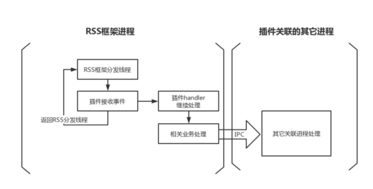

# Resource_Schedule_Service**进程管理规范**

**注：新增插件或新增事件，要按照以下要求添加到相对应的Check_List中。**

## • **插件管理规范**

注：新增加插件会引起resource_schedule_service进程内存增长，且resource_schedule_service进程存在内存基线，为了避免resource_schedule_service进程因新增插件导致内存无序增长，**因此只要新增加插件都要重新进行评审resource_schedule_service进程的内存基线**。

因此新增插件需要统计两种内存

1：进程基线内存：为了申请resource_schedule_service进程内存所需要的数据。

2：插件内存：用于统计插架实际增加的内存开销。

新增插件需要测试以上两种内存，**并统计到插件check_list**中。

### 1. **插件内存规范**

#### 内存测试类型及方法：

##### 1：进程基线内存测试：以进程为单位统计内存

​	测试方法：

​	    预先准备好，能引起新增插件注册的所有事件的场景。

​	    开启新增插件，共测试三轮，一轮内统计**常驻内存**和**动态内存**，取平均值。三轮结果再取平均值。

​    测试类型：

​		1）常驻内存：设备开机，静置三分钟。按照预先设定的场景执行操作，结束任务并退至后台。静置五分钟，每3秒统计一次进程resource_schedule_service的PSS内存值，统计30分钟采集600次样本，取平均值。

​		2）动态内存： 设备开机，静置三分钟。按照预先设定的场景，连续不断地执行操作（建议脚本自动执行），每1秒统计一次进程resource_schedule_service的PSS内存值，统计10分钟采集600次样本，取平均值。

##### 2：插件内存测试：以插件为单位统计内存

​	测试方法：

​	    预先准备好，能引起新增插件注册的所有事件的场景。

​	    开启和关闭新增插件，共测试三轮,**(每一轮为开启测试+关闭测试)**，一轮内统计常驻内存的开启插件和关闭插件的差值的平均值，和动态内存的开启插件和关闭插件的差值的平均值。三轮结果再取平均值。

​    测试类型：

​		1）常驻内存：设备开机，静置三分钟。按照预先设定的场景执行操作，结束任务并退至后台。静置五分钟，每3秒统计一次进程resource_schedule_service的PSS内存值，统计30分钟采集600次样本，取平均值。

​		2）动态内存： 设备开机，静置三分钟。按照预先设定的场景，连续不断地执行操作（建议脚本自动执行），每1秒统计一次进程resource_schedule_service的PSS内存值，统计10分钟采集600次样本，取平均值。

#### 其他测试类型：

场景内存：后续可能会增加一些常用的场景测试，比如top app，相机等常用场景。

#### 评审：

新增插件需要统计好**进程基线内存数据**，参与内存评审，评审人：黄昌华

注：相关数据统计到check_list中。

### 2. **插件执行效率规范**

由于插件分发事件为串行分发，所以对插件接收分发事件有比较强的性能要求，原则上需要插件接收事件后可以快速返回，事件尽量异步处理。所以对于插件的执行效率就有了一定的要求。

原则上，插件只做为接收事件用途，后续其它任何耗时业务，都需要发给具体服务进程/线程执行，以保证接收事件效率。(详见第3章)

1. 插件执行耗时尽量不能超过1ms，超过1ms即会产生相关WRNING警告，在开发插件过程中，需要尽量消除此类情况，插件需要上库到系统，则需要提供monkey测试中，每24H的WARNING<= 3次。

测试方式：

可以通过 hilog | grep deliverResourceToPlugin 抓取日志获取，如果超时会在是日志打印出来。

### 3. **插件线程和关联进程**

由于插件需要高效的接收RSS框架的事件，所以推荐使用插件接收到事件后，即启动一个handler进行后续的事件处理。而这个handler原则上即使用IPC进行事件转发，分发到对应模块的services中进行事件次处理。这样即保证了插件不会增加太多RSS框架的开销，也能够快速的对事件进行响应。

 

使用如此方式的插件，则只会增加RSS框架一个线程。而如果有特殊需求，需要增加RSS框架进程多个线程的，则需要说明原因并且参与评审，并且梳理清楚以下几点。

1：线程数目，以及线程执行的内容。

2：线程所需要的权限，以及权限对应的任务。

3：线程所关联的进程，以及这些进程是否强耦合RSS框架，能否脱离RSS框架独立运行。

如果特殊情况需要评审，详见附件1.

### 4. 新插件加入**check_list**

| 插件名             | 插件名                                                       |
| ------------------ | ------------------------------------------------------------ |
| 插件功能简介       | 简单描述插件功能，以README形式提供在resource_schedule_service仓中 |
| 插件订阅事件       | 给出插件订阅的事件列表                                       |
| 进程基线内存       | 增加插件后resource_schedule_service进程PSS内存值。1：常驻内存 2：动态内存 |
| 插件内存           | 插件引起resource_schedule_service框架内存增长的PSS值。1：常驻内存 2：动态内存 |
| 插件的事件执行效率 | 以RK3568为准，所有订阅事件执行效率均需有保证。上库前需要提供稳定运行24H的RSS框架日志，保证无告警。 |
| 插件新增线程       | 插件新增的线程 以及各个线程的用途                            |
| 插件关联进程       | 插件会与哪些关联进程进行通信，是否存在其它进程依赖           |
| 插件需要的权限     | 读写特性IO的selinux权限等(暂时不涉及)                        |
| 插件负责人         | 增加插件的人员                                               |

## • 事件管理规范

### 1. **事件传输标准格式**

根据IPC接口的传输规范，传输事件一般需要有

type_id , value , payload

type_id ：  unit_32_t 型；事件标志。

Value   ：   int型；内容可自行定义，一般用于区分事件的动作或者子类。

Payload ： 接口类型unordered_map<string,string>型，用于更详细的消息传递。

根据res_type.h中定义所需要的事件，添加相应信息。

RSS框架的事件完全继承IPC的传输规范，开发者可以在RSS框架代码中res_type.h中定义需要的事件type_id，以及定义对应的value和payload格式。

其中value一般为int型的值，大部分事件中只取0/1。

payload为unordered_map<string,string>型。

Payload在RSS框架使用Json格式，大概如下:

{

“key1”: int_value1,

“key2”: string_value1,

“key3”: [list_int_value1,list_int_value2],

“key4”: {

  “map_key1”: map_int_value1,

  “map_key2”: map_string_value1

}

}

例如：

type: RES_TYPE_WINDOW_FOCUS

value: 0:start, 1:finish

payload: {

“pid”: 1234,

“uid”: 1000,

“bundleName”: “xxxxx”

}

Json格式有着非常丰富的库方法进行解析和生成，这里RSS框架代码推荐使用lib-jsoncpp-dev进行相关操作。尽可能减少其它三方库引入以节约内存。

### 2. **事件打点性能**

A. 事件打点延时

事件本身有一定的传递效率，比如焦点切换的事件，在发生焦点切换事件后，需要多少时间才能让订阅焦点切换事件的第一个插件接收到该事件，这个延时即为焦点切换事件的性能(社区RK3568进行测试)。

测试方法：

​    开始点：”ResSchedClient::ReportData receive resType = xxx“ 或 “ResSchedClient::ReportDataInProcess resType = xxx”

​    结束点：“PluginMgr::DispatchResource resType resType = xxx”

标准：<10ms。

### 3. 新事件加入**check_list**

| 事件type        | Type名称记录在res_type.h中                     |
| --------------- | ---------------------------------------------- |
| 事件用途        | 简单描述事件的用途记录在res_type.h中           |
| 事件value       | 需要描述清楚value含义                          |
| 事件payload格式 | 需要描述payload格式以及每个字段的含义          |
| 事件打点延时    | 以RK3568测试为准，记录第一个插件收到事件的延时 |
| 订阅事件插件    | 给出订阅了改事件的插件名列表。                 |

##  **Check_List**

### 1：插件Check_List

更新2022年2月18日14:35:24

| 插件名            | 插件功能简介 | 插件订阅事件                                                 | 进程基线内存（KB）     | 插件内存基线(KB)     | 插件的事件执行效率 | 插件新增线程 | 插件关联进程    | 插件需要的权限 | 插件负责人 |
| ----------------- | ------------ | :----------------------------------------------------------- | ---------------------- | :------------------- | ------------------ | ------------ | --------------- | -------------- | ---------- |
| soc_perf          | cpu提频      | RES_TYPE_APP_STATE_CHANGE; RES_TYPE_WINDOW_FOCUS; RES_TYPE_CLICK_RECOGNIZE；RES_TYPE_PUSH_PAGE;  RTS_TYPE_SLIDE_RECOGNIZE; | 常驻：5918  动态：5922 | 常驻:88      动态:88 | 无                 | 无           | socperf_service | 无             | HaoyangT   |
| frame_aware_sched | 智能感知调度 | RES_TYPE_WINDOW_FOCUS;  RES_TYPE_PROCESS_STATE_CHANGE;  RES_TYPE_APP_STATE_CHANGE | 常驻：4537             | 常驻：109            |                    |              | 暂无            |                | rongkunshi |
| component_sched | 外设调度 | RES_TYPE_SCREEN_STATUS；RES_TYPE_APP_STATE_CHANGE；RES_TYPE_ABILITY_STATE_CHANGE；RES_TYPE_EXTENSION_STATE_CHANGE；RES_TYPE_PROCESS_STATE_CHANGE；RES_TYPE_WINDOW_FOCUS; | 常驻：             | 常驻： 动态:            |                    |              | 暂无            |                | linyunxuan |

### 2：事件Check_List

更新2022年6月01日14:35:24

| 事件type                        | 事件用途                             | 事件value                 | 事件payload格式                                              | 事件打点延时: | 订阅事件插件           |
| ------------------------------- | ------------------------------------ | ------------------------- | ------------------------------------------------------------ | ------------- | ---------------------- |
| RES_TYPE_SCREEN_STATUS          | 屏幕状态                             | 0：屏幕暗 1：屏幕亮       | 无需payload                                                  |               |                        |
| RES_TYPE_APP_STATE_CHANGE       | APP状态改变事件                      | value : app state         | {"pid"=?,"uid"=?,"bundleName"="?"}                          | <10ms         | soc_perf;  frame_aware |
| RES_TYPE_ABILITY_STATE_CHANGE   | ABILITY状态改变事件                  | value : ability state     | {"pid"=?,"uid"=?,"bundleName"="?"}                           |               |                        |
| RES_TYPE_EXTENSION_STATE_CHANGE | EXTENSION状态改变事件                | value ：extension state   | {"pid"=?,"uid"=?,"bundleName"="?"}                           |               |                        |
| RES_TYPE_PROCESS_STATE_CHANGE   | 进程状态事件                         | 0：创建 1：销毁           | {"pid"=?,"uid"=?,"bundleName"="?"}                           | <10ms         | frame_aware            |
| RES_TYPE_WINDOW_FOCUS           | 窗口聚焦事件                         | 0：聚焦1：不聚焦          | {"pid"=?,"uid"=?,"bundleName"="?",  "windowId"=?,"windowType"=?,displayId=?} | <10ms         | soc_perf ; frame_aware |
| RES_TYPE_TRANSIENT_TASK         | 瞬态任务事件                         | 0：开始  1：结束          | {"pid"=?,"uid"=?,"bundleName"="?"}                           |               |                        |
| RES_TYPE_CONTINUOUS_TASK        | 长时任务事件                         | 0：开始  1：结束          | {"pid"=?,"uid"=?,"abilityName"="?"}                          |               |                        |
| RES_TYPE_CGROUP_ADJUSTER        | cgroup改变事件                       | 0: 进程组分组变化  1: 线程分组变化 | {"pid"=?,"uid"=?,"name"="?","oldGroup"=?, "newGroup"=?}      |               |                        |
| RES_TYPE_CLICK_RECOGNIZE        | ace手势点击识别器                    | 无                        | 无                                                           | <10ms         | soc_perf               |
| RES_TYPE_PUSH_PAGE              | ace pipeline_context.cpp::PushPage() | 无                        | 无                                                           | <10ms         | soc_perf               |
| RTS_TYPE_SLIDE_RECOGNIZE        | ace slide event recognize            | 1: slide on; 0: slide off | 无                                                           | <10ms         | soc_perf               |
| RES_TYPE_WINDOW_VISIBILITY_CHANGE     | 窗口可见性状态变化事件          | 1: 可见, 0: 不可见     | 无                    | - | - |
| RES_TYPE_REPORT_MMI_PROCESS           | 上报mmi_service线程ID          | mmi_service线程号     | {"uid"=?, "pid"=?}    | - | - |
| RES_TYPE_REPORT_RENDER_THREAD         | 上报应用的RSRender线程ID       | RSRenderThread线程号   |  {"uid"=?, "pid"=?}   | - | - |
| RES_TYPE_APP_INSTALL_UNINSTALL  | 应用安装和卸载事件                    | value 0: 卸载, 1: 安装  | {"uid"=?,"bundleName"="?} | - | - |
| RES_TYPE_WIFI_CONNECT_STATE_CHANGE | wifi连接状态事件                  | 1:空闲, 2:连接中, 3:已连接, 4:断开中, 5:已断开   | 无需payload | - | - |
| RES_TYPE_USER_SWITCH            | 用户切换事件                         | value: 切换到的目标用户id  | 无需payload         | - | - |
| RES_TYPE_USER_REMOVE            | 用户删除事件                         | value: 删除的用户id        | 无需payload         | - | - |
| RES_TYPE_SCREEN_LOCK            | 锁屏和解锁事件                       | 0：解锁 1：锁屏             | 无需payload         | - | - |
| RES_TYPE_CALL_STATE_UPDATE          | 电话状态改变事件                 | value：电话状态             | 无需payload         | - | - |
| RES_TYPE_AUDIO_RENDER_STATE_CHANGE  | 音频流状态改变事件               | value：音频流状态           | {"uid"=?,"sessionId"=?}          | - | - |
| RES_TYPE_AUDIO_RING_MODE_CHANGE     | 声音模式改变事件                 | 0：响铃模式 1：静音模式     | 无需payload         | - | - |
| RES_TYPE_AUDIO_VOLUME_KEY_CHANGE    | 音量改变事件                     | value：音量大小             | {"volumeType"=?}         | - | - |
| RES_TYPE_POP_PAGE    | ace pipeline_context.cpp::PopPage();          | 无             |{"pid"=?,"uid"=?,"bundleName"="?","abilityName"="?", "pageUrl"="?"} | - | - |
| RES_TYPE_WEB_GESTURE                | web手势事件                     | 无                        |无     | -        | -       |

## 附件1：

评审入口可以在社区提issues，标题为XXX评审，并根据下方的“**评审问题模板**”给出详细内容。

每天定期检查待评审issues。待评审人可以在“附件2中”跟踪问题进展。

评审问题模板：

| 待评审人员 | PR   | 问题描述 | 问题详细描述 |
| ---------- | ---- | -------- | ------------ |
| XXX        | xx   | Xxx      | Xxx          |

##  附件2：

评审记录汇总表

| ID   |      | 待评审人员 | 评审结果 | 问题描述 | 问题评审纪要 | 评审时间 |
| ---- | ---- | ---------- | -------- | -------- | ------------ | -------- |
|      |      |            |          |          |              |          |

