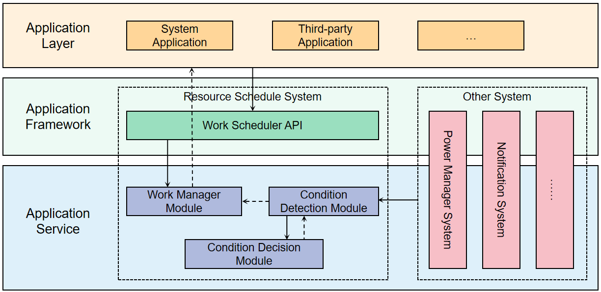

# Work Scheduler

-   [Introduction](#section11660541593)
-   [Directory Structure](#section161941989596)
-   [Work Scheduler](#section1312121216216)
    -   [Available APIs](#section114564657874)
    -   [Usage Guidelines](#section129654513264)
        -   [Restrictions on Using Work Scheduler](#section1551164914237)

-   [Repositories Involved](#section1371113476307)

## Introduction<a name="section11660541593"></a>

When an application needs to perform tasks that do not require high real-time performance, such as data learning when the device is idle, the work scheduler can be used. When the application setting conditions are met, the mechanism will uniformly decide the scheduling time according to the current state of the system, such as memory, power consumption, heat, etc.



## Directory Structure<a name="section161941989596"></a>

```

├── frameworks       # Frameworks
├── interfaces
│   └── kits         # External APIs
├── sa_profile       # SA profile
├── services         # Services
└── utils            # Utilities

```
## Work Scheduler<a name="section1312121216216"></a>

### Available APIs<a name="section114564657874"></a>

1. The members of WorkInfo

 API                                                          | Description | Type
  ------------------------------------------------------------ | ------------------------------------------------------------ | ------------------------------------------------------------ 
workId | The id of work（required）|number
bundleName | The bundle name（required）|string
abilityName | The ability name（required）|string
networkType | The type of network | NetworkType
isCharging | Is charging. | bool
chargerType | The charging type. | ChargingType
batteryLevel | The  battery | number
batteryStatus| The battery status |	BatteryStatus
storageRequest|The storage status|	StorageRequest
isRepeat|Is repeating work |	boolean
repeatCycleTime | The repeating cycle time|	number
repeatCount	| The repeating cycle count| number
parameters    |Parameter information carried| {[key: string]: any}


2. The api of work scheduler for starting, stopping and querying.

 API                                                          | Description                                                  
 ------------------------------------------------------------ | ------------------------------------------------------------ 
 function startWork(work: WorkInfo): void;                 | work scheduler application                                   
 function stopWork(work: WorkInfo, needCancel?: boolean): void; | work scheduler cancel                                        
 function getWorkStatus(workId: number, callback: AsyncCallback<WorkInfo>): void; | get the status of work（Callback form）                      
 function getWorkStatus(workId: number): Promise<WorkInfo>;   | get the status of work（Promise form）                       
 function obtainAllWorks(callback: AsyncCallback<void>): Array<WorkInfo>; | get all works（Callback form）                               
 function obtainAllWorks(): Promise<Array<WorkInfo>>;         | get all works（Promise form）                                
 function stopAndClearWorks(): void;                       | stop and clear work                                          
 function isLastWorkTimeOut(workId: number, callback: AsyncCallback<void>): boolean; | Get whether the last task has timed out（For repeat work. Callback form） 
 function isLastWorkTimeOut(workId: number): Promise<boolean>; | Get whether the last task has timed out（For repeat work. Promise form） 

3. Callback api of work scheduler

API                                                          | Description                                                  
 ------------------------------------------------------------ | ------------------------------------------------------------ 
 function onWorkStart(work: WorkInfo): void;                 | Callback when work starts.       
 function onWorkStop(work: WorkInfo): void;                 | Callback when work stops.

### Usage Guidelines<a name="section129654513264"></a>

When an application needs to perform tasks with low real-time performance, work scheduler can be used. When the conditions set by the application are met, the mechanism will make a unified decision and scheduling time based on the current state of the system, such as memory, power consumption, and heat.

#### Restrictions on Using Work Scheduler<a name="section1551164914237"></a>

Adhere to the following constraints and rules when using work scheduler:

- **Timeout**：The longest running time is 120s each time.
- **Execution frequency**：The system will perform hierarchical control on the work scheduler according to the bundle activity of the application, and limit the execution frequency of work scheduler.

Application group             |    Execution frequency constraint                            
--------------------|-------------------------
active group | minimum interval 2 hours
daily used group | minimum interval 4 hours
fixed group | minimum interval 24 hours
rare used group | minimum interval 48 hours
restricted group | forbidden
unused group | forbidden 

- **Restrict to WorkInfo**：

(1) WorkId, bundleName and abilityName are required.

(2) At least one condition must be set.

(3) Repeatcycletime should be at least 20 minutes. When setting repeatcycletime, you must select one of isrepeat and repeatcount.

(4) Parameters support type include number, string and bool.

## Repositories Involved<a name="section1371113476307"></a>

Resource Schedule subsystem

[**resourceschedule_work_scheduler**](https://gitee.com/openharmony/resourceschedule_work_scheduler)

[notification_ces_standard](https://gitee.com/openharmony/notification_ces_standard)

[appexecfwk_standard](https://gitee.com/openharmony/appexecfwk_standard)

[powermgr_battery_manager](https://gitee.com/openharmony/powermgr_battery_manager)