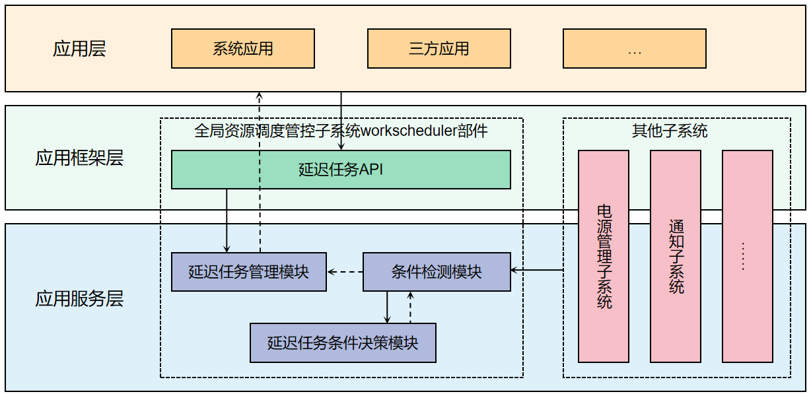

# 延迟任务调度

-   [简介](#section11660541593)
-   [目录](#section161941989596)
-   [延迟任务调度](#section1312121216216)
    -   [接口说明](#section114564657874)
    -   [使用说明](#section129654513264)
        -   [延迟任务调度使用约束](#section1551164914237)

-   [相关仓](#section1371113476307)

## 简介<a name="section11660541593"></a>

在资源调度子系统中，延迟任务调度部件给应用提供一个可以执行实时性不高的任务的机制。当满足设定条件时，会被放入可执行队列，系统根据设备情况，延迟触发可执行队列内的任务。



## 目录<a name="section161941989596"></a>

```

├── frameworks       # 客户端模块
├── interfaces
│   └── kits         # 对外接口模块
├── sa_profile       # 组件服务配置
├── services         # 服务端模块
└── utils            # 工具类、可维可测模块

```
## 延迟任务调度<a name="section1312121216216"></a>

### 接口说明<a name="section114564657874"></a>
1、延迟任务WorkInfo成员接口

接口名|接口描述|类型                           
---------------------------------------------------------|-----------------------------------------|---------------------------------------------------------
workId | 延迟任务Id（必填）|number
bundleName | 延迟任务包名（必填）|string
abilityName | 延迟任务回调通知的组件名（必填）|string
networkType | 网络条件 | NetworkType
isCharging | 是否充电 | bool
chargerType | 充电类型 | ChargingType
batteryLevel | 电量| number
batteryStatus| 电池状态|	BatteryStatus
storageRequest|存储状态|	StorageRequest
isRepeat|是否循环任务|	boolean
repeatCycleTime |循环间隔|	number
repeatCount	|循环次数| number
parameters    |携带参数信息| {[key: string]: any}

2、延迟任务注册、取消、查询等相关接口

接口名                                                    |     接口描述                            
---------------------------------------------------------|-----------------------------------------
function startWork(work: WorkInfo): void; | 延迟调度任务申请 
function stopWork(work: WorkInfo, needCancel?: boolean): void;        | 延迟调度任务取消 
function getWorkStatus(workId: number, callback: AsyncCallback<WorkInfo>): void;| 获取延迟调度任务状态（Callback形式） 
function getWorkStatus(workId: number): Promise<WorkInfo>; | 获取延迟调度任务状态（Promise形式） 
function obtainAllWorks(callback: AsyncCallback<void>): Array<WorkInfo>;| 获取所有延迟调度任务（Callback形式） 
function obtainAllWorks(): Promise<Array<WorkInfo>>;| 获取所有延迟调度任务（Promise形式） 
function stopAndClearWorks(): void;| 停止并清除任务
function isLastWorkTimeOut(workId: number, callback: AsyncCallback<void>): boolean;| 获取上次任务是否超时（针对RepeatWork，Callback形式）
function isLastWorkTimeOut(workId: number): Promise<boolean>;| 获取上次任务是否超时（针对RepeatWork，Promise形式）

3、延迟任务回调接口

接口名                                                    |     接口描述                            
---------------------------------------------------------|-----------------------------------------
function onWorkStart(work: WorkInfo): void; | 延迟调度任务回调开始
function onWorkStop(work: WorkInfo): void; | 延迟调度任务回调结束


### 使用说明<a name="section129654513264"></a>
应用要执行对实时性要求不高的任务的时候，比如设备空闲时候做一次数据学习等场景，可以使用延迟调度任务，该机制在满足应用设定条件的时候，会根据系统当前状态，如内存、功耗、热等统一决策调度时间。

#### 延迟调度任务使用约束<a name="section1551164914237"></a>

延迟调度任务的使用需要遵从如下约束和规则：

- **超时**：系统会设置超时机制，延迟任务回调只允许运行一段时间，每次最长运行120s。超时之后，系统会主动停止。默认的超时限制为2分钟，对于系统应用，可以通过[能效资源申请接口](https://gitee.com/openharmony/resourceschedule_background_task_mgr/blob/master/README_ZH.md)获取更长的执行时间（充电状态20分钟，非充电状态10分钟）。
- **执行频率**：系统会根据应用的活跃度对延迟任务做分级管控，限制延迟任务调度的执行频率。

应用分组             |     延迟任务执行频率约束                            
--------------------|-------------------------
活跃 | 最小间隔2小时
每日使用 | 最小间隔4小时 
经常使用 | 最小间隔24小时 
不经常使用 | 最小间隔48小时 
受限分组 | 禁止 
未使用分组 | 禁止 
[能效资源豁免分组](https://gitee.com/openharmony/resourceschedule_background_task_mgr/blob/master/README_ZH.md)  | 不受限制 

- **WorkInfo设置参数约束** 

（1） workId、bundleName、abilityName为必填项，bundleName必须填本应用，否则校验失败。

（2）至少要设置一个满足的条件。

（3）重复任务时间间隔至少20分钟，当设置重复任务时间间隔时，必须设置始终重复和重复次数中的一个。

（4）额外数据支持number、string、bool三种类型。

## 相关仓<a name="section1371113476307"></a>

资源调度子系统

[**resourceschedule_work_scheduler**](https://gitee.com/openharmony/resourceschedule_work_scheduler)

[notification_ces_standard](https://gitee.com/openharmony/notification_ces_standard)

[appexecfwk_standard](https://gitee.com/openharmony/appexecfwk_standard)

[powermgr_battery_manager](https://gitee.com/openharmony/powermgr_battery_manager)

[resourceschedule_background_task_mgr](https://gitee.com/openharmony/resourceschedule_background_task_mgr)