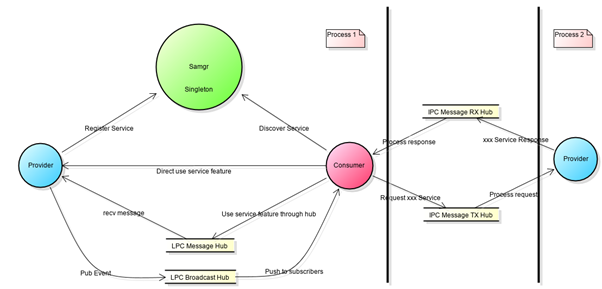

# 轻量型系统服务框架部件<a name="ZH-CN_TOPIC_0000001081445008"></a>

-   [简介](#section11660541593)
-   [目录](#section1464106163817)
-   [使用](#section10729231131110)
-   [相关仓](#section176111311166)

## 简介<a name="section11660541593"></a>

safwklite模块负责提供基础服务运行的空进程。

## 系统架构<a name="section342962219551"></a>

**图 1**  面向服务的架构




-   Provider：服务的提供者，为系统提供能力（对外接口）。
-   Consumer：服务的消费者，调用服务提供的功能（对外接口）。
-   Samgr：作为中介者，管理Provider提供的能力，同时帮助Consumer发现Provider的能力。


## 目录<a name="section1464106163817"></a>

系统服务管理源代码目录结构如下表所示：

**表1 **主要源代码目录结构

<a name="table43531856201716"></a>
<table><thead align="left"><tr id="row20416556201718"><th class="cellrowborder" valign="top" width="50%" id="mcps1.1.3.1.1"><p id="p10416456121716"><a name="p10416456121716"></a><a name="p10416456121716"></a>名称</p>
</th>
<th class="cellrowborder" valign="top" width="50%" id="mcps1.1.3.1.2"><p id="p1841645631717"><a name="p1841645631717"></a><a name="p1841645631717"></a>描述</p>
</th>
</tr>
</thead>
<tbody><tr id="row104169564177"><td class="cellrowborder" valign="top" width="50%" headers="mcps1.1.3.1.1 "><p id="p17416125614179"><a name="p17416125614179"></a><a name="p17416125614179"></a>safwk_lite</p>
</td>
<td class="cellrowborder" valign="top" width="50%" headers="mcps1.1.3.1.2 "><p id="p04163569170"><a name="p04163569170"></a><a name="p04163569170"></a>foundation进程实现</p>
</td>
</tr>
</tbody>
</table>

其中系统服务管理safwk\_lite组件的源代码目录结构如下：

```
├── BUILD.gn
├── readme.md
├── LICENSE
├── src
    └── main.c
```

## 使用<a name="section10729231131110"></a>

在foundation进程中添加服务

按照服务的模板写完服务后在BUILD.gn中添加依赖即可：

```
deps = [
  "${aafwk_lite_path}/services/abilitymgr_lite:abilityms",
  "${appexecfwk_lite_path}/services/bundlemgr_lite:bundlems",
  "//base/hiviewdfx/hilog_lite/frameworks/featured:hilog_shared",
  "//base/security/permission_lite/services/ipc_auth:ipc_auth_target",
  "//base/security/permission_lite/services/pms:pms_target",
  "//foundation/ability/dmsfwk_lite:dtbschedmgr",
  "//foundation/systemabilitymgr/samgr_lite/samgr_server:server",
]
```

## 相关仓<a name="section176111311166"></a>

系统服务管理子系统

[systemabilitymgr\_samgr\_lite](https://gitee.com/openharmony/systemabilitymgr_samgr_lite)

[systemabilitymgr\_samgr](https://gitee.com/openharmony/systemabilitymgr_samgr)

[systemabilitymgr\_safwk](https://gitee.com/openharmony/systemabilitymgr_safwk)

[**systemabilitymgr\_safwk\_lite**](https://gitee.com/openharmony/systemabilitymgr_safwk_lite)


