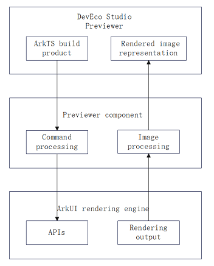

# Previewer

## Introduction

The Previewer is a component that empowers the DevEco Studio Previewer to leverage the ArkUI rendering engine for real-time rendering and preview. To be specific, with the Previewer component, the DevEco Studio Previewer can send commands through the named pipe to instruct the ArkUI rendering engine to implement real-time rendering and receive the resultant images for preview presentation. The Previewer component supports ArkTS and JS applications on Windows or macOS.

**Figure 1** Previewer component architecture<a name="fig2606133765017"></a> 



To start with, the DevEco Studio Previewer launches the Previewer component through the command line and passes to it startup parameters such as the ArkTS build product path and preview specifications. When starting up, the Previewer component launches the ArkUI rendering engine, which then renders pages based on the startup parameters and delivers preview images for the DevEco Studio Previewer. When page information changes, the DevEco Studio Previewer sends page refresh commands through the named pipe to the Previewer component. Based on the received commands, the Previewer component calls the ArkUI processing APIs to refresh and render the pages and deliver the images.
## Directory Structure

The source code of the Previewer component is stored in **/tools_previewer**. The following shows the directory structure.

```
/tools_previewer
├── cli                       # Command processing
├── gn                        # Build dependencies and toolchain configuration
├── jsapp                     # Rendering engine invoking
├── mock                      # Code of the interaction layer
├── util                      # Utility
```

## Application Scenarios

The Previewer component is built and released with the OpenHarmony SDK. You can use it to enable the DevEco Studio Previewer to leverage the ArkUI rendering engine for page rendering.

## Building and Compilation

For details, see the README in the [build](https://gitee.com/openharmony/build) repository.

## Repositories Involved

**tools_previewer**

[arkui\_ace\_engine\_lite](https://gitee.com/openharmony/arkui_ace_engine_lite)

[arkui\_ace\_engine](https://gitee.com/openharmony/arkui_ace_engine)

## How to Contribute

For details about how to contribute, see [Contribution Guide](https://gitee.com/openharmony/docs/blob/master/en/contribute/Readme-EN.md).
